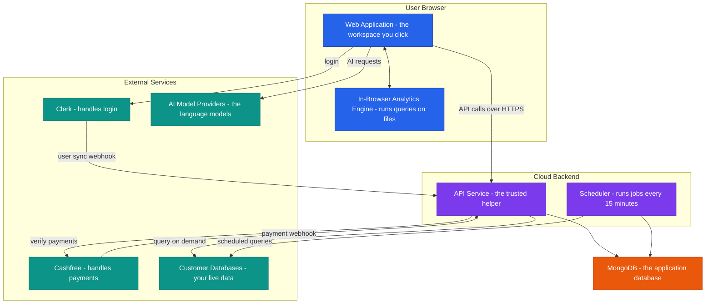
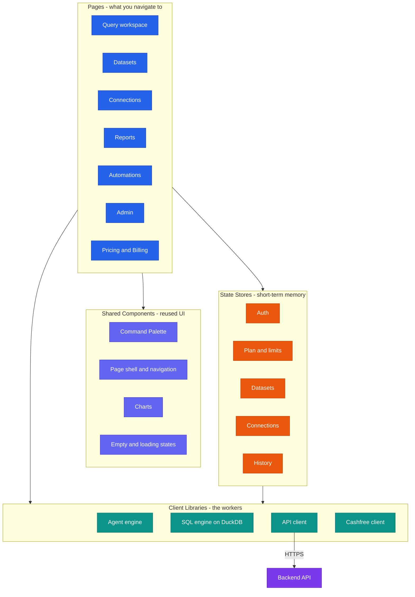
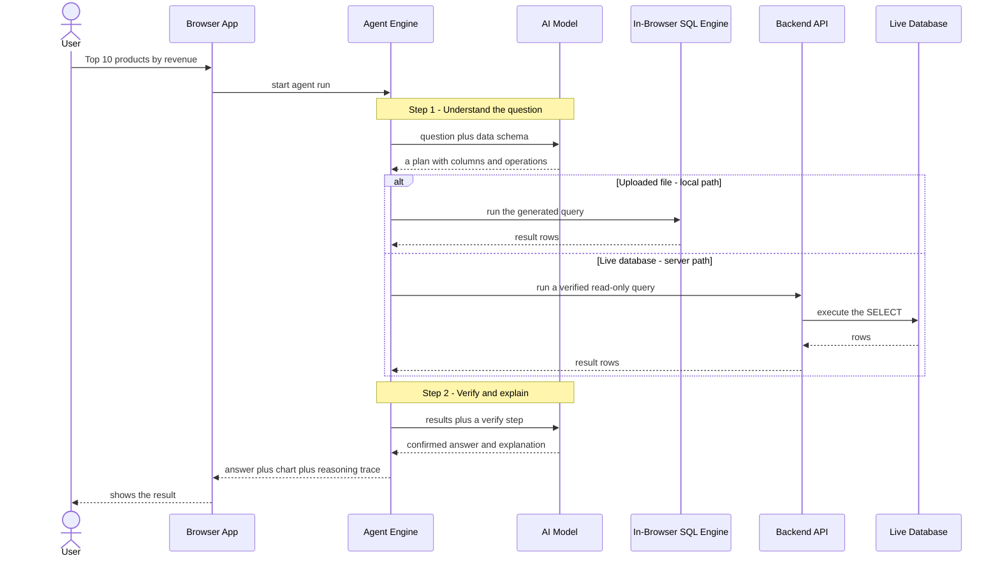
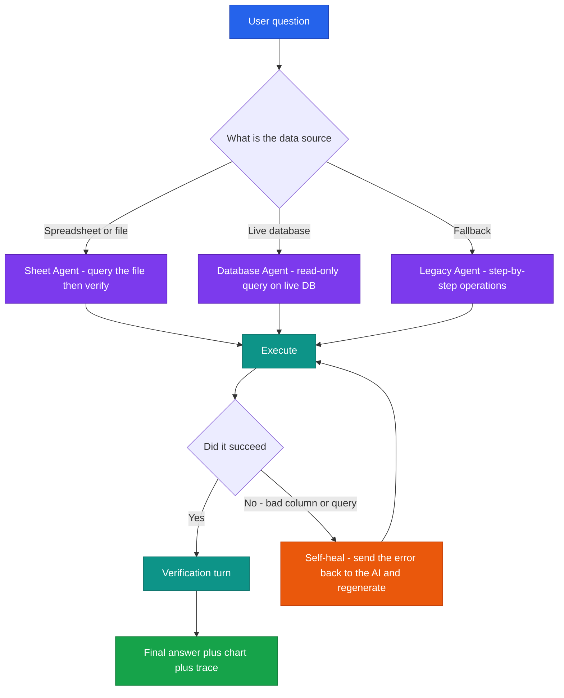
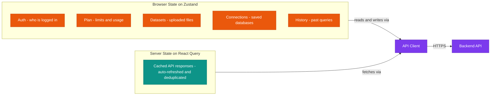
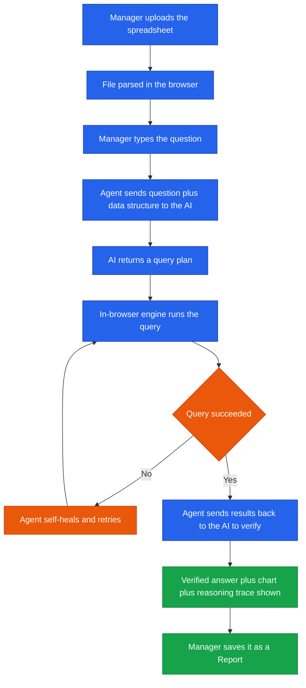

<!--
  Render note: diagrams use Mermaid. They display as real visuals in GitHub,
  GitLab, VS Code (Markdown Preview Mermaid Support), Obsidian, Notion, and
  Typora. To export a polished PDF: open in VS Code preview or Typora, then Export PDF.
  Diagram style is kept parser-safe: no line-break tags, no emoji, no semicolons
  inside labels, no nested subgraphs, no cylinder shapes.
-->

# Querify — Application Architecture

**Natural-Language Analytics Platform**

| | |
|---|---|
| **Document** | Application Architecture |
| **Owner** | Engineering |
| **Version** | 2.0 (Comprehensive Edition) |
| **Status** | Pre-Launch Baseline |
| **Date** | 27 June 2026 |
| **Classification** | Confidential — Internal |
| **Audience** | Executives, engineers, new joiners, technical partners |

---

## How to Read This Document

This document is written for a mixed audience. Each major section follows the same pattern so everyone can find their level:

- **In plain words** — a non-technical explanation anyone can follow.
- **The detail** — the precise, technical version for engineers.
- **Why it matters** — the business or practical consequence.

Technical terms are defined the first time they appear and collected in the [Glossary](#13-glossary) at the end.

---

## Table of Contents

1. [Executive Summary](#1-executive-summary)
2. [Key Concepts in Plain Words](#2-key-concepts-in-plain-words)
3. [System at a Glance](#3-system-at-a-glance)
4. [Technology Stack](#4-technology-stack)
5. [Component Architecture](#5-component-architecture)
6. [Request Flow — Asking a Question](#6-request-flow--asking-a-question)
7. [The Agent Engine](#7-the-agent-engine)
8. [State and Data Management](#8-state-and-data-management)
9. [Design Patterns](#9-design-patterns)
10. [Module Reference](#10-module-reference)
11. [A Worked Example, End to End](#11-a-worked-example-end-to-end)
12. [Frequently Asked Questions](#12-frequently-asked-questions)
13. [Glossary](#13-glossary)

---

## 1. Executive Summary

**In plain words.** Querify is a website where a person can type an everyday question about their data — for example, *"What were my top 10 products by revenue last quarter?"* — and get back a clear answer, a chart, and an explanation of how that answer was worked out. The user never has to write a database query or know any technical language.

**The detail.** Querify is a two-tier web application:

- A **browser application** (the part that runs inside the user's web browser) delivers the entire interactive experience. Crucially, it can run analytical queries *locally* — inside the browser itself — for instant results on uploaded files.
- A **backend API** (a program running in the cloud) handles the things that must be centralised and trusted: verifying identity, processing payments, enforcing governance rules, connecting to live corporate databases, running scheduled work, and serving the public programming interface.

The single most distinctive design choice is that **a large amount of the analytical work happens on the user's own device**, using an embedded analytics engine. The cloud backend is deliberately reserved for what genuinely must be central.

**Why it matters.** This split has three direct business benefits:

| Benefit | Cause |
|---|---|
| **Speed** | Answers on uploaded files do not need a round-trip to a server |
| **Lower cost** | Heavy computation runs on the user's device, not on paid cloud compute |
| **Privacy** | Uploaded data can stay on the user's machine; less customer data is stored centrally |

> **Executive takeaway:** The architecture is cost-efficient and privacy-respecting by design. Heavy lifting happens on the user's device; the server only does what truly needs to be central.

---

## 2. Key Concepts in Plain Words

Before the diagrams, here are the handful of ideas that everything else builds on. If you understand these five, you understand the architecture.

| Concept | Plain-words explanation | Everyday analogy |
|---|---|---|
| **Frontend (browser app)** | The part you see and click, running in your web browser | The dashboard and controls of a car |
| **Backend (API)** | The behind-the-scenes program in the cloud that does trusted work | The engine and gearbox you do not see |
| **In-browser engine** | A small but powerful data tool that runs inside the web page itself | A calculator built into the page, so you do not have to phone someone for the maths |
| **The agent** | The "brain" that turns your English question into a database query, runs it, and checks the result | A skilled analyst who understands your question, does the work, and double-checks before answering |
| **Verification step** | The agent re-checks its own answer before showing it to you | A careful accountant reviewing their figures before sending the report |

---

## 3. System at a Glance

**In plain words.** There are three worlds: your **browser** (where you work), the **cloud backend** (the trusted helper), and the **outside services** Querify relies on (login, payments, AI, and your databases). They talk to each other over secure connections.

**The detail.**

| Tier | What it is | Technology | Why it exists |
|---|---|---|---|
| **Browser Application** | The interactive analytics workspace | React single-page application | Fast, responsive experience; runs analysis locally |
| **In-Browser Engine** | An analytics database embedded in the page | DuckDB compiled to WebAssembly | Instant results on uploaded files with no server round-trip |
| **API Service** | The serverless backend | Node.js and Express on AWS Lambda | Identity, billing, governance, live-database access |
| **Scheduler** | A background job runner | A separate scheduled Lambda function | Runs scheduled reports and data alerts |
| **Application Database** | The system of record | MongoDB Atlas | Stores users, plans, connections, history, reports |

**Why it matters.** Each box has one clear job. If one external service has an outage (say, payments), the rest of the system keeps working. This separation limits how far any single failure can spread.

> **A note on the word "serverless":** It does not mean there are no servers. It means *you* do not manage any. The cloud provider runs your code on demand and bills only for the moments it actually runs. When no one is using the app, the backend costs almost nothing.

---

## 4. Technology Stack

**In plain words.** A "stack" is simply the set of tools the product is built from, like the list of ingredients and appliances in a kitchen. Below is what Querify uses and what each tool is for.

**The detail.**

| Layer | Technology | What it does | Why this choice |
|---|---|---|---|
| UI framework | React 18 + TypeScript | Builds the interface from reusable pieces; TypeScript catches errors early | Industry-standard, large talent pool, type safety |
| Build tool | Vite | Bundles the code and runs a fast local dev server | Very fast feedback while developing |
| Styling | Tailwind CSS | Styles the interface from a consistent set of design tokens | Consistency and speed; no scattered custom styles |
| Client state | Zustand | Remembers things in the browser (who is logged in, the active dataset) | Lightweight and simple |
| Server state | React Query | Fetches, caches, and refreshes data from the API automatically | Removes a whole class of manual data-handling bugs |
| In-browser analytics | DuckDB-WASM | Runs real SQL queries inside the browser on uploaded files | Instant local results; keeps data on the device |
| Charts | Recharts | Draws the visualisations | Mature, flexible charting |
| Backend runtime | Node.js 20 + Express | Runs the API code and routes requests | Same language (JavaScript) as the frontend |
| Deployment | Serverless Framework to AWS Lambda | Packages and ships the backend to auto-scaling cloud functions | No servers to manage; scales to zero |
| Database | MongoDB | Stores all application records | Flexible records that suit fast iteration |
| Identity | Clerk | Manages login, sessions, and single sign-on | Removes the burden and risk of building auth |
| Payments | Cashfree | Handles subscription checkout in INR | Strong coverage for Indian payment methods |

**Why it matters.** Frontend and backend share one language (JavaScript/TypeScript), so the same engineers can work across both. The riskiest, most specialised concerns — login and payments — are delegated to expert providers rather than built in-house.

---

## 5. Component Architecture

**In plain words.** The browser app is organised like a well-arranged workshop. There are **pages** (the rooms you walk into), **shared components** (tools reused in every room), **stores** (the app's short-term memory), and **client libraries** (the workers that do the actual jobs and talk to the outside).

**The detail.**

| Layer | Examples | Responsibility |
|---|---|---|
| **Pages** | Query, Datasets, Connections, Reports, Automations, Admin, Pricing | Each page is a screen the user navigates to; it composes shared components and reads from stores |
| **Shared components** | Command palette, page shell, charts, empty/loading states | Reusable building blocks so every screen looks and behaves consistently |
| **State stores** | Auth, plan, datasets, connections, history | Hold fast-changing information in memory for instant access |
| **Client libraries** | Agent engine, SQL engine, API client, payment client | The logic layer; the only parts that talk to the engine or the backend |

**The backend** mirrors this with one focused module per capability (identity, datasets, connections, plans/billing, governance, automations, public API, admin). Each is independent and sits behind a common security pipeline (described in section 9).

**Why it matters.** Because screens are assembled from shared parts, a change to a shared component (say, how a chart looks) updates everywhere at once. New features are faster to build and the product stays visually consistent.

---

## 6. Request Flow — Asking a Question

**In plain words.** This is the heart of the product. When you ask a question, the system: (1) understands it with an AI model, (2) turns it into a database query and runs it, and (3) checks the result with the AI again before showing you the answer. Where step 2 runs depends on your data: an uploaded file is handled inside your browser; a live database is queried through the secure backend.

**The detail.**

| Step | What happens | Where it runs |
|---|---|---|
| 1. Understand | The question plus a description of the data structure is sent to an AI model, which proposes a plan | Browser to AI provider |
| 2a. Execute (file) | The plan becomes a SQL query and runs in the in-browser engine | Entirely in the browser |
| 2b. Execute (database) | The query runs server-side against the customer's live database, after a read-only safety check | Backend to customer database |
| 3. Verify | The results are sent back to the AI for a verification pass | Browser to AI provider |
| 4. Present | The verified answer, a chart, and a full reasoning trace are displayed | Browser |

**Why the verification step exists.** AI can occasionally generate a flawed query — a wrong column, a mis-stated total. The verification pass is the platform's core trust mechanism: the agent re-examines its own output before the user ever sees it. This is what separates Querify from a generic "chat with your data" tool.

> **Edge case — what if the query fails?** The agent does not simply give up. It feeds the error back to the AI model and tries again with that context. This is called *self-healing* and is described next.

---

## 7. The Agent Engine

**In plain words.** The agent is the product's brain. It picks the right approach for your data source, generates the query, runs it, and — if something goes wrong — fixes its own mistake and retries.

**The detail — three specialised runners.**

| Runner | Used for | How it works |
|---|---|---|
| **Sheet Agent** | Uploaded CSV/Excel files | Generates SQL, runs it in the in-browser engine, then runs a verification turn |
| **Database Agent** | Live database connections | Generates read-only SQL, runs it server-side against the customer's database |
| **Legacy Agent** | Fallback and edge cases | Performs the work as a series of step-by-step data operations; kept as a safety net |

**Self-healing — the detail.** The agent recovers from two distinct kinds of failure:

| Failure type | Example | Recovery |
|---|---|---|
| Transient/API error | The AI provider briefly times out | Retry the call |
| Execution error | The generated query references a column that does not exist | Send the exact error back to the AI as context and regenerate the query |

**Why it matters.** Most "AI on data" tools present whatever the model produces, errors and all. Querify's agent verifies and self-corrects, which is why its answers are more trustworthy. For the business, that trust is the product's core differentiator.

> **Worked example of self-healing.** A user asks for "revenue by region." The AI guesses a column named `region`, but the real column is `sales_region`. The query fails with "column region not found." The agent catches this, tells the AI "that column does not exist, here are the real columns," and the AI regenerates the query using `sales_region`. The user simply sees the correct answer — the stumble is invisible.

---

## 8. State and Data Management

**In plain words.** The app keeps two kinds of memory. One is for fast-changing things it needs right now (who is logged in, which dataset you picked). The other is a smart cache of information fetched from the backend, kept fresh automatically.

**The detail.**

| Mechanism | Holds | Behaviour |
|---|---|---|
| **Zustand stores** | Fast-changing UI state (logged-in user, plan limits, active dataset) | Instant in-memory reads and writes |
| **React Query** | Everything fetched from the API | Caches responses, refreshes them in the background, and removes duplicate requests |
| **API Client** | n/a — it is the single doorway to the backend | Attaches the user's identity token to every request |

**Why it matters.** Separating "my current screen state" from "data from the server" prevents a common class of bugs where the screen shows stale information. React Query keeps everything fresh without engineers writing manual refresh code.

---

## 9. Design Patterns

**In plain words.** Patterns are repeatable, proven ways of solving common problems. Using the same handful of patterns everywhere keeps the codebase predictable and safe to change.

| Pattern | Plain-words meaning | Where it is used | Benefit |
|---|---|---|---|
| **Single source of truth** | Define a fact in exactly one place | Plan limits and pricing | Change a number once; everywhere updates |
| **Middleware pipeline** | Every request passes the same security checkpoints in order | All backend requests | Consistent, unskippable security |
| **Provider abstraction** | Hide the differences between vendors behind a common interface | AI models and databases | Add a new model or database without rewriting callers |
| **Lazy loading** | Load heavy parts only when needed | Database drivers, pages | Smaller, faster initial load |
| **Idempotent operations** | Doing the same thing twice has the same effect as once | Payment processing | A duplicate event never double-charges |
| **Graceful degradation** | When one thing fails, the rest keeps working | Agent self-healing, error boundaries | One failure does not crash the experience |

**The security pipeline — the detail.** Every backend request flows through these stages in this exact order before any business logic runs:

**Why it matters.** Because every request goes through the same pipeline, a developer cannot accidentally create an endpoint that skips authentication or input cleaning. Security is structural, not something each developer has to remember.

---

## 10. Module Reference

**In plain words.** The backend is divided into focused modules, each responsible for one capability. Here is the map.

| Capability | Responsibility |
|---|---|
| **Identity** | Verifies logins, creates and syncs user records, blocks suspended accounts |
| **Datasets** | Stores uploaded-file metadata; enforces size and count limits |
| **Connections** | Manages live database connections; encrypts credentials at rest |
| **Live Query** | Runs verified read-only queries against customer databases |
| **Plans and Billing** | Plan definitions, usage counting, limit enforcement |
| **Payments** | Checkout, signature-verified webhooks, subscription lifecycle |
| **Governance** | Business glossary, certified metrics, audit log |
| **Automations** | Scheduled queries and data alerts |
| **Reports** | Saved dashboards built by the agent |
| **Collaboration** | Comments and shareable links |
| **Public API** | Key-authenticated programmatic access |
| **Admin** | Organisation user and role management |
| **Analytics** | Internal operations dashboard (separate credentials) |

**Why it matters.** Clear module boundaries mean a change to billing cannot accidentally break governance. New engineers can learn one module at a time.

---

## 11. A Worked Example, End to End

To tie it all together, here is the complete journey of one real question.

**Scenario:** A marketing manager uploads a sales spreadsheet and asks, *"Which 5 campaigns had the highest return on ad spend last month?"*

| Step | What the manager experiences | What actually happens |
|---|---|---|
| Upload | Drops the file in; it is ready in seconds | The file is parsed by the in-browser engine; only metadata is sent to the server |
| Ask | Types a plain-English question | The agent starts a run |
| Wait briefly | A short "thinking" indicator | The AI plans, the engine runs the query, the AI verifies |
| Answer | Sees the top 5 campaigns, a chart, and an explanation | The verified result is rendered with its reasoning trace |
| Save | Clicks "save as report" | The report is stored, subject to the plan limit |

**Why it matters.** Nothing in this flow required the manager to know SQL, configure a database, or trust an unverified answer. That is the entire product promise, delivered by the architecture above.

---

## 12. Frequently Asked Questions

| Question | Answer |
|---|---|
| Does my uploaded data go to your servers? | For files, the heavy data is processed in your browser; only metadata is stored centrally. |
| Can the AI change my database? | No. Live database queries are checked to be read-only before they run. |
| What happens if the AI gets it wrong? | The verification step catches many errors, and the self-healing mechanism retries failed queries automatically. |
| Why serverless instead of a normal server? | It scales automatically, costs almost nothing when idle, and removes server maintenance. |
| Is it slow because it uses AI? | Most file analysis runs locally for speed; the AI is used for understanding and verification, not for crunching all the data. |
| What if an external service (login, payments) goes down? | The rest of the system keeps working; the affected feature degrades gracefully. |

---

## 13. Glossary

| Term | Plain-words definition |
|---|---|
| **API** | A doorway that lets one program ask another program to do something |
| **Backend** | The behind-the-scenes program running in the cloud |
| **Frontend** | The part of the app you see and interact with in your browser |
| **Serverless / Lambda** | Cloud code that runs on demand; you do not manage any servers |
| **SQL** | The standard language for asking questions of a database |
| **DuckDB-WASM** | A database engine that runs inside the web browser |
| **Agent** | The component that turns your question into a query, runs it, and verifies it |
| **LLM (AI model)** | A large language model that understands and generates human-like text |
| **Token** | A small unit of text an AI model processes; usage is measured in tokens |
| **MongoDB** | The database that stores the application's records |
| **Webhook** | A message one service sends another when an event happens (for example, "payment succeeded") |
| **Middleware** | Code that every request passes through before reaching its destination |
| **Idempotent** | An operation that has the same effect whether run once or many times |

---

---

**Querify — Application Architecture v2.0 (Comprehensive Edition)**
Confidential — Internal Use Only · © 2026 Querify

