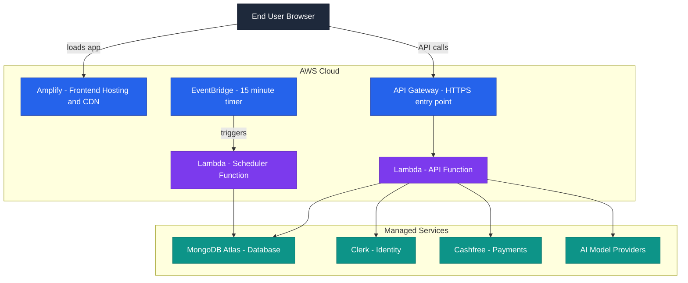
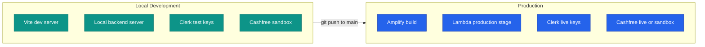
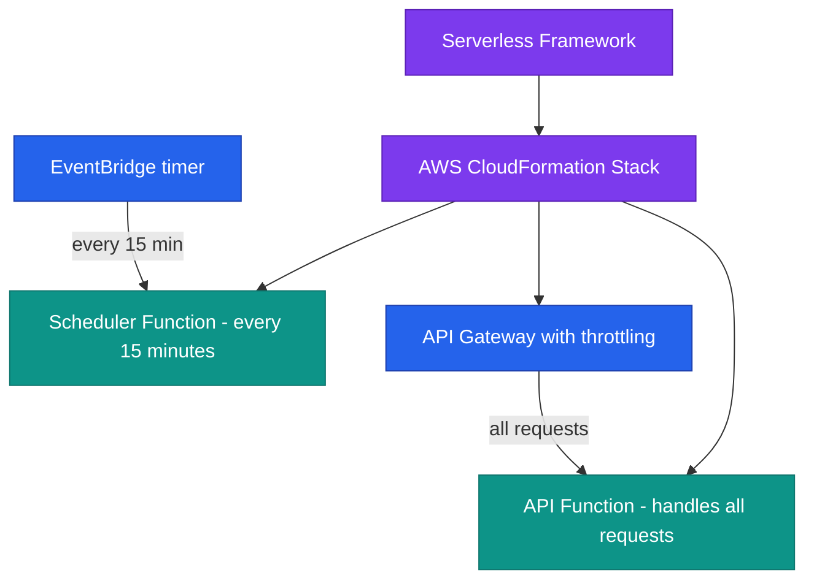
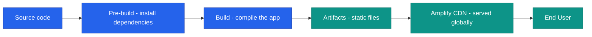
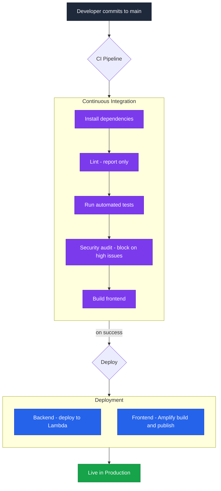
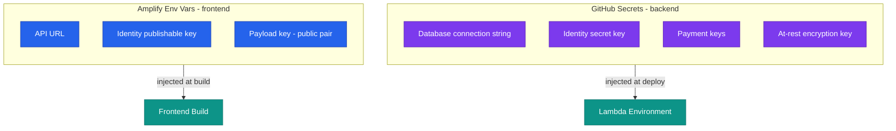
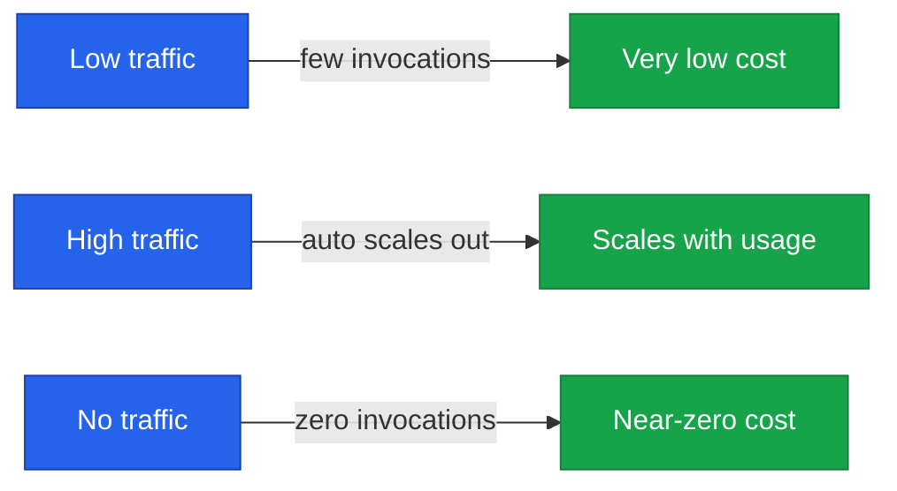
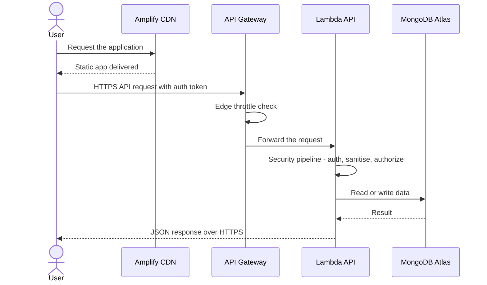

<!--
  Render note: diagrams use Mermaid. View in VS Code preview (Ctrl+Shift+V) with
  the "Markdown Preview Mermaid Support" extension, or in GitHub/GitLab/Notion.
  Diagram style is parser-safe: no line-break tags, no emoji, no semicolons in
  labels, no nested subgraphs, no cylinder shapes.
-->

# Querify — Deployment and Infrastructure Architecture

**Natural-Language Analytics Platform**

| | |
|---|---|
| **Document** | Deployment and Infrastructure Architecture |
| **Owner** | Engineering / DevOps |
| **Version** | 2.0 (Comprehensive Edition) |
| **Status** | Pre-Launch Baseline |
| **Date** | 27 June 2026 |
| **Classification** | Confidential — Internal |
| **Audience** | Executives, engineers, operations, technical partners |

---

## How to Read This Document

Each section is layered: **In plain words** (anyone), **The detail** (engineers), **Why it matters** (the consequence). Terms are defined on first use and collected in the [Glossary](#11-glossary).

---

## Table of Contents

1. [Executive Summary](#1-executive-summary)
2. [Key Concepts in Plain Words](#2-key-concepts-in-plain-words)
3. [Infrastructure Overview](#3-infrastructure-overview)
4. [Environments](#4-environments)
5. [The Backend on Serverless](#5-the-backend-on-serverless)
6. [The Frontend on Amplify](#6-the-frontend-on-amplify)
7. [CI/CD Pipeline — Commit to Production](#7-cicd-pipeline--commit-to-production)
8. [Configuration and Secrets](#8-configuration-and-secrets)
9. [Scaling, Availability and Cost](#9-scaling-availability-and-cost)
10. [Network and Traffic Flow](#10-network-and-traffic-flow)
11. [Glossary](#11-glossary)

---

## 1. Executive Summary

**In plain words.** Querify runs entirely on rented, fully-managed cloud services. There are no physical or virtual servers that the team has to set up, patch, or babysit. The product is delivered in two halves: the part that runs in the browser is hosted and served worldwide, and the behind-the-scenes program runs on demand in the cloud and only costs money while it is actually working.

**The detail.** The platform is split into two independently deployed halves:

- The **frontend** is hosted on **AWS Amplify**, which builds it from source code and serves it on a global content delivery network (CDN).
- The **backend** runs on **AWS Lambda** behind **API Gateway**, deployed through the **Serverless Framework**. It scales automatically from zero to peak demand and bills only for the compute it actually uses.

The **application database** is **MongoDB Atlas** (a managed database service). Identity is handled by **Clerk** and payments by **Cashfree**, both managed software-as-a-service providers.

**Why it matters.**

| Benefit | Explanation |
|---|---|
| No maintenance burden | The cloud provider patches and runs the underlying machines |
| No fixed server cost | You pay per use, not for idle capacity |
| Automatic scaling | Traffic spikes are handled without manual intervention |
| Faster, cheaper, safer | Less to operate means fewer things to break and less to secure |

> **Executive takeaway:** The infrastructure is fully managed and pay-per-use. There is no fixed server cost, no capacity planning, and no patching burden. It scales automatically with demand.

---

## 2. Key Concepts in Plain Words

| Concept | Plain-words explanation | Everyday analogy |
|---|---|---|
| **Cloud / AWS** | Renting computing power from Amazon instead of owning machines | Renting a hall for an event instead of building one |
| **Serverless (Lambda)** | Your code runs on demand; you never manage a server | A taxi that appears when you need it and is gone (and unpaid) when you do not |
| **CDN** | A network of servers worldwide that serve your app from the location nearest each user | Local warehouses so deliveries arrive faster |
| **CI/CD** | Automated checking and shipping of code changes | A factory line with quality control that packages and ships automatically |
| **Environment** | A separate copy of the system (for example, for development versus the real thing) | A rehearsal stage versus the opening-night stage |

---

## 3. Infrastructure Overview

**In plain words.** A user's browser loads the app from a worldwide delivery network, then talks to a secure cloud entry point that passes requests to on-demand code, which reads and writes the database and talks to the outside services.

**The detail.**

| Component | Service | Purpose |
|---|---|---|
| Frontend hosting | AWS Amplify | Builds and serves the browser app on a CDN |
| API entry point | AWS API Gateway | Public HTTPS endpoint with edge rate limiting |
| API compute | AWS Lambda | Runs the backend on demand |
| Background jobs | AWS Lambda + EventBridge | Scheduled reports and alerts every 15 minutes |
| Database | MongoDB Atlas | Application system of record |
| Identity | Clerk | Login, sessions, single sign-on |
| Payments | Cashfree | Subscription checkout |

**Why it matters.** Every box is a managed service with its own reliability guarantees. The team operates the *application*, not the *infrastructure* underneath it.

---

## 4. Environments

**In plain words.** An environment is a complete copy of the system. Today there is the developer's local copy (on their own machine) and the real production copy that customers use.

**The detail.**

| Aspect | Local Development | Production |
|---|---|---|
| Frontend | Vite dev server on the developer's machine | Amplify-built static site on a CDN |
| Backend | A local Node process | AWS Lambda (production stage) |
| Database | MongoDB Atlas (a staging database) | MongoDB Atlas (the production database) |
| Identity | Clerk test instance | Clerk live instance |
| Payments | Cashfree sandbox | Cashfree (sandbox or live) |
| Secrets | Local files that are never committed | GitHub Secrets and Amplify variables |

**Why it matters.** Developers can experiment safely on their own machine without touching real customer data or money.

> **Recommendation (tracked in the Tech Debt Register):** There is currently one deployed environment (production). Adding a dedicated **staging** environment — a production-like copy for final checks before release — is the single highest-value reliability improvement.

---

## 5. The Backend on Serverless

**In plain words.** The backend is shipped as two small programs that the cloud runs only when needed: one answers user requests, the other wakes up every 15 minutes to do background chores.

**The detail — two functions.**

| Function | Trigger | Responsibility |
|---|---|---|
| **API** | Every HTTP request via API Gateway | Serves the entire REST API |
| **Scheduler** | EventBridge timer, every 15 minutes | Runs due scheduled queries, evaluates alerts, processes the billing lifecycle, prunes old traces |

**Resource profile (from the deployment configuration):**

| Setting | API Function | Scheduler Function |
|---|---|---|
| Memory | 1024 MB | 512 MB |
| Timeout | 30 seconds | 120 seconds |
| Runtime | Node.js 20 | Node.js 20 |
| Region | us-east-1 | us-east-1 |

**Edge protection.** API Gateway applies a request throttle (about 50 requests per second sustained, 100 burst) as an outer wall before traffic ever reaches the Lambda. This bounds cost and blunts floods.

**Why it matters.** Splitting the always-responsive API from the periodic background worker means a heavy scheduled job can never slow down a user's live request — they run in separate functions with separate resources.

> **What is a "CloudFormation stack"?** It is AWS's record of everything your deployment created (the functions, the gateway, the timer). Because it is one managed unit, the whole deployment can be updated or rolled back together.

---

## 6. The Frontend on Amplify

**In plain words.** The part of the app you see is just a set of pre-built files. Amplify takes the source code, builds those files, and serves them from locations around the world so the app loads quickly everywhere.

**The detail.** The frontend is a **static single-page application**. Amplify installs dependencies, runs the production build, and publishes the compiled files to a global CDN. Build-time configuration (such as the API URL and the public identity key) is injected as **Amplify environment variables** during the build.

**Why it matters.** Because the frontend is static files with no server logic, there is no server to attack or maintain on the frontend at all. It is fast, cheap, and inherently more secure.

---

## 7. CI/CD Pipeline — Commit to Production

**In plain words.** When a developer finishes a change, an automated assembly line checks it (does it work, is it safe) and, if everything passes, ships it to customers — with no manual steps that could be forgotten.

**The detail.**

| Stage | What it does | Blocks deploy on failure |
|---|---|---|
| Install | Installs dependencies cleanly | Yes |
| Lint | Reports code-style issues | No (report-only while a backlog is cleared) |
| Test | Runs the automated test suite | Yes |
| Security audit | Fails on known high/critical vulnerabilities, with a documented exemption for the one unfixable spreadsheet-parser advisory | Yes |
| Build | Compiles the production frontend | Yes |
| Deploy backend | Serverless Framework pushes to Lambda | — |
| Deploy frontend | Amplify builds and publishes | — |

**Why it matters.** Tests and the security audit are hard gates: a change that breaks tests or introduces a serious vulnerability physically cannot reach production. This removes human error from the release process.

---

## 8. Configuration and Secrets

**In plain words.** Passwords and secret keys are never written into the code. They live in two secure lockboxes — one for the backend, one for the frontend — and are handed to the app only at the moment it is built or run.

**The detail.**

| Location | Holds | Reaches |
|---|---|---|
| **GitHub Secrets** | Server-only secrets (database string, identity secret, payment secret, encryption key) | The Lambda environment at deploy time |
| **Amplify Env Vars** | Browser-safe build values (API URL, publishable keys) | Compiled into the frontend bundle |

**The golden rule.** Anything destined for the browser is public by design and goes in Amplify. Anything genuinely secret stays server-side in GitHub Secrets. Two encryption keys must match across the two halves; these are documented in the Security Architecture.

**Why it matters.** If secrets lived in the code, anyone with the code (or a leaked copy) would have the keys to everything. Keeping them in managed secret stores means the code can be shared safely and secrets can be rotated without code changes.

> **Edge case — the at-rest encryption key.** This particular key protects stored database credentials. It must be preserved carefully: if it were lost, those stored credentials could not be decrypted. It is therefore treated as a long-lived, critical asset and is not rotated casually.

---

## 9. Scaling, Availability and Cost

**In plain words.** When more people use the app, it automatically grows to handle them. When no one is using it, it costs almost nothing. There is no manual "add more servers" step.

**The detail.**

| Dimension | Behaviour |
|---|---|
| Scaling | Lambda scales automatically per request; the CDN scales globally with no action |
| Availability | Managed services (Lambda, Amplify, Atlas, Clerk, Cashfree) each carry their own provider reliability guarantees |
| Cost model | Pay-per-use: Lambda per invocation, Amplify per build and bandwidth, Atlas per cluster tier |
| Cold starts | A lightweight keep-alive routine reduces the occasional slow first response after idle |
| Idle cost | Near zero — there are no always-on servers |

**Why it matters.** The cost of the platform tracks its usage. Early on, when usage is low, the bill is small. As the customer base grows, capacity grows automatically and cost grows in step with revenue — not ahead of it.

> **What is a "cold start"?** When a serverless function has not run recently, the very first request has to wait a moment while the cloud "wakes it up." A small keep-alive routine pings the function periodically to keep it warm, reducing this delay.

---

## 10. Network and Traffic Flow

**In plain words.** Everything travels over secure (encrypted) connections. The user loads the app from the nearest CDN location, then sends requests through a guarded gateway that checks for floods before passing them to the backend, which enforces all its security checks before touching the database.

**The detail.** All traffic is **HTTPS end to end**. The user loads the static app from the CDN, then communicates with the backend through API Gateway, which throttles at the edge before forwarding to the Lambda function. The Lambda enforces the full security pipeline (described in the Security Architecture) before touching the database.

**Why it matters.** There are multiple guards between the public internet and the data: encryption in transit, an edge throttle, and the backend security pipeline. An attacker has to get past all of them, not just one.

---

## 11. Glossary

| Term | Plain-words definition |
|---|---|
| **AWS** | Amazon Web Services — the cloud provider the platform runs on |
| **Lambda** | Cloud code that runs on demand without a managed server |
| **API Gateway** | The guarded front door that all backend requests pass through |
| **Amplify** | The AWS service that builds and hosts the frontend |
| **CDN** | Content Delivery Network — worldwide servers that deliver the app quickly |
| **Serverless Framework** | The tool that packages and deploys the backend to Lambda |
| **CloudFormation stack** | AWS's single record of everything a deployment created |
| **EventBridge** | The AWS timer service that triggers the scheduler every 15 minutes |
| **MongoDB Atlas** | The managed database service that stores application data |
| **CI/CD** | Continuous Integration / Continuous Delivery — automated testing and shipping |
| **Environment** | A complete, separate copy of the system (local, staging, production) |
| **Cold start** | The brief delay when a serverless function runs for the first time after being idle |
| **HTTPS / TLS** | Encrypted, secure communication over the internet |
| **Secret** | A sensitive value (password, key) kept out of the code in a secure store |

---

---

**Querify — Deployment and Infrastructure Architecture v2.0 (Comprehensive Edition)**
Confidential — Internal Use Only · © 2026 Querify

