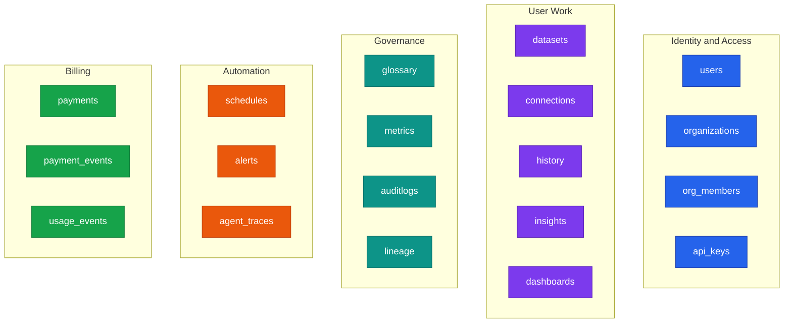
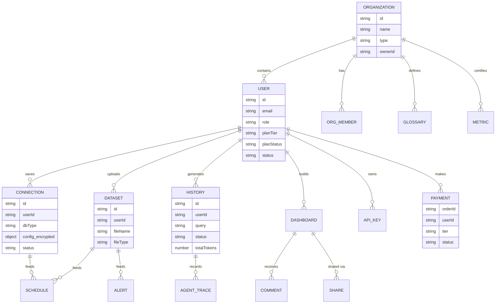
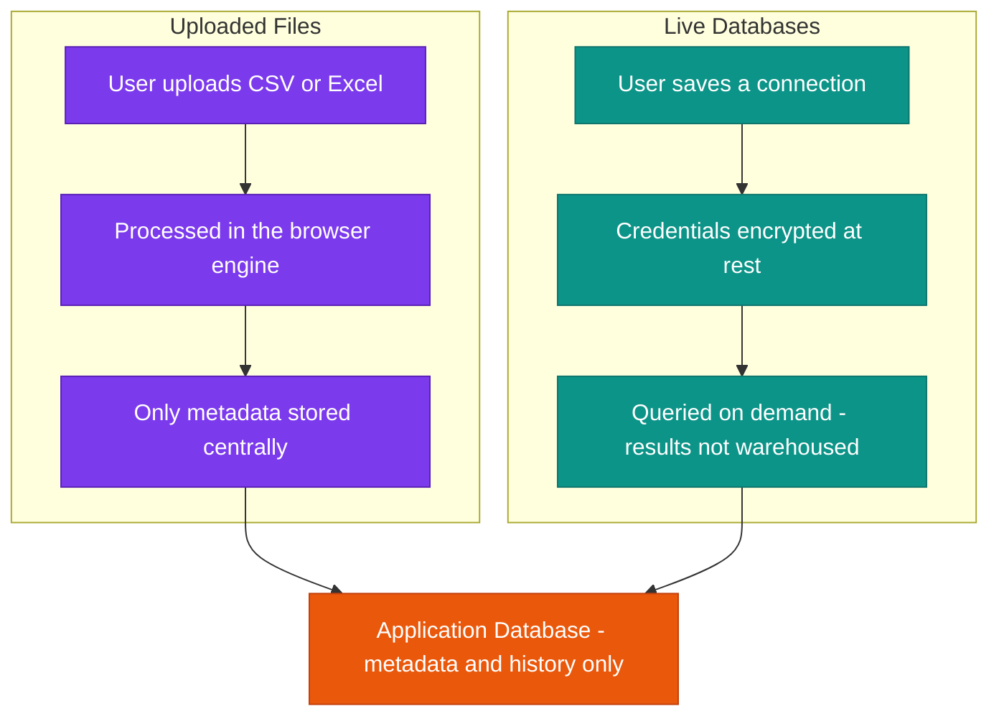
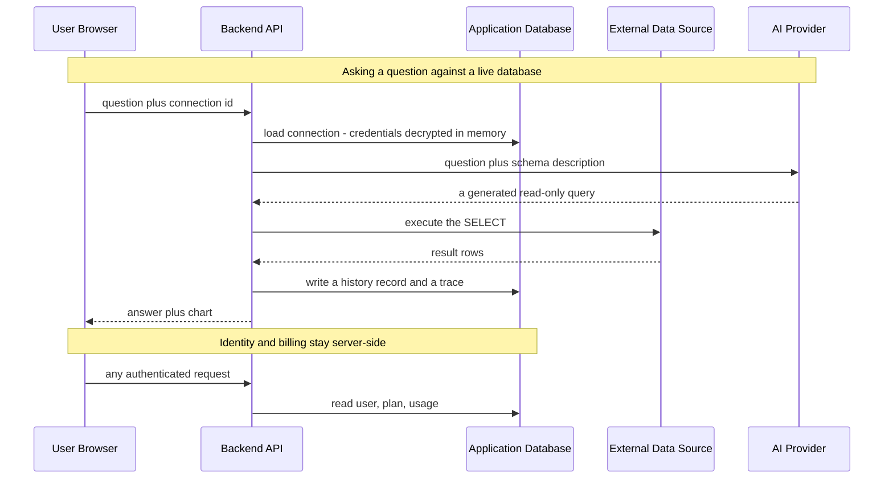
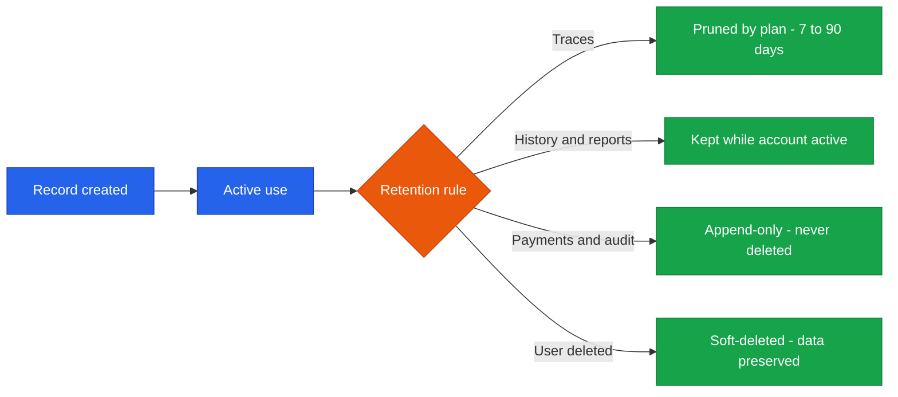
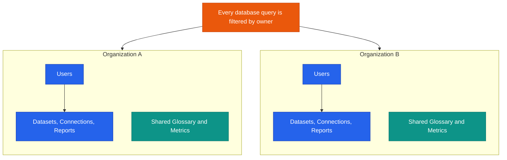

<!--
  Render note: diagrams use Mermaid. View in VS Code preview (Ctrl+Shift+V) with
  the "Markdown Preview Mermaid Support" extension, or in GitHub/GitLab/Notion.
  Diagram style is parser-safe: no line-break tags, no emoji, no semicolons in
  labels, no nested subgraphs, no cylinder shapes.
-->

# Querify — Data Architecture

**Natural-Language Analytics Platform**

| | |
|---|---|
| **Document** | Data Architecture |
| **Owner** | Engineering / Data |
| **Version** | 2.0 (Comprehensive Edition) |
| **Status** | Pre-Launch Baseline |
| **Date** | 27 June 2026 |
| **Classification** | Confidential — Internal |
| **Audience** | Executives, engineers, data and compliance reviewers |

---

## How to Read This Document

Each section gives **In plain words** (anyone), **The detail** (engineers and data reviewers), and **Why it matters** (the practical or compliance consequence). Terms are defined on first use and gathered in the [Glossary](#10-glossary).

---

## Table of Contents

1. [Executive Summary](#1-executive-summary)
2. [Key Concepts in Plain Words](#2-key-concepts-in-plain-words)
3. [Data Storage Model](#3-data-storage-model)
4. [Core Entities and Relationships](#4-core-entities-and-relationships)
5. [Data Domains](#5-data-domains)
6. [Where Customer Data Lives](#6-where-customer-data-lives)
7. [Data Flow Between Systems](#7-data-flow-between-systems)
8. [Data Retention and Lifecycle](#8-data-retention-and-lifecycle)
9. [Multi-Tenancy and Isolation](#9-multi-tenancy-and-isolation)
10. [Glossary](#10-glossary)

---

## 1. Executive Summary

**In plain words.** Querify keeps its records in a managed cloud database. Importantly, it is built to store as *little* of the customer's actual data as possible. Spreadsheets are crunched on the user's own device, and live databases are queried only when needed — Querify does not hoard copies. What it does keep is the operational record: who the users are, their plans, their saved connections (with passwords encrypted), their past questions, and the reports they have built.

**The detail.** Data lives in **MongoDB Atlas**, a managed document database. Instead of rigid tables, it stores flexible records grouped into **collections** (the document-database equivalent of tables). A central design principle is **data minimisation**: uploaded spreadsheets are processed in the user's browser, and live database results are not permanently warehoused.

**Why it matters.**

| Principle | Business consequence |
|---|---|
| Store less customer data | Smaller breach exposure; simpler compliance |
| Process data in place | The customer keeps control of their own data |
| Keep only the operational record | Lower storage cost; clearer data-handling story |

> **Executive takeaway:** Querify is a thin, governed layer over the customer's own data. It remembers *what was asked and built*, not large copies of the customer's underlying data.

---

## 2. Key Concepts in Plain Words

| Concept | Plain-words explanation | Everyday analogy |
|---|---|---|
| **Database** | The organised store of all the app's records | A very large, well-indexed filing cabinet |
| **Collection** | A group of similar records (all users, all reports) | One labelled drawer in the cabinet |
| **Document / record** | One entry (one user, one report) | One file folder in the drawer |
| **Entity relationship** | How records connect (a user owns many reports) | A family tree showing who belongs to whom |
| **Data minimisation** | Keeping as little personal/customer data as possible | Photographing a document and returning the original, rather than keeping it |
| **Multi-tenancy** | Many customers sharing one system, fully separated | Apartments in one building — shared structure, private homes |

---

## 3. Data Storage Model

**In plain words.** All records are organised into themed groups. There is no single giant table; each kind of thing (users, datasets, payments) has its own tidy drawer.

**The detail.** The database is organised into five logical domains (identity, user work, governance, automation, billing), each containing focused collections. Documents within a collection share a shape but, being a document database, can flex as the product evolves.

**Why it matters.** Clear grouping makes the data understandable and keeps unrelated concerns apart — billing records never get tangled with governance records.

---

## 4. Core Entities and Relationships

**In plain words.** This diagram is a family tree of the data. It shows that an organisation contains users, and each user owns things like datasets, connections, reports, and payments.

**The detail — how to read an entity-relationship diagram.** Each box is a record type; the lines show relationships. The branching "crow's-foot" end marks the "many" side. So "ORGANIZATION contains many USERS" and "USER uploads many DATASETS."

**Why it matters.** This map shows that almost everything hangs off a **user**, who belongs to an **organization**. That ownership chain is exactly what the security model uses to keep each customer's data separate (see section 9).

> **Note on the connection record.** Notice `config_encrypted` on the CONNECTION entity. A customer's database credentials are stored in encrypted form, never plain text — see the Security Architecture for the encryption detail.

---

## 5. Data Domains

**In plain words.** Here is what each group of records is for, in everyday terms.

| Domain | Collections | What it holds |
|---|---|---|
| **Identity and Access** | users, organizations, org_members, api_keys | Who the users are, which organisation they belong to, their roles, and programmatic keys |
| **User Work** | datasets, connections, history, insights, dashboards | Uploaded-file metadata, saved database connections, past questions, saved answers, and reports |
| **Governance** | glossary, metrics, auditlogs, lineage | Shared business definitions, certified metrics, an audit trail, and data-lineage links |
| **Automation** | schedules, alerts, schedule_runs, agent_traces | Recurring queries, threshold alerts, run logs, and agent reasoning traces |
| **Billing** | payments, payment_events, usage_events, daily_token_logs | Subscription ledger, payment events, usage metering, and daily token usage |
| **Collaboration** | comments, shares, notifications | Comments, shareable links, and in-app notifications |
| **Deployments** | deployments, deployment_token_logs | Published public chat apps and their usage budgets |

**Why it matters.** Each domain maps to a product capability. When a feature changes, it is clear which records are affected.

---

## 6. Where Customer Data Lives

**In plain words.** This is the most important idea in the whole document. Customer *content* is handled differently depending on where it comes from. Uploaded files are crunched on the user's device and not stored wholesale. Live databases stay with the customer; Querify queries them on demand and does not keep the results.

**The detail.**

| Source | Where the actual data is processed | What Querify stores |
|---|---|---|
| **Uploaded file** | The user's browser (in-browser engine) | File metadata, a schema summary, and query history — the heavy data stays client-side where possible |
| **Live database** | The customer's own database, queried on demand | The connection details (credentials encrypted), the query that ran, and that run's result |

**Why it matters — the governance payoff.** Querify is **not a data warehouse**. It does not accumulate large copies of customer data. This materially reduces breach exposure and simplifies data-protection compliance (for regimes such as GDPR or similar), because there is simply far less sensitive data sitting in one place.

> **Worked example.** A hospital connects a patient-statistics database and asks for monthly admission trends. Querify generates a read-only query, runs it against the hospital's own database, returns the monthly totals, and stores only the question and that summary result. The underlying patient records never leave the hospital's database.

---

## 7. Data Flow Between Systems

**In plain words.** Three kinds of information move around: the operational records (users, plans), the customer's content (which passes through briefly and is not hoarded), and the context sent to the AI (just the question and a description of the data shape — not the bulk data).

**The detail.**

| Category | What moves | Stored long term |
|---|---|---|
| Operational data | Users, plans, history | Yes (the application database) |
| Customer content | Rows from the customer's source, in transit | No — passes through to produce the answer |
| AI context | The question plus a schema description | The question is kept in history; the bulk data is not sent |

**Why it matters.** The bulk of a customer's data is never sent to the AI provider and never warehoused by Querify. Only a description of the data's structure plus the question is shared with the AI, which is enough for it to generate a query.

---

## 8. Data Retention and Lifecycle

**In plain words.** Different records are kept for different lengths of time. Some are pruned automatically, some are kept while the account is active, and a few (money and audit records) are kept permanently and never edited.

**The detail.**

| Data type | Retention policy |
|---|---|
| Agent traces | Automatically pruned by plan tier (7 / 30 / 90 days; unlimited on Enterprise) |
| Query history and reports | Retained while the account is active |
| Payments and payment events | Append-only ledger — never deleted (audit and reconciliation) |
| Audit logs | Append-only |
| Deleted connections and datasets | Soft-deleted (flagged, not physically removed) so nothing is lost by accident |
| Deleted user | Soft-deleted; data preserved per the identity webhook handler |

**Why it matters.** Automatic pruning of traces keeps storage lean and respects privacy. Append-only money and audit records mean there is always a trustworthy, tamper-resistant history for finance and compliance.

> **What is "soft delete"?** Instead of erasing a record, the system marks it as deleted. It disappears from normal views but can be recovered if a deletion was a mistake. This prevents accidental, irreversible data loss.

---

## 9. Multi-Tenancy and Isolation

**In plain words.** Many customers use the same system, but each one's data is walled off from the others. Every time the system fetches data, it filters by who is asking, so one customer can never see another's information.

**The detail.**

| Scope | Rule |
|---|---|
| **User-scoped** | Datasets, connections, history, and reports are filtered by the owner's user identity on every read and write |
| **Organization-scoped** | Glossary and certified metrics are shared among members of the same organisation |
| **Cross-tenant** | No cross-tenant access is possible by design — every query carries the owner filter |

**Why it matters.** This is the foundation of customer trust in a shared (multi-tenant) system. It was specifically verified during the security review: the classic "change the ID in the request to see someone else's data" attack does not work, because every query is owner-filtered.

> **Worked example.** User A and User B both have a dataset numbered 42 in their own accounts. If User A tries to open dataset 42, the system fetches "dataset 42 owned by User A." If User A somehow asked for User B's dataset, the owner filter would simply return nothing — there is no path to another tenant's data.

---

## 10. Glossary

| Term | Plain-words definition |
|---|---|
| **Database** | The organised store of all application records |
| **Collection** | A group of similar records (the document-database version of a table) |
| **Document / record** | A single entry, such as one user or one report |
| **Schema** | The shape or structure of data (which fields exist) |
| **Entity-relationship diagram** | A map showing record types and how they connect |
| **Multi-tenancy** | One system serving many customers, kept separate |
| **Data minimisation** | Storing as little personal/customer data as possible |
| **Soft delete** | Marking a record as deleted instead of erasing it |
| **Append-only** | Records that can be added to but never changed or removed |
| **Retention** | How long a type of data is kept before it is removed |
| **Encryption at rest** | Scrambling stored data so it is unreadable without the key |
| **Owner filter** | A condition on every query that limits results to the requester's own data |

---

---

**Querify — Data Architecture v2.0 (Comprehensive Edition)**
Confidential — Internal Use Only · © 2026 Querify

