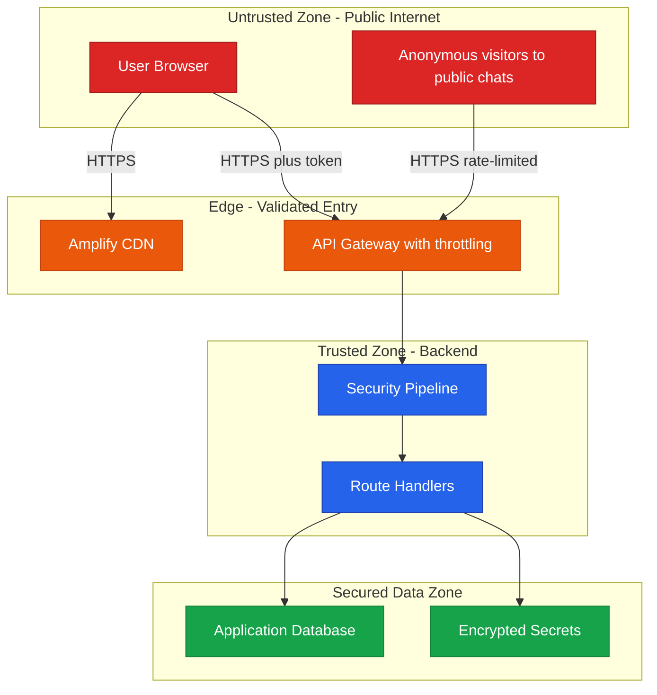
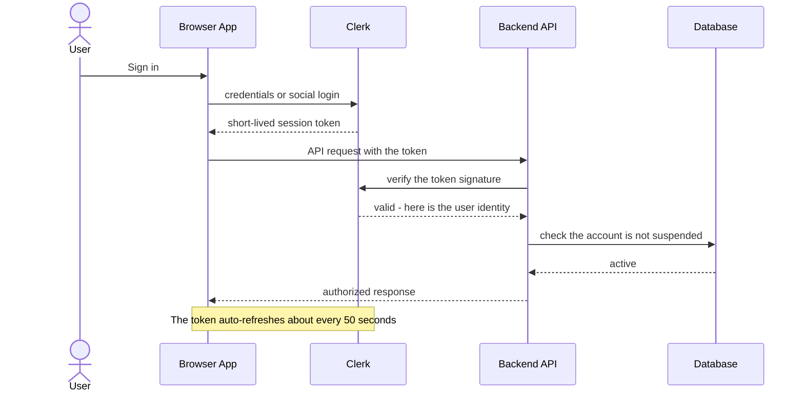
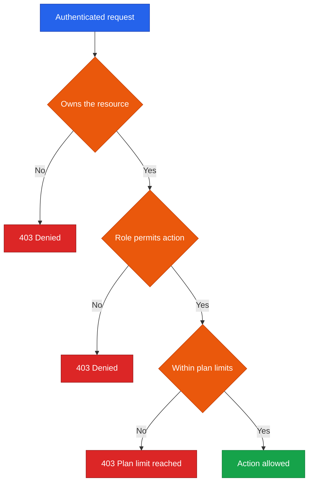
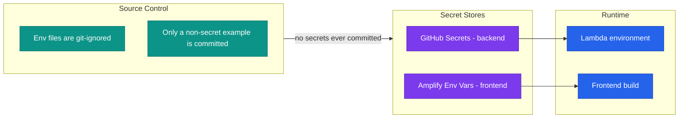
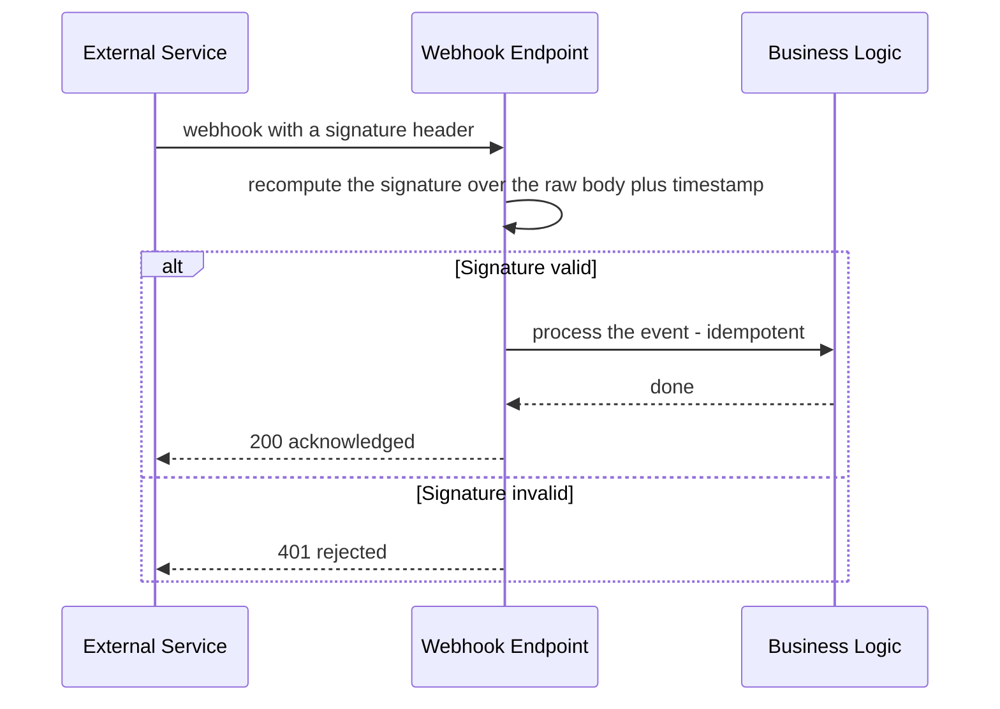
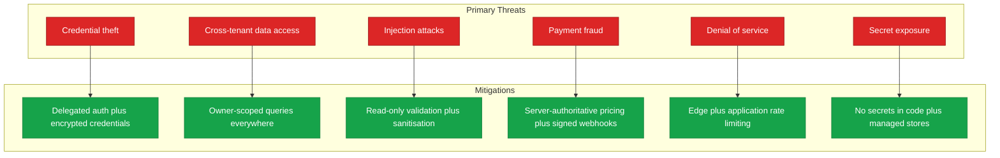

<!--
  Render note: diagrams use Mermaid. View in VS Code preview (Ctrl+Shift+V) with
  the "Markdown Preview Mermaid Support" extension, or in GitHub/GitLab/Notion.
  Diagram style is parser-safe: no line-break tags, no emoji, no semicolons in
  labels, no nested subgraphs, no cylinder shapes.
-->

# Querify — Security Architecture

**Natural-Language Analytics Platform**

| | |
|---|---|
| **Document** | Security Architecture |
| **Owner** | Engineering / Security |
| **Version** | 2.0 (Comprehensive Edition) |
| **Status** | Pre-Launch Baseline |
| **Date** | 27 June 2026 |
| **Classification** | Confidential — Internal |
| **Audience** | Executives, engineers, security reviewers, prospective customers' security teams |

---

## How to Read This Document

Every section is layered: **In plain words** (anyone), **The detail** (security and engineering), **Why it matters** (the risk addressed). Terms are defined on first use and collected in the [Glossary](#12-glossary).

---

## Table of Contents

1. [Executive Summary](#1-executive-summary)
2. [Key Concepts in Plain Words](#2-key-concepts-in-plain-words)
3. [Trust Boundaries](#3-trust-boundaries)
4. [Authentication Model](#4-authentication-model)
5. [Authorization and Access Control](#5-authorization-and-access-control)
6. [The Request Security Pipeline](#6-the-request-security-pipeline)
7. [Encryption](#7-encryption)
8. [Secrets Management](#8-secrets-management)
9. [Webhook Security](#9-webhook-security)
10. [Threat Model](#10-threat-model)
11. [Security Controls Summary](#11-security-controls-summary)
12. [Glossary](#12-glossary)

---

## 1. Executive Summary

**In plain words.** Security in Querify is built in many layers, like a building with a perimeter fence, locked doors, ID checks, and a safe — not a single lock on the front door. The platform does not store user passwords at all (a specialist provider handles login). Sensitive items like customers' database passwords are scrambled (encrypted) so they are useless if stolen. Messages from payment and login providers are checked for a valid signature before they are trusted.

**The detail.** Identity is delegated to **Clerk**, so the platform never stores passwords. Every backend request passes through a fixed pipeline of security checks. The credentials for customers' own databases are **encrypted at rest** with strong, server-only keys. Payment and identity webhooks are **cryptographically verified** before they are acted on. A full pre-launch security review was conducted across authentication, injection, secrets, API security, data protection, dependencies, and infrastructure; findings were remediated or documented.

**Why it matters.**

| Principle | Consequence |
|---|---|
| Defence in depth | No single failure exposes customer data |
| No stored passwords | A whole category of breach risk is removed |
| Encrypted credentials | A database leak does not yield usable secrets |
| Verified webhooks | Forged "you got paid" messages are rejected |

> **Executive takeaway:** The platform follows defence-in-depth. Identity, authorization, input cleaning, encryption, and rate limiting each provide an independent layer of protection.

---

## 2. Key Concepts in Plain Words

| Concept | Plain-words explanation | Everyday analogy |
|---|---|---|
| **Authentication** | Proving who you are | Showing your passport at the airport |
| **Authorization** | What you are allowed to do once inside | Your boarding pass only lets you on your flight |
| **Encryption** | Scrambling data so only the key-holder can read it | A locked diary; useless without the key |
| **Trust boundary** | A line where data must be checked before being trusted | The security checkpoint between the public area and the gates |
| **Injection attack** | Tricking a system by sneaking commands into input | Slipping fake instructions into a form |
| **Rate limiting** | Capping how often someone can act, to stop abuse | A turnstile that only lets so many people through per minute |
| **Webhook signature** | A tamper-proof stamp proving a message is genuine | A wax seal on a letter |

---

## 3. Trust Boundaries

**In plain words.** A trust boundary is a checkpoint. Data coming from the open internet is treated as untrusted until it has been verified. Querify has clear checkpoints between the public, the guarded edge, the backend, and the secured data.

**The detail.**

| Boundary | Crossing | Control |
|---|---|---|
| Internet to Edge | All traffic | HTTPS only; API Gateway throttling |
| Edge to Backend | API requests | Authentication, sanitisation, rate limiting |
| Backend to Data | Reads and writes | Owner-scoped queries; encrypted credentials |
| Backend to External data | Live database queries | Read-only query validation |

**Why it matters.** Knowing exactly where the checkpoints are means nothing slips from "untrusted" to "trusted" without being validated. Each boundary is an opportunity to stop an attack.

---

## 4. Authentication Model

**In plain words.** Querify does not keep your password. When you log in, a specialist service (Clerk) verifies you and hands the app a short-lived pass. The app checks that pass on every request. The pass expires quickly and renews automatically, so a stolen pass is only useful for a very short time.

**The detail.**

| Property | Detail |
|---|---|
| Provider | Clerk (email, Google, GitHub, single sign-on) |
| Passwords stored by Querify | None — delegated entirely to Clerk |
| Token lifetime | Short (about 60 seconds), auto-refreshed by the client |
| Verification | Every request verifies the token signature server-side |
| Suspended accounts | Blocked at the door even with a valid token (cached check) |
| Multi-factor | Available via Clerk; recommended to enforce for administrators |

**Why it matters.** Passwords are the most common cause of breaches. By never storing them and using short-lived passes, Querify removes a large attack surface. The suspended-account check means an administrator can revoke access immediately, even if the user is mid-session.

> **What is a "token"?** A token is a temporary, signed pass that proves you are logged in. It is like a wristband at an event: it shows you are allowed in, without you presenting your ID every single time.

---

## 5. Authorization and Access Control

**In plain words.** Logging in proves *who* you are. Authorization decides *what* you may do. Querify checks three things before any action: do you own this item, does your role allow this action, and are you within your plan's limits.

**The detail.**

| Layer | Rule |
|---|---|
| **Ownership** | Every data query is filtered by the requesting user's identity. User A cannot read User B's data by changing an ID in the request |
| **Roles** | Admin, analyst, viewer. Administrative actions require an admin role within the same organisation |
| **Organisation scope** | Admin actions are restricted to the admin's own organisation; no cross-organisation reach |
| **Plan limits** | Resource creation is checked against the plan's allowance before proceeding |

**Why it matters.** The most common serious web vulnerability is "broken object-level authorization" — being able to see someone else's data by guessing an ID. Querify's owner-filtering defends against exactly this, and it was explicitly verified across connections, datasets, reports, deployments, and admin routes during the security review.

> **Worked example.** An analyst at Company A tries to call the admin endpoint to change a user's role, supplying the ID of a user at Company B. The request is denied twice over: the analyst lacks the admin role, and even an admin's actions are scoped to their own organisation, so Company B's user is simply invisible to them.

---

## 6. The Request Security Pipeline

**In plain words.** Every request to the backend goes through the same security checkpoints, in the same order, before any real work happens. A developer cannot accidentally build a "back door" that skips them.

```mermaid
flowchart LR
    REQ[Incoming request] --> H[Security headers]
    H --> C[CORS allowlist check]
    C --> B[Body parsing with size limits]
    B --> S[Input sanitisation]
    S --> RL[Rate limiting]
    RL --> A[Authentication]
    A --> SUS[Suspended account check]
    SUS --> AUTHZ[Authorization and plan check]
    AUTHZ --> HANDLER[Route handler]

    classDef step fill:#7c3aed,stroke:#5b21b6,color:#fff
    classDef gate fill:#ea580c,stroke:#c2410c,color:#fff
    classDef ok fill:#16a34a,stroke:#15803d,color:#fff
    class H,C,B,S step
    class RL,A,SUS,AUTHZ gate
    class HANDLER ok
```

**The detail.**

| Stage | Protects against |
|---|---|
| Security headers | Clickjacking, content-type sniffing, protocol downgrade |
| CORS allowlist | Unauthorised cross-site use of the API (no wildcard origins) |
| Body size limits | Payload-based denial-of-service |
| Input sanitisation | Database-operator injection |
| Rate limiting | Brute force and floods (tighter limits on login) |
| Authentication | Unidentified access |
| Suspended check | Banned users with still-valid tokens |
| Authorization | Privilege escalation and cross-tenant access |

**Injection defences specifically:**

| Attack | Plain-words risk | Defence |
|---|---|---|
| SQL injection | Sneaking a destructive command into a query | A strict validator allows only read-only SELECT/WITH queries and blocks all write or schema-changing commands; multi-statement input is rejected |
| Database-operator injection | Tricking the database filter with special characters | A global sanitiser strips operator characters from all input |
| Cross-site scripting | Injecting malicious scripts into the page | The frontend escapes output by default; the API returns data, not HTML |

**Why it matters.** Because the pipeline is fixed and shared, security is structural, not dependent on each developer remembering to add checks. The read-only validator in particular means even a cleverly crafted question can never make the agent damage a customer's database.

---

## 7. Encryption

**In plain words.** Data is protected both while travelling (in transit) and while stored (at rest). All network traffic is encrypted. Customers' database passwords are scrambled with a strong key that lives only on the server, so even someone who copied the database could not read them.

```mermaid
flowchart TB
    subgraph TRANSIT[In Transit]
        direction TB
        T1[HTTPS everywhere using TLS]
        T2[HSTS header enforces HTTPS]
    end
    subgraph REST[At Rest]
        direction TB
        R1[Database connection credentials - AES-256-GCM]
        R2[API keys - hashed, shown once]
        R3[MongoDB Atlas storage encryption]
    end
    subgraph KEYS[Key Handling]
        direction TB
        K1[At-rest key is server-only - never sent to the browser]
        K2[Per-value random IV plus an authentication tag]
    end

    classDef transit fill:#2563eb,stroke:#1e40af,color:#fff
    classDef rest fill:#16a34a,stroke:#15803d,color:#fff
    classDef keys fill:#7c3aed,stroke:#5b21b6,color:#fff
    class T1,T2 transit
    class R1,R2,R3 rest
    class K1,K2 keys
```

**The detail.**

| Data | Protection |
|---|---|
| All network traffic | HTTPS/TLS end to end, with HSTS to enforce it |
| Customer database credentials | AES-256-GCM field encryption, server-only key, per-value random initialisation vector and authentication tag; tampering is detected |
| API keys | Stored only as one-way hashes; the plaintext key is shown exactly once at creation |
| Database storage | MongoDB Atlas encryption at rest |

**Why it matters.** Two independent layers protect credentials: the database's own at-rest encryption, plus Querify's field-level encryption on top. A leak of the raw database still yields only scrambled, useless credential values.

> **An honest note on the transport-obfuscation layer.** Querify has a separate lightweight layer that obfuscates request bodies, but it is deliberately *not* relied upon for confidentiality, because its key is shared with the browser. TLS is the real protection in transit; AES-256-GCM is the real protection at rest. The codebase documents this distinction plainly rather than overstating it.

---

## 8. Secrets Management

**In plain words.** Secret keys and passwords are never written into the code. They live in secure lockboxes and are handed to the app only when it runs. A scan of the entire project history confirmed no secrets were ever committed.

**The detail.**

| Practice | Status |
|---|---|
| Secrets in source code | None — verified across the full project history |
| Env files | Git-ignored; only a non-secret example template is committed |
| Backend secrets | GitHub Secrets, injected into Lambda at deploy |
| Frontend build values | Amplify environment variables (browser-safe only) |
| Production guardrail | The backend refuses to start in the cloud without its encryption keys set |

**Why it matters.** Leaked secrets in source code are one of the most common breach causes industry-wide. Querify's clean history and managed secret stores remove this risk, and the startup guardrail prevents a misconfigured deploy from running insecurely.

---

## 9. Webhook Security

**In plain words.** Outside services (payments, login) send Querify automatic messages — for example, "this customer just paid." Before acting on such a message, Querify checks a tamper-proof stamp to confirm it is genuine and not forged.

**The detail.**

| Webhook | Verification |
|---|---|
| Payment events (Cashfree) | Signature recomputed over the raw request body and timestamp; mismatches rejected |
| Identity events (Clerk) | Signature verified; replay attacks rejected by a timestamp window |

Both handlers verify against the **raw request body** (a subtle but critical detail — re-serialised data would fail verification). Payment processing is **idempotent**: a duplicate event can never double-charge or double-apply a plan.

**Why it matters.** Without signature verification, an attacker could send a fake "payment succeeded" message to unlock a paid plan for free. The signature check makes that impossible, and idempotency protects against accidental duplicate processing.

> **What is "idempotent"?** It means doing the same operation twice has the same result as doing it once. If the payment provider sends the "paid" message twice (which happens), the customer is upgraded once, not twice, and is never billed twice.

---

## 10. Threat Model

**In plain words.** A threat model lists the bad things that could happen and what stops each one. Here are the main threats to Querify and their defences.

**The detail.**

| Threat | Severity if unmitigated | Mitigation |
|---|---|---|
| Stolen database credentials | High | Encrypted at rest; decrypted only in memory at query time |
| User A reads User B's data | High | Every query filtered by owner; verified across routes |
| Malicious query via the agent | High | Strict read-only validator; no write or schema change possible |
| Paying a tiny amount for a premium plan | High | The server recomputes the price; the client cannot set the amount |
| Public chat quota abuse | Medium | Per-deployment daily budget plus an owner kill-switch |
| Forged payment or identity message | High | Cryptographic signature verification |
| Brute-forced login | Medium | Tight per-IP rate limit on authentication endpoints |

**Why it matters.** A documented threat model proves the team has thought adversarially — anticipating attacks rather than reacting to them. Each high-severity threat has a concrete, verified defence.

---

## 11. Security Controls Summary

| Domain | Control | Status |
|---|---|---|
| Authentication | Delegated to Clerk; no stored passwords | In place |
| Authorization | Role plus ownership plus organisation scope | In place |
| Suspended accounts | Blocked despite a valid token | In place |
| SQL injection | Read-only validator | In place |
| Operator injection | Global sanitiser | In place |
| Credentials at rest | AES-256-GCM | In place |
| API keys | Hashed, shown once | In place |
| Secrets | Managed stores; none in code | In place |
| Webhooks | Signature-verified, idempotent | In place |
| Transport | HTTPS plus HSTS | In place |
| Rate limiting | Edge plus per-route plus tight on auth | In place |
| Error handling | Generic messages on public endpoints | In place |
| Multi-factor (admin) | Available via Clerk | Recommended to enforce |
| Dedicated staging environment | Production-like pre-release checks | Recommended post-launch |

**Why it matters.** This single table is the at-a-glance security posture — useful for a customer's security questionnaire or an internal review. The two "recommended" rows are the honest, known next steps, not gaps being hidden.

---

## 12. Glossary

| Term | Plain-words definition |
|---|---|
| **Authentication** | Proving who you are |
| **Authorization** | Deciding what you are allowed to do |
| **Token** | A temporary, signed pass proving you are logged in |
| **Encryption at rest** | Scrambling stored data so it is unreadable without the key |
| **Encryption in transit (TLS)** | Securing data as it travels over the network |
| **HSTS** | A rule forcing browsers to always use secure connections |
| **AES-256-GCM** | A strong, modern encryption method that also detects tampering |
| **Hash** | A one-way scramble; used to store keys so the original cannot be recovered |
| **Injection attack** | Sneaking commands into input to trick a system |
| **Rate limiting** | Capping how often someone can act |
| **Webhook** | An automatic message one service sends another when an event happens |
| **Signature verification** | Checking a tamper-proof stamp to confirm a message is genuine |
| **Idempotent** | Running an operation twice has the same effect as once |
| **Multi-factor authentication** | Requiring a second proof of identity beyond a password |
| **Defence in depth** | Layering many independent protections |

---

---

**Querify — Security Architecture v2.0 (Comprehensive Edition)**
Confidential — Internal Use Only · © 2026 Querify

