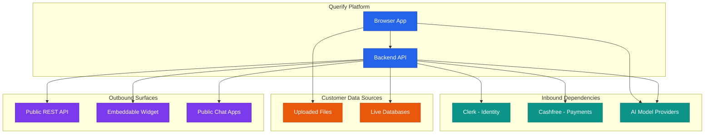
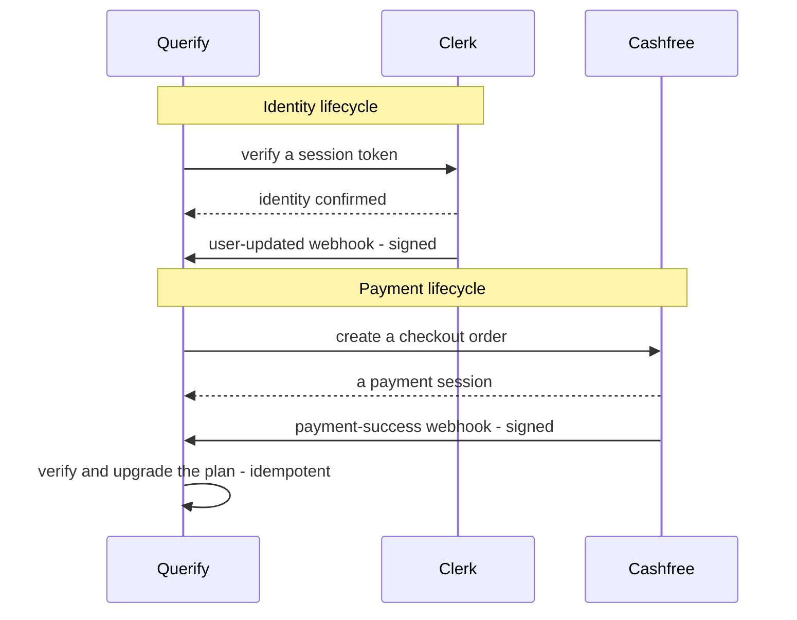
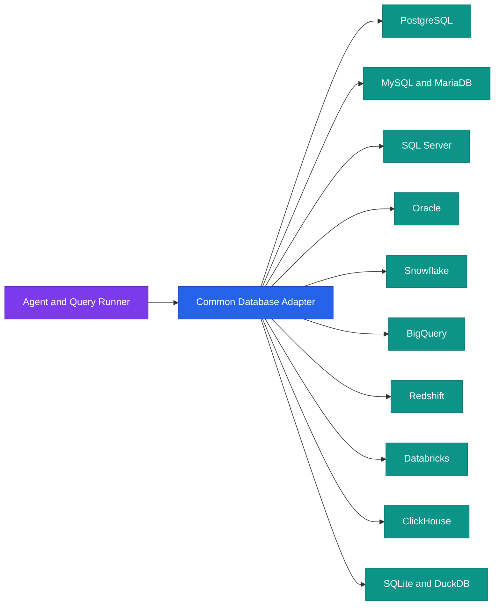
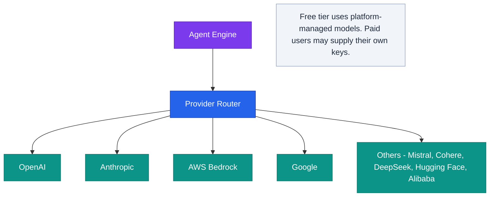
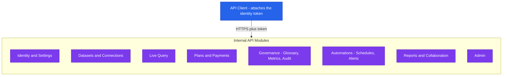
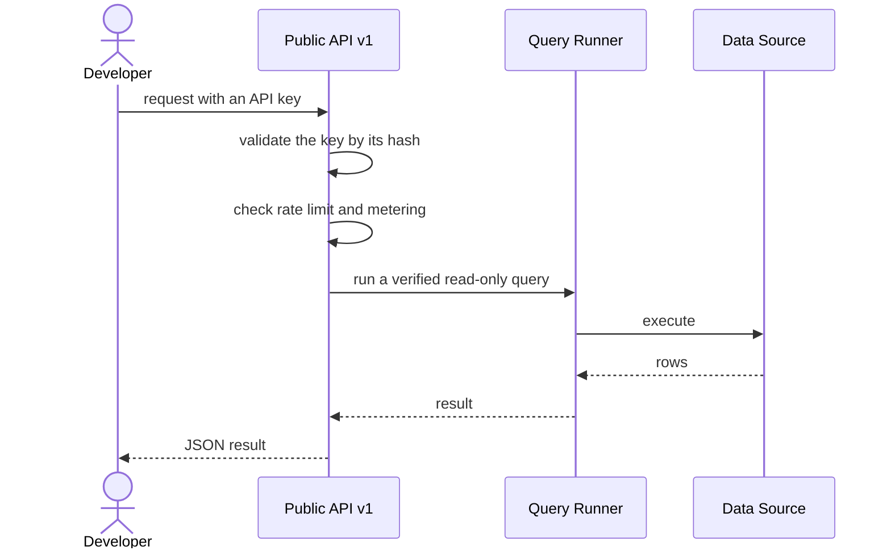
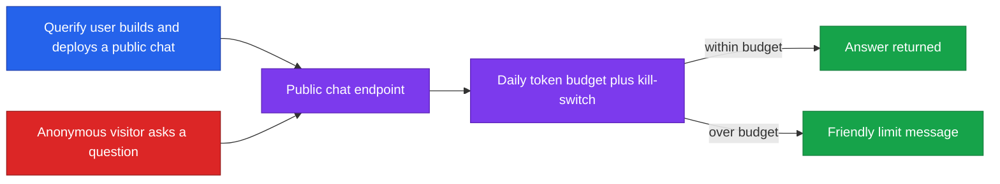
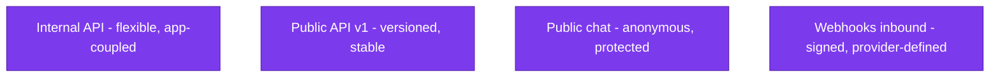

<!--
  Render note: diagrams use Mermaid. View in VS Code preview (Ctrl+Shift+V) with
  the "Markdown Preview Mermaid Support" extension, or in GitHub/GitLab/Notion.
  Diagram style is parser-safe: no line-break tags, no emoji, no semicolons in
  labels, no nested subgraphs, no cylinder shapes.
-->

# Querify — Integration and API Architecture

**Natural-Language Analytics Platform**

| | |
|---|---|
| **Document** | Integration and API Architecture |
| **Owner** | Engineering |
| **Version** | 2.0 (Comprehensive Edition) |
| **Status** | Pre-Launch Baseline |
| **Date** | 27 June 2026 |
| **Classification** | Confidential — Internal |
| **Audience** | Executives, engineers, integration partners, developers |

---

## How to Read This Document

Layered as usual: **In plain words** (anyone), **The detail** (engineers and partners), **Why it matters** (the practical value). Terms are defined on first use and gathered in the [Glossary](#11-glossary).

---

## Table of Contents

1. [Executive Summary](#1-executive-summary)
2. [Key Concepts in Plain Words](#2-key-concepts-in-plain-words)
3. [Integration Landscape](#3-integration-landscape)
4. [External Integrations](#4-external-integrations)
5. [Supported Data Sources](#5-supported-data-sources)
6. [AI Model Providers](#6-ai-model-providers)
7. [The Internal API](#7-the-internal-api)
8. [The Public Developer API](#8-the-public-developer-api)
9. [The Embeddable Widget](#9-the-embeddable-widget)
10. [API Contracts at a Glance](#10-api-contracts-at-a-glance)
11. [Glossary](#11-glossary)

---

## 1. Executive Summary

**In plain words.** Querify's value comes from connecting things: the customer's data, an AI model, and a friendly, governed experience. It both *relies on* outside services (for login, payments, and AI) and *offers* its own ways for others to plug in (a developer API, an embeddable chat widget, and shareable public chat apps).

**The detail.** Integrations run in two directions:

- **Inbound** — services Querify depends on: identity (Clerk), payments (Cashfree), and AI providers.
- **Outbound** — Querify's own surfaces that others build on: the internal API (used by the app), the public REST API (key-authenticated), and embeddable artifacts.

**Why it matters.** Querify is provider-agnostic where it counts. It supports a dozen database types and multiple AI providers behind common interfaces, so a new source or model can be added without re-architecting the system.

> **Executive takeaway:** Querify both consumes best-in-class services and exposes its own capabilities outward, multiplying its value and its potential channels (API, embeds, public apps).

---

## 2. Key Concepts in Plain Words

| Concept | Plain-words explanation | Everyday analogy |
|---|---|---|
| **Integration** | Two systems working together | Two companies agreeing to share a delivery service |
| **API** | A defined way for programs to talk to each other | A restaurant menu: a fixed list of what you can order and how |
| **Inbound vs outbound** | Services Querify uses vs surfaces Querify offers | Ingredients you buy in vs dishes you serve out |
| **Adapter / abstraction** | A common interface that hides vendor differences | A universal power adapter that fits any country's socket |
| **API key** | A secret password for programs (not people) | A keycard that opens specific doors |
| **Embed / widget** | A piece of Querify placed inside another website | A YouTube video embedded in a blog post |

---

## 3. Integration Landscape

**In plain words.** Querify sits in the middle, connecting the customer's data sources on one side, the services it depends on on another, and the surfaces it offers outward on a third.

**Why it matters.** This single picture explains the business model's reach: Querify is not a closed app — it is a hub with multiple ways to connect data in and push capability out.

---

## 4. External Integrations

**In plain words.** Querify leans on three specialist services so it does not have to build everything itself, and each one is connected securely.

**The detail.**

| Integration | Type | Purpose | Trust mechanism |
|---|---|---|---|
| **Clerk** | Identity (SaaS) | Login, sessions, single sign-on, user sync | Token signature verification; signed webhooks |
| **Cashfree** | Payments (SaaS) | Subscription checkout (INR) | Server-authoritative pricing; signed webhooks |
| **AI Providers** | Model APIs | Natural-language understanding and query generation | API keys (platform-managed or user-supplied) |
| **Customer Databases** | Data sources | Live querying | Encrypted credentials; read-only validation |

**Why it matters.** Building secure login and payments from scratch is expensive and risky. Delegating to specialists lets the team focus on the product's unique value — natural-language analytics — while still meeting a high security bar.

---

## 5. Supported Data Sources

**In plain words.** Querify can connect to many kinds of databases, plus uploaded files. The rest of the system does not need to know which kind it is talking to, thanks to a common "translator" layer.

**The detail.**

| Category | Supported types |
|---|---|
| Cloud warehouses | Snowflake, BigQuery, Redshift, Databricks |
| Relational | PostgreSQL, MySQL, MariaDB, SQL Server, Oracle |
| Analytical and local | ClickHouse, SQLite, DuckDB |
| Files | CSV, Excel (processed in the browser) |

All live queries are **read-only by enforcement** — the validator permits only SELECT/WITH and blocks every write or schema-changing operation.

**Why it matters.** Broad source support widens the addressable market: almost any organisation can connect the database it already has. The common adapter means adding the next database type is a contained change, not a rewrite.

> **What is an "adapter"?** Different databases speak slightly different dialects. An adapter is a translator that lets the rest of Querify issue one kind of request and have it work everywhere — like a travel adapter that lets one charger work in any country.

---

## 6. AI Model Providers

**In plain words.** Querify is not tied to a single AI company. It can route requests to whichever model is best or most cost-effective, and paid users can even bring their own AI account.

**The detail.**

| Aspect | Detail |
|---|---|
| Providers | OpenAI, Anthropic, AWS Bedrock, Google, Mistral, Cohere, DeepSeek, Hugging Face, Alibaba |
| Free tier | Served by platform-managed models, with a daily token allowance |
| Bring-your-own-key | Paid users may configure their own provider keys |
| Routing | A provider router hides the differences between each vendor's API |

**Why it matters.** Model independence protects the business from any single vendor's price rises, outages, or policy changes, and lets Querify always use the best tool for the job. It also controls cost: the free tier uses managed models, while heavy users can bring their own.

---

## 7. The Internal API

**In plain words.** This is the private set of doorways the Querify app itself uses. It is organised by capability and is not meant for outside developers.

**The detail.**

| Convention | Detail |
|---|---|
| Protocol | HTTPS, JSON request and response |
| Authentication | An identity token on every request |
| Methods | Standard verbs: read, create, update, remove |
| Errors | A consistent JSON error shape with appropriate status codes |
| Rate limiting | Applied per route group, tighter on sensitive endpoints |

**Why it matters.** A consistent internal API makes the app reliable and quick to extend. Because it is separate from the public API, the team can change it freely without breaking external developers.

---

## 8. The Public Developer API

**In plain words.** Querify offers a small, stable set of doorways for other developers' programs, protected by an API key. They can ask questions, run read-only queries, and list their data sources.

**The detail.**

| Capability | Description |
|---|---|
| Natural-language query | Submit a question and a target source; receive a structured answer |
| Direct SQL | Submit a read-only SQL statement against a connection |
| List datasets | Retrieve the caller's datasets |
| List connections | Retrieve the caller's connections (no credentials returned) |

| Property | Detail |
|---|---|
| Authentication | API key in the request header; stored only as a hash |
| Versioning | Path-versioned (v1), so future changes do not break existing callers |
| Rate limiting | A dedicated, tighter limit (each call may invoke a model) |
| Metering | Usage recorded per call for plan accounting |

**Why it matters.** A public API turns Querify from an app into a platform. Other teams can embed analytics into their own products, which is both a growth channel and a stickiness factor.

> **Why is the public API versioned?** Putting "v1" in the address means that when Querify needs to make a breaking change, it can release "v2" while leaving "v1" working. Existing integrations keep running and upgrade on their own schedule.

---

## 9. The Embeddable Widget

**In plain words.** A Querify user can publish a public chat app — for example on their website — that lets anyone ask questions of a chosen dataset. Strong guard-rails stop this from being abused or running up costs.

**The detail.**

| Protection | Why it matters |
|---|---|
| Per-deployment daily token budget | Bounds cost even if anonymous traffic is spread across many sources |
| Owner kill-switch | A disabled deployment cannot spend the owner's AI quota |
| Read-only enforcement | Public users can only read, never modify, the underlying data |
| Credential scrubbing | Connection credentials are never exposed on the public surface |

**Why it matters.** Public, anonymous surfaces are inherently risky (cost and abuse). Querify's budget caps, kill-switch, and read-only enforcement let users share safely without fear of a surprise bill or a data leak.

> **Worked example.** A consultant publishes a public chat over a market-research dataset for a client. Hundreds of anonymous visitors use it. The per-deployment daily budget ensures the consultant's AI costs stay capped; once the budget is reached, visitors see a polite "daily limit reached" message instead of running up an unbounded bill.

---

## 10. API Contracts at a Glance

**In plain words.** A "contract" is the promise an API makes about how it behaves. Querify has four kinds, each with a different audience and stability promise.

**The detail.**

| Surface | Audience | Authentication | Stability |
|---|---|---|---|
| Internal API | The Querify browser app | Identity token | Evolves with the app |
| Public API v1 | External developers | API key | Versioned and stable |
| Public chat endpoints | Anonymous end users | None (rate-limited and budgeted) | Stable |
| Webhooks (inbound) | Clerk, Cashfree | Signature verification | Provider-defined |

**Why it matters.** Being explicit about which surfaces are stable (public API, public chat) versus free to change (internal API) protects external integrators from surprise breakages while letting the team move fast internally.

---

## 11. Glossary

| Term | Plain-words definition |
|---|---|
| **Integration** | Two systems working together |
| **API** | A defined way for programs to talk to each other |
| **REST API** | A common style of web API using standard web requests |
| **Inbound dependency** | An outside service that Querify relies on |
| **Outbound surface** | A way Querify lets others connect to it |
| **Adapter / abstraction** | A common interface that hides differences between vendors |
| **API key** | A secret credential for programs (not people) |
| **Versioning** | Labelling an API (v1, v2) so changes do not break existing users |
| **Webhook** | An automatic message a service sends when an event happens |
| **Embed / widget** | A piece of Querify placed inside another website |
| **Token budget** | A cap on how much AI usage a public chat can consume |
| **Kill-switch** | A control to immediately disable a public deployment |
| **Read-only** | Able to view data but never change it |

---

---

**Querify — Integration and API Architecture v2.0 (Comprehensive Edition)**
Confidential — Internal Use Only · © 2026 Querify

