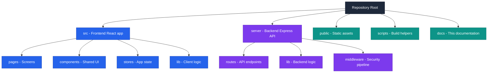
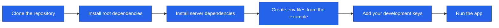
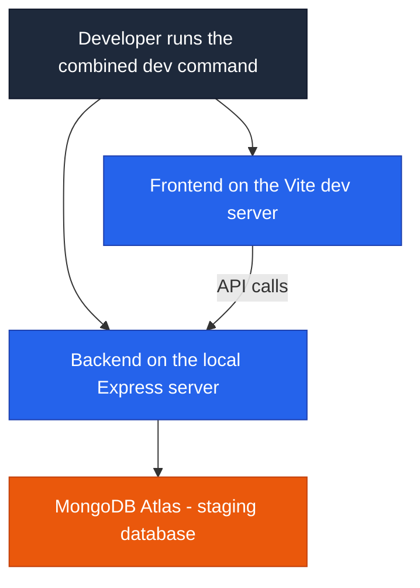
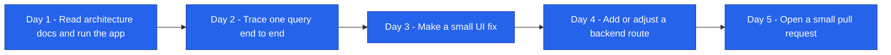

<!--
  Render note: diagrams use Mermaid. View in VS Code preview (Ctrl+Shift+V) with
  the "Markdown Preview Mermaid Support" extension, or in GitHub/GitLab/Notion.
  Diagram style is parser-safe: no line-break tags, no emoji, no semicolons in
  labels, no nested subgraphs, no cylinder shapes.
-->

# Querify — README and Developer Onboarding

**Natural-Language Analytics Platform**

| | |
|---|---|
| **Document** | README and Developer Onboarding |
| **Owner** | Engineering |
| **Version** | 2.0 (Comprehensive Edition) |
| **Status** | Active |
| **Date** | 27 June 2026 |
| **Classification** | Confidential — Internal |
| **Audience** | New engineers, contractors, technical reviewers |

---

## How to Read This Document

This guide takes a brand-new developer from nothing to a first contribution. Each section gives **In plain words** (the idea), **The steps** (what to do), and **Why it matters** (so you understand, not just follow). A [Glossary](#10-glossary) defines the tooling terms.

---

## Table of Contents

1. [What Querify Is](#1-what-querify-is)
2. [Prerequisites](#2-prerequisites)
3. [Project Structure](#3-project-structure)
4. [First-Time Setup](#4-first-time-setup)
5. [Running Locally](#5-running-locally)
6. [Environment Variables](#6-environment-variables)
7. [Common Commands](#7-common-commands)
8. [Onboarding Path for a New Developer](#8-onboarding-path-for-a-new-developer)
9. [Contributing](#9-contributing)
10. [Glossary](#10-glossary)

---

## 1. What Querify Is

**In plain words.** Querify is a website where people ask questions about their data in everyday English and get verified answers, charts, and an explanation — no SQL needed. It works on uploaded files and live databases.

**The detail.** The repository is a **single codebase** containing two deployable applications: a React frontend (in `src/`) and a Node/Express backend (in `server/`). For the full picture, read the Application Architecture and Deployment documents first.

**Why it matters.** Understanding that one repository holds two apps explains why there are two dependency installs and why some configuration is duplicated (one half for the browser, one for the server).

---

## 2. Prerequisites

**In plain words.** Here is what you need installed before you start.

| Requirement | Version | Notes |
|---|---|---|
| Node.js | 20.x | Pinned for the project; required for both halves |
| npm | Bundled with Node 20 | The package manager |
| MongoDB | Atlas account or local | The application database |
| Clerk account | — | Identity (use a test instance for development) |
| Code editor | VS Code recommended | With the Markdown and Mermaid preview extensions |

**Why it matters.** Matching the pinned Node version avoids a class of "works on my machine" problems. Using a Clerk *test* instance and a *staging* database keeps your experiments away from real users and data.

---

## 3. Project Structure

**In plain words.** Here is the map of the repository so you know where things live.

**The detail.**

| Folder | Contains |
|---|---|
| `src/` | The frontend React application (pages, components, state, client logic) |
| `server/` | The backend API (routes, business logic, middleware) |
| `public/` | Static assets served with the frontend |
| `scripts/` | Build and install helpers |
| `docs/` | This documentation set |

**Why it matters.** When you get a task, this map tells you immediately whether it is a frontend change (`src/`), a backend change (`server/`), or both.

---

## 4. First-Time Setup

**In plain words.** Four moves get you running: copy the code, install both halves' dependencies, create your settings file, and start the app.

**The steps.**

1. **Clone** the repository to your machine.
2. **Install dependencies** for the frontend (at the root) and the backend (in the `server` folder). The repository provides scripts for both.
3. **Create environment files** by copying the provided example template, then fill in your development keys.
4. **Start the app** with the combined development command, which runs both halves together.

**Why it matters.** The setup is deliberately short — two installs, one settings file, one run command — so a new developer is productive on day one rather than fighting configuration.

---

## 5. Running Locally

**In plain words.** One command starts both the frontend and backend together, with clearly labelled output so you can see what each is doing.

**The detail.**

| What runs | How |
|---|---|
| Frontend and backend together | The combined development command starts both with labelled output |
| Frontend only | The frontend dev command |
| Backend only | The server command |

The frontend hot-reloads on save (your change appears instantly). The backend picks up changes when you restart the server command.

**Why it matters.** Running both halves locally means you can test the full flow — UI to API to database — on your own machine before opening a pull request.

---

## 6. Environment Variables

**In plain words.** Settings and secret keys live in a local file that is never shared or committed. You copy the example file and fill in your own development values.

**The detail.**

| Variable group | Used by | Example purpose |
|---|---|---|
| Database connection | Backend | Points at MongoDB |
| Identity keys | Both | Clerk publishable (frontend) and secret (backend) keys |
| Payment keys | Backend | Cashfree app id and secret |
| Encryption keys | Both | The payload key (a matched pair) and the server-only at-rest key |
| API URL | Frontend | Where the frontend finds the backend |

**Why it matters.** Keeping secrets in a git-ignored file (never in code) is the single most important habit for not leaking credentials. The example template documents exactly which values are needed.

> **Important pairing.** The payload key has a frontend value and a backend value that **must match**. If they drift apart, requests fail with an "invalid payload" error. When in doubt, check both.

---

## 7. Common Commands

**In plain words.** Here are the everyday commands and what each is for.

| Goal | Command intent |
|---|---|
| Run everything for development | Combined frontend and backend dev command |
| Run frontend only | Frontend dev command |
| Run backend only | Server command |
| Run tests | Test command (single run) |
| Watch tests | Test watch command |
| Lint | Lint command |
| Build for production | Build command |
| Deploy backend | Serverless deploy command |

**Why it matters.** Knowing the handful of commands you will use daily removes friction. The test and lint commands in particular are what the automated pipeline also runs, so running them locally first avoids surprises.

---

## 8. Onboarding Path for a New Developer

**In plain words.** A suggested first week that builds understanding before asking you to change anything risky.

**The detail.**

| Step | Goal |
|---|---|
| Read the architecture docs | Understand the two-tier model and the agent flow |
| Run the app locally | Confirm your environment works |
| Trace a query | Follow a question from the UI through the agent to the answer |
| Make a small change | Build confidence with a low-risk fix |
| Open a pull request | Learn the review and CI process |

**Why it matters.** Tracing a real query end to end is the fastest way to truly understand the system. Starting with a small, safe change builds confidence and teaches the workflow before you touch anything critical.

---

## 9. Contributing

**In plain words.** Work on a branch, make your change, run the tests, open a pull request, get it reviewed, and merge. Merging to the main branch ships it to production automatically.

```mermaid
flowchart LR
    BRANCH[Create a branch] --> CODE[Make changes]
    CODE --> TEST[Run tests locally]
    TEST --> PR[Open a pull request to main]
    PR --> CI[CI runs - tests and security audit]
    CI -->|pass| REVIEW[Code review]
    REVIEW --> MERGE[Merge to main]
    MERGE --> DEPLOY[Auto-deploy to production]

    classDef step fill:#2563eb,stroke:#1e40af,color:#fff
    classDef gate fill:#ea580c,stroke:#c2410c,color:#fff
    classDef ok fill:#16a34a,stroke:#15803d,color:#fff
    class BRANCH,CODE,TEST,PR step
    class CI,REVIEW gate
    class MERGE,DEPLOY ok
```

**The detail.**

| Rule | Why |
|---|---|
| Work on a branch, not directly on main | Keeps main always deployable |
| Tests must pass | The pipeline hard-gates on tests |
| No new high-severity vulnerabilities | The pipeline hard-gates on the security audit |
| Keep changes focused and reviewed | Easier review, safer releases |
| Match the surrounding code style | Consistency across the codebase |

**Why it matters.** Because merging to main triggers automatic deployment, the discipline above is what keeps production stable. Treat main as production: if it is broken, customers feel it.

> **Golden rule for new contributors:** when in doubt, make the change smaller. A small, focused pull request is easier to review, safer to ship, and faster to roll back if needed.

---

## 10. Glossary

| Term | Plain-words definition |
|---|---|
| **Repository (repo)** | The project's code, tracked in version control |
| **Clone** | Make a local copy of the repository |
| **Branch** | A separate line of work, kept apart from the main code |
| **Pull request (PR)** | A proposal to merge your branch, reviewed before acceptance |
| **Merge** | Combine your reviewed change into the main code |
| **Dependency** | An external code library the project relies on |
| **npm** | The tool that installs and manages dependencies |
| **Hot reload** | The browser updating instantly when you save a change |
| **Lint** | Automated checking of code style and common mistakes |
| **CI (Continuous Integration)** | The automated pipeline that tests every change |
| **Environment variable** | A configuration value supplied outside the code |
| **Main branch** | The production line of code; what gets deployed |

---

---

**Querify — README and Developer Onboarding v2.0 (Comprehensive Edition)**
Confidential — Internal Use Only · © 2026 Querify

