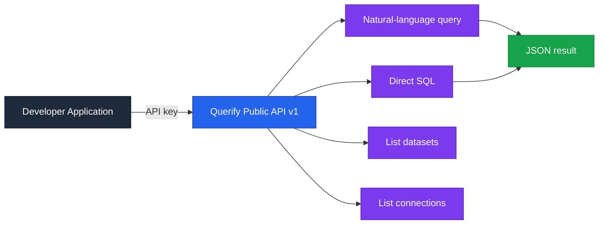
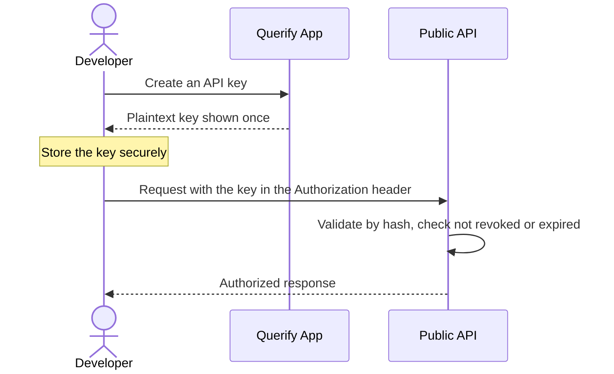
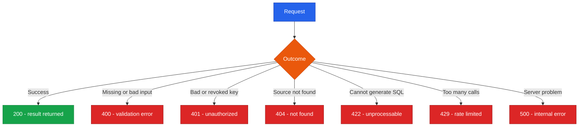

<!--
  Render note: diagrams use Mermaid. View in VS Code preview (Ctrl+Shift+V) with
  the "Markdown Preview Mermaid Support" extension, or in GitHub/GitLab/Notion.
  Diagram style is parser-safe: no line-break tags, no emoji, no semicolons in
  labels, no nested subgraphs, no cylinder shapes.
-->

# Querify — API Documentation

**Public Developer API (v1)**

| | |
|---|---|
| **Document** | API Documentation |
| **Owner** | Engineering |
| **Version** | 2.0 (Comprehensive Edition, API v1) |
| **Status** | Active |
| **Date** | 27 June 2026 |
| **Classification** | Confidential — Internal / Partner |
| **Audience** | External developers, integration partners, technical evaluators |

---

## How to Read This Document

Each part gives **In plain words** (what it does), **The detail** (how to use it), and **Why it matters** (when to choose it). A [Glossary](#11-glossary) defines API terms. Per the documentation standard, this describes contracts in plain English rather than dumping raw code.

---

## Table of Contents

1. [Overview](#1-overview)
2. [Key Concepts in Plain Words](#2-key-concepts-in-plain-words)
3. [Authentication](#3-authentication)
4. [Base URL and Versioning](#4-base-url-and-versioning)
5. [Rate Limits and Metering](#5-rate-limits-and-metering)
6. [Endpoint — Natural-Language Query](#6-endpoint--natural-language-query)
7. [Endpoint — Direct SQL](#7-endpoint--direct-sql)
8. [Endpoint — List Datasets](#8-endpoint--list-datasets)
9. [Endpoint — List Connections](#9-endpoint--list-connections)
10. [Errors and Status Codes](#10-errors-and-status-codes)
11. [Glossary](#11-glossary)

---

## 1. Overview

**In plain words.** The Querify API lets a developer's program do what a person does in the app: ask a question of their data and get an answer back. There are two ways to ask — in plain English (Querify writes the query) or with your own read-only SQL — plus two ways to list your available data.

**The detail.** The Public API exposes four endpoints: natural-language query, direct read-only SQL, list datasets, and list connections. All access is **read-only by enforcement** — the API can read data but never modify it.

**Why it matters.** The API turns Querify into a building block other products can use. A developer can add "ask your data anything" to their own app without building any of the analytics engine themselves.

---

## 2. Key Concepts in Plain Words

| Concept | Plain-words explanation | Everyday analogy |
|---|---|---|
| **Endpoint** | A specific doorway for one kind of request | A particular counter at a bank for one service |
| **API key** | The secret credential your program presents | A keycard for your program |
| **Request / response** | What you send and what comes back | A question slip and the answer slip |
| **Status code** | A standard number saying how it went | Traffic lights: green is go, red is stop |
| **Rate limit** | A cap on how often you can call | A "take a number" queue limit |
| **Read-only** | Can look at data but never change it | A library reading room: read, do not edit the books |

---

## 3. Authentication

**In plain words.** Every request must carry an API key, which proves your program is allowed in. You create keys inside the app, and a key is shown only once — Querify stores only a scrambled version, so a lost key cannot be recovered and must be replaced.

**The detail.**

| Property | Detail |
|---|---|
| Header | An Authorization header carrying the key (an alternate key header is also accepted) |
| Key format | Begins with a fixed prefix; the rest is random |
| Storage | Only a one-way hash is stored; plaintext is shown once |
| Revocation | Keys can be revoked at any time; revoked keys are rejected |
| Expiry | An optional expiry date can be set per key |
| Limit | A maximum number of active keys per user |

**Why it matters.** Because only a hash is stored, even a breach of Querify's database would not reveal usable API keys. The "shown once" rule pushes developers to store keys securely from the start.

---

## 4. Base URL and Versioning

**In plain words.** All API addresses begin with a common path that includes the version number. Keeping the version in the address means future changes will not break programs already using today's version.

| Item | Value |
|---|---|
| Base path | `/api/v1` |
| Versioning | Path-versioned; future breaking changes use a new version, leaving v1 stable |
| Format | JSON request and response over a secure connection |

**Why it matters.** Versioning is a promise of stability. A partner who builds against v1 can rely on it continuing to work even as Querify evolves.

---

## 5. Rate Limits and Metering

**In plain words.** There is a cap on how many calls you can make per minute, because each natural-language call can invoke an AI model. Every call is also counted for your plan.

| Control | Behaviour |
|---|---|
| Rate limit | A fixed number of calls per minute, per caller |
| Metering | Each call is recorded against the key owner's usage |
| Over-limit response | A clear "rate limit exceeded" message with the appropriate status |

**Why it matters.** The cap protects both Querify's costs and your own — it prevents a runaway loop in your code from generating a huge bill. Metering keeps usage transparent for plan accounting.

---

## 6. Endpoint — Natural-Language Query

**In plain words.** Send a question and say which data to use; Querify writes the query, runs it, and returns the answer along with the query it generated.

**The detail.**

| Aspect | Detail |
|---|---|
| Method | POST |
| Path | `/api/v1/query` |
| Required inputs | A question, and a target (a dataset identifier or a connection identifier) |
| Optional inputs | A sheet name (for multi-sheet files) |
| Returns | The original question, the generated SQL, the row count, the result rows, and the source name |
| Notable behaviour | Identical repeat questions are served from a short-lived cache to save cost and time |

**Why it matters.** This is the flagship endpoint — it gives any program the platform's core ability. Returning the generated SQL alongside the answer means the developer can inspect and trust what ran.

> **Worked example (described).** A reporting tool sends the question "total sales last month" with a connection identifier. Querify generates a read-only SQL statement, validates it, runs it against that connection, and returns the monthly total plus the SQL it used. The reporting tool displays the number without ever writing SQL itself.

---

## 7. Endpoint — Direct SQL

**In plain words.** If you already have a read-only SQL query, send it directly to run against a chosen source.

| Aspect | Detail |
|---|---|
| Method | POST |
| Path | `/api/v1/sql` |
| Required inputs | A SQL statement, and a target (dataset or connection identifier) |
| Optional inputs | A sheet name |
| Returns | The SQL, the row count, the result rows, and the source name |
| Enforcement | Must be a single read-only SELECT/WITH statement; writes and schema changes are rejected |

**Why it matters.** This gives technical users precise control when they know exactly what they want, while the read-only enforcement guarantees they still cannot harm the underlying data.

---

## 8. Endpoint — List Datasets

**In plain words.** Ask for the list of datasets your key can use.

| Aspect | Detail |
|---|---|
| Method | GET |
| Path | `/api/v1/datasets` |
| Returns | A list of datasets (identifiers and metadata); the underlying file data is never included |
| Scope | Only the key owner's own datasets |

**Why it matters.** Programs need to discover which data sources are available before querying them. Excluding the bulky file data keeps the response small and avoids exposing raw content.

---

## 9. Endpoint — List Connections

**In plain words.** Ask for the list of database connections your key can use.

| Aspect | Detail |
|---|---|
| Method | GET |
| Path | `/api/v1/connections` |
| Returns | A list of connections with identifier, name, database type, and status |
| Security | Connection credentials are never returned |

**Why it matters.** Like listing datasets, this lets a program discover targets — without ever exposing the sensitive credentials behind a connection.

---

## 10. Errors and Status Codes

**In plain words.** When something goes wrong, the API replies with a standard number and a clear message, so your program can react correctly.

**The detail.**

| Status | Meaning | What to do |
|---|---|---|
| 200 | Success | Use the result |
| 400 | Validation error (missing input or non-read-only SQL) | Fix the request |
| 401 | Missing, invalid, revoked, or expired API key | Check or regenerate your key |
| 404 | The referenced dataset or connection was not found | Verify the identifier |
| 422 | A question could not be turned into SQL | Rephrase the question |
| 429 | Rate limit exceeded | Slow down and retry later |
| 500 | Unexpected server error | Retry; if it persists, contact support |

**Why it matters.** Predictable, standard status codes let developers handle every outcome cleanly, rather than guessing what went wrong.

> **Internal API note.** The browser application uses a separate, larger internal API (identity, datasets, plans, governance, automations, admin, payments). That surface is coupled to the app and is not part of the public, versioned contract. See the Integration and API Architecture for the full module map.

---

## 11. Glossary

| Term | Plain-words definition |
|---|---|
| **API** | A defined way for programs to talk to each other |
| **Endpoint** | A specific address for one kind of request |
| **API key** | The secret credential a program presents to authenticate |
| **Header** | Extra information sent alongside a request (such as the key) |
| **Method (GET/POST)** | The verb describing the request: read versus send |
| **Status code** | A standard number describing the outcome |
| **Rate limit** | A cap on how often you can call the API |
| **Metering** | Counting calls for plan accounting |
| **Hash** | A one-way scramble used to store keys safely |
| **Read-only** | Able to view data but never modify it |
| **Versioning** | Labelling the API (v1) so changes do not break callers |
| **JSON** | A simple, standard text format for data exchange |

---

---

**Querify — API Documentation v2.0 (Comprehensive Edition)**
Confidential — Internal / Partner Use Only · © 2026 Querify

