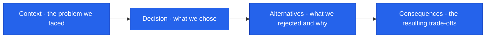

<!--
  Render note: diagrams use Mermaid. View in VS Code preview (Ctrl+Shift+V) with
  the "Markdown Preview Mermaid Support" extension, or in GitHub/GitLab/Notion.
  Diagram style is parser-safe.
-->

# Querify — Architecture Decision Records (ADRs)

**Natural-Language Analytics Platform**

| | |
|---|---|
| **Document** | Architecture Decision Records |
| **Owner** | Engineering |
| **Version** | 2.0 (Comprehensive Edition) |
| **Status** | Active |
| **Date** | 27 June 2026 |
| **Classification** | Confidential — Internal |
| **Audience** | Engineers, technical reviewers, future maintainers |

---

## What an ADR Is (In Plain Words)

**In plain words.** An Architecture Decision Record is a short note that captures *one important decision* and, crucially, *why* it was made. Months or years later, when someone asks "why on earth did we choose this?", the ADR has the answer — including what was rejected and what the trade-offs were. ADRs are never edited after the fact; if a decision changes, a new ADR replaces the old one. This preserves an honest history.

**Why it matters.** Without ADRs, the reasoning behind decisions lives only in people's heads and walks out the door when they leave. ADRs make the "why" durable, so future teams do not relitigate settled choices or accidentally undo a deliberate trade-off.

**How to read each ADR.** Every record has four parts:

### Index

| ADR | Decision | Status |
|---|---|---|
| 001 | Run analytical queries in the browser | Accepted |
| 002 | Delegate identity to Clerk | Accepted |
| 003 | Serverless backend on AWS Lambda | Accepted |
| 004 | MongoDB as the application database | Accepted |
| 005 | Cashfree for payments | Accepted |
| 006 | A self-verifying agent with self-healing | Accepted |
| 007 | Read-only SQL validation for live databases | Accepted |
| 008 | Plan limits defined in one place | Accepted |
| 009 | Encrypt connection credentials at rest | Accepted |
| 010 | Provider-agnostic AI routing | Accepted |

---

## ADR-001 — Run Analytical Queries in the Browser

**Context.** Users upload spreadsheets and expect fast, interactive results. Sending every file to a server to process is slow, costly, and increases data-handling risk.

**Decision.** Use an embedded in-browser analytics engine (DuckDB compiled to WebAssembly) to run queries on uploaded files directly on the user's device.

**Alternatives considered.**

| Option | Why not |
|---|---|
| Server-side processing of every upload | Higher latency, higher cost, more data stored centrally |
| A hosted data warehouse per user | Expensive and heavy for the use case |

**Consequences.** Fast results, lower server cost, and less customer data stored centrally. The trade-off is reliance on the user's device for file-based analysis; live databases still use the server path.

**In plain words.** We do the maths on the user's own computer for uploaded files, which is faster, cheaper, and more private — at the cost of depending on the user's device for that work.

---

## ADR-002 — Delegate Identity to Clerk

**Context.** Authentication is security-critical and easy to get wrong. The platform previously used a custom approach.

**Decision.** Delegate login, sessions, and single sign-on to Clerk. The backend verifies Clerk tokens; the platform stores no passwords.

**Alternatives considered.**

| Option | Why not |
|---|---|
| Custom authentication | High security burden; reinvents a solved problem |
| Auth0 | Viable, but Clerk's integration and billing fit were better |

**Consequences.** No password storage, faster delivery of single sign-on and social login, and a reduced security surface. The trade-off is a dependency on Clerk and the need to keep its keys configured per environment.

**In plain words.** We let a security specialist handle logins so we never store passwords — accepting that we now depend on that specialist.

---

## ADR-003 — Serverless Backend on AWS Lambda

**Context.** Traffic is uneven and the team is small. A fleet of always-on servers would be costly and operationally heavy.

**Decision.** Deploy the backend as AWS Lambda functions behind API Gateway, using the Serverless Framework.

**Alternatives considered.**

| Option | Why not |
|---|---|
| Always-on containers or virtual machines | Fixed cost, capacity planning, patching burden |
| A platform-as-a-service host | Less control over the deploy pipeline and edge throttling |

**Consequences.** Automatic scaling, near-zero idle cost, and no servers to patch. The trade-off is cold-start latency (mitigated by a keep-alive routine) and per-request execution limits.

**In plain words.** Our code runs on demand and costs almost nothing when idle — at the cost of an occasional brief warm-up delay.

---

## ADR-004 — MongoDB as the Application Database

**Context.** The data model is varied (users, plans, connections, history, traces) and evolves quickly during early development.

**Decision.** Use MongoDB Atlas, a managed document database, as the system of record.

**Alternatives considered.**

| Option | Why not |
|---|---|
| A relational database | More rigid schema during rapid iteration |
| A self-hosted database | Operational overhead the team does not want |

**Consequences.** Flexible records and fast iteration, fully managed. The trade-off is that relational integrity is enforced in application logic rather than by the database.

**In plain words.** We chose a flexible, managed database that lets us move fast — accepting that we must enforce some data consistency ourselves in code.

---

## ADR-005 — Cashfree for Payments

**Context.** The platform sells subscriptions priced in INR and needs a payment provider with strong India coverage.

**Decision.** Use Cashfree with an inline checkout, server-authoritative pricing, and signature-verified webhooks.

**Alternatives considered.**

| Option | Why not |
|---|---|
| A global-first provider | Weaker fit for INR and local payment methods |
| Manual or offline billing | Does not scale; poor user experience |

**Consequences.** Native INR checkout and local payment methods. The trade-off is provider-specific integration work, handled behind a payment abstraction.

**In plain words.** We picked a payment provider strong in our primary market, and wrapped it so we could swap providers later if needed.

---

## ADR-006 — A Self-Verifying Agent with Self-Healing

**Context.** AI-generated queries are occasionally wrong — a mis-named column, a flawed aggregation, or a transient error.

**Decision.** The agent runs a verification turn on its own results and self-heals on failure by feeding the error back to the model and regenerating.

**Alternatives considered.**

| Option | Why not |
|---|---|
| Trust the first generation | Lower accuracy; erodes user trust |
| Require manual review of every query | Defeats the natural-language value proposition |

**Consequences.** Higher answer accuracy and resilience to transient errors. The trade-off is additional model calls per question, accepted for the accuracy gain.

**In plain words.** The agent double-checks and fixes its own work, which costs a little more AI usage but makes answers far more trustworthy — the core differentiator.

---

## ADR-007 — Read-Only SQL Validation for Live Databases

**Context.** The agent and the public API can run generated queries against customers' live databases. Any write path would be dangerous.

**Decision.** All live queries pass a strict validator that permits only read-only SELECT/WITH statements, blocks every write or schema-changing keyword, and rejects multi-statement input.

**Alternatives considered.**

| Option | Why not |
|---|---|
| Rely on database permissions alone | A single mis-provisioned connection could allow writes |
| Allow writes with confirmation | Unnecessary risk for an analytics product |

**Consequences.** Strong protection against destructive or injected queries, in addition to recommended least-privilege database users. The trade-off is that legitimately advanced write use cases are intentionally out of scope.

**In plain words.** Querify can only ever read a customer's database, never change it — enforced in our own code, not just trusted to permissions.

---

## ADR-008 — Plan Limits Defined in One Place

**Context.** Plan tiers cap many resources (connections, glossary terms, metrics, reports, automations, workspaces, trace retention). Scattering these numbers invites drift and bugs.

**Decision.** Define all plan limits in a single source of truth on the backend, mirrored once on the frontend for display, and enforce them through a shared check at resource creation.

**Alternatives considered.**

| Option | Why not |
|---|---|
| Hardcode limits per feature | Inconsistent, hard to change, error-prone |

**Consequences.** A pricing or limit change is a one-line edit that propagates everywhere. The trade-off is keeping the frontend mirror in sync, a small and well-understood task.

**In plain words.** All the plan limits live in one list, so changing a number is a single edit instead of a risky hunt across the code.

---

## ADR-009 — Encrypt Connection Credentials at Rest

**Context.** Customers' live-database credentials are highly sensitive. Storing them in plaintext would make any database leak catastrophic.

**Decision.** Encrypt sensitive connection fields with AES-256-GCM using a server-only key, decrypting only in memory at query time.

**Alternatives considered.**

| Option | Why not |
|---|---|
| Plaintext with redaction on read | Redaction protects responses, not the stored data |
| The transport obfuscation layer | Its key is shared with the browser; not real confidentiality |

**Consequences.** A database or backup leak does not expose usable credentials. The trade-off is an additional server-only key that must be set and never rotated casually (rotation would invalidate stored credentials).

**In plain words.** We scramble customers' database passwords with a key only the server holds, so a stolen database is useless — accepting that this key must be guarded and not changed lightly.

---

## ADR-010 — Provider-Agnostic AI Routing

**Context.** AI providers differ in capability, cost, and availability, and the landscape changes quickly.

**Decision.** Route AI requests through a provider abstraction supporting multiple vendors, with platform-managed models for the free tier and bring-your-own-key for paid users.

**Alternatives considered.**

| Option | Why not |
|---|---|
| A single hardcoded provider | Vendor lock-in; no cost or capability flexibility |

**Consequences.** Freedom to choose the best or cheapest model and to add providers without re-architecting. The trade-off is maintaining adapters for each provider's API differences.

**In plain words.** We are not tied to one AI company, so we can always pick the best or cheapest — at the cost of maintaining a small translator for each one.

---

---

**Querify — Architecture Decision Records v2.0 (Comprehensive Edition)**
Confidential — Internal Use Only · © 2026 Querify

