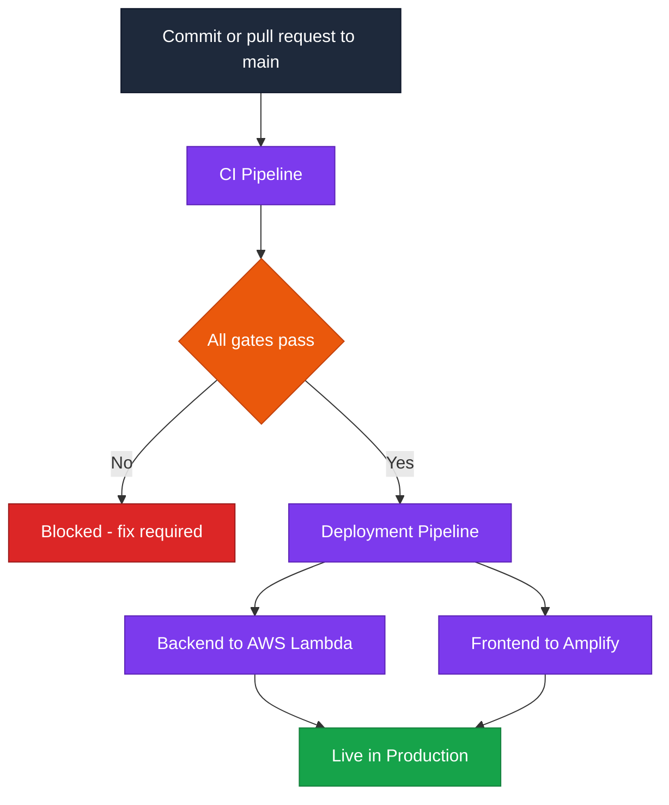
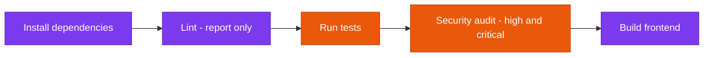
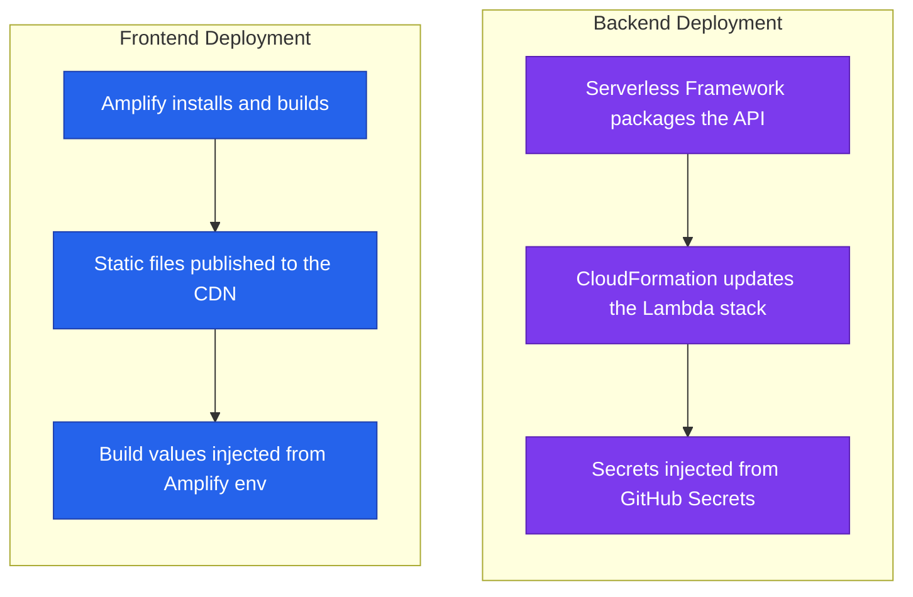
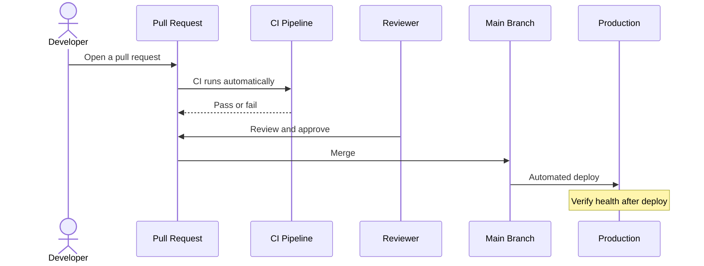
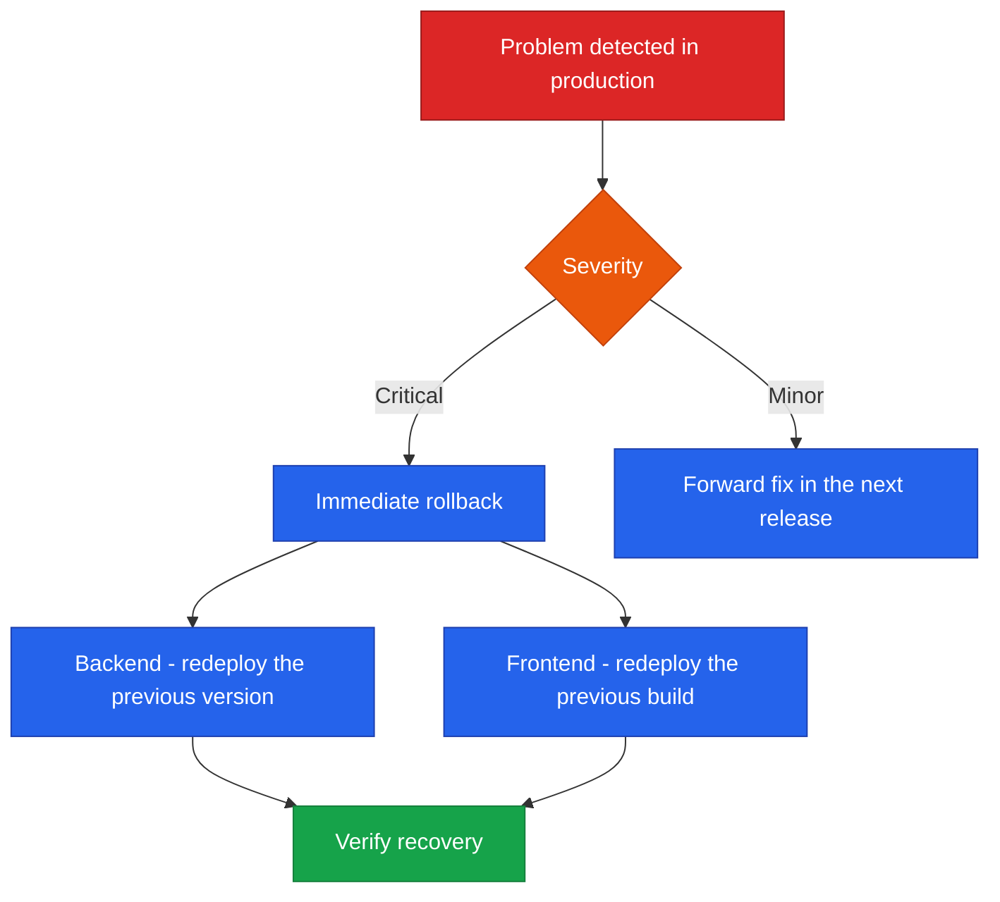
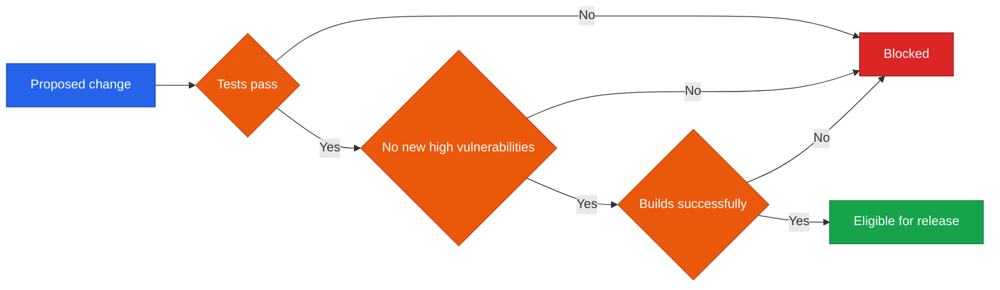

<!--
  Render note: diagrams use Mermaid. View in VS Code preview (Ctrl+Shift+V) with
  the "Markdown Preview Mermaid Support" extension, or in GitHub/GitLab/Notion.
  Diagram style is parser-safe.
-->

# Querify — CI/CD and Release Documentation

**Natural-Language Analytics Platform**

| | |
|---|---|
| **Document** | CI/CD and Release Documentation |
| **Owner** | Engineering / DevOps |
| **Version** | 2.0 (Comprehensive Edition) |
| **Status** | Active |
| **Date** | 27 June 2026 |
| **Classification** | Confidential — Internal |
| **Audience** | Engineers, operations, technical leadership |

---

## How to Read This Document

Layered as **In plain words**, **The detail**, **Why it matters**, with a [Glossary](#9-glossary) at the end.

---

## Table of Contents

1. [Executive Summary](#1-executive-summary)
2. [Key Concepts in Plain Words](#2-key-concepts-in-plain-words)
3. [Pipeline Overview](#3-pipeline-overview)
4. [Continuous Integration](#4-continuous-integration)
5. [Deployment](#5-deployment)
6. [Release Process](#6-release-process)
7. [Rollback Procedure](#7-rollback-procedure)
8. [Quality Gates and Release Checklist](#8-quality-gates-and-release-checklist)
9. [Glossary](#9-glossary)

---

## 1. Executive Summary

**In plain words.** When a developer's change is approved, an automated assembly line tests it, scans it for security problems, and — only if everything passes — ships it to customers. No one has to remember a list of manual steps, which is where mistakes usually creep in.

**The detail.** Querify uses **continuous delivery**: a change merged to the main branch is automatically tested, security-audited, and deployed. There are two automated pipelines — **continuous integration** (verify the change is safe) and **deployment** (publish it). Hard quality gates prevent broken or insecure code from reaching production.

**Why it matters.** Automated, gated releases are faster *and* safer than manual ones. The business can ship improvements frequently with confidence that a bad change cannot slip through unchecked.

> **Executive takeaway:** Releases are automated, gated, and repeatable. A change cannot reach production unless it passes tests and a security audit.

---

## 2. Key Concepts in Plain Words

| Concept | Plain-words explanation | Everyday analogy |
|---|---|---|
| **CI (Continuous Integration)** | Automatically checking every change | Quality control inspecting each item on a line |
| **CD (Continuous Delivery)** | Automatically shipping changes that pass | The line automatically packaging and dispatching |
| **Pipeline** | The sequence of automated steps | The conveyor belt the work travels along |
| **Quality gate** | A checkpoint that blocks bad work | An inspector who stops a faulty item |
| **Rollback** | Returning to the previous good version | Undo, restoring the last working state |
| **Deploy** | Publishing a version so customers use it | Opening the doors for business |

---

## 3. Pipeline Overview

**In plain words.** A change goes through checks; if it passes, it is deployed to both halves of the app and goes live.

**The detail.**

| Pipeline | Trigger | Outcome |
|---|---|---|
| Continuous Integration | Every push and pull request to main | A pass or fail verdict |
| Deployment | A successful merge to main | A live production update |

**Why it matters.** Separating "check" from "ship" means a risky change is caught before it ever reaches the deployment stage.

---

## 4. Continuous Integration

**In plain words.** Before anything ships, the pipeline installs the code cleanly, checks style, runs the tests, scans for known security holes, and builds the app. If the tests or the security scan fail, the change is blocked.

**The detail.**

| Stage | Purpose | Blocks release |
|---|---|---|
| Install | Clean, reproducible dependency install | Yes |
| Lint | Reports code-style issues | No (report-only while a backlog is cleared) |
| Test | Runs the automated test suite | Yes |
| Security audit | Fails on high/critical vulnerabilities, with a documented exemption for one unfixable spreadsheet-parser advisory | Yes |
| Build | Compiles the production frontend | Yes |

**Why it matters.** The test and security stages are *hard gates*. This is the safety net that lets the team ship often without fear: the machine enforces quality, consistently, on every single change.

---

## 5. Deployment

**In plain words.** The two halves are published separately and independently: the backend goes to the cloud functions, and the frontend is rebuilt and served from the global network. Secrets are injected at this moment, never stored in the code.

**The detail.**

| Half | Deployed by | Notes |
|---|---|---|
| Backend | Serverless Framework via the CI/CD workflow | Updates the Lambda functions and API Gateway |
| Frontend | AWS Amplify | Rebuilds and republishes the static site |

**Why it matters.** Independent deployment means a frontend-only change does not risk the backend, and vice versa — smaller blast radius per release.

---

## 6. Release Process

**In plain words.** A developer opens a proposal (pull request); the pipeline checks it; a colleague reviews it; it is merged; it deploys automatically; and the team confirms it is healthy.

**The detail.**

| Step | Owner | Notes |
|---|---|---|
| Branch and build the change | Developer | Work off main, keep changes focused |
| Open a pull request | Developer | CI runs automatically |
| Review | Reviewer | Approve before merge |
| Merge to main | Developer/Reviewer | Triggers deployment |
| Post-deploy verification | Developer | Confirm the health endpoint and a smoke test |

**Why it matters.** Human review plus automated checks together catch more than either alone. The post-deploy verification ensures someone confirms reality matches expectation.

---

## 7. Rollback Procedure

**In plain words.** If a release causes a problem, the team can quickly return to the previous working version. Critical issues are rolled back immediately; minor ones are fixed in the next release.

**The detail.**

| Method | How |
|---|---|
| Frontend rollback | Amplify keeps previous builds; redeploy the last good build |
| Backend rollback | Re-run the deployment from the last known-good commit, or roll back the infrastructure stack to the previous version |
| Decision rule | Critical user-facing or security issue, roll back now; minor issue, forward-fix |

**Why it matters.** A fast, rehearsed rollback turns a scary incident into a routine recovery. Knowing the team can always get back to the last good state reduces release anxiety.

> **Recommendation (post-launch):** tag each release and keep a short "last known good" note so rollback targets are unambiguous under pressure.

---

## 8. Quality Gates and Release Checklist

**In plain words.** A change must clear every gate to be eligible for release, and the team runs a short checklist around each release.

**Release checklist.**

| Item | Done |
|---|---|
| Change reviewed and approved | ☐ |
| CI green (tests, audit, build) | ☐ |
| Required secrets present in the target environment | ☐ |
| Database or data changes considered | ☐ |
| Post-deploy health check passed | ☐ |
| Smoke test of the changed feature | ☐ |
| Rollback target noted | ☐ |

**Why it matters.** The gates are automated and unskippable; the checklist covers the human judgement around them. Together they make releases boringly reliable — which is exactly what you want.

---

## 9. Glossary

| Term | Plain-words definition |
|---|---|
| **CI (Continuous Integration)** | Automatically testing every change |
| **CD (Continuous Delivery)** | Automatically shipping changes that pass |
| **Pipeline** | The automated sequence of build, test, and deploy steps |
| **Quality gate** | A checkpoint that blocks a change unless it passes |
| **Pull request** | A proposal to merge a change, reviewed first |
| **Merge** | Combining an approved change into the main code |
| **Deploy** | Publishing a version so customers use it |
| **Rollback** | Returning to the previous good version |
| **Smoke test** | A quick check that core functions work after a release |
| **Health endpoint** | A simple address that reports whether the service is up |
| **Lint** | Automated code-style checking |
| **Security audit** | Automated scanning for known vulnerabilities |

---

---

**Querify — CI/CD and Release Documentation v2.0 (Comprehensive Edition)**
Confidential — Internal Use Only · © 2026 Querify

