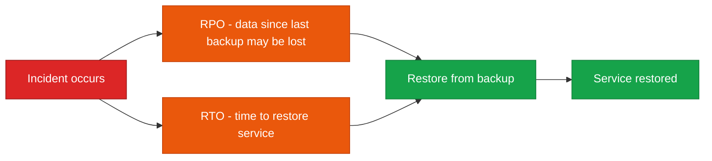
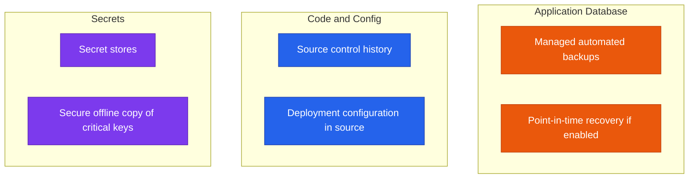
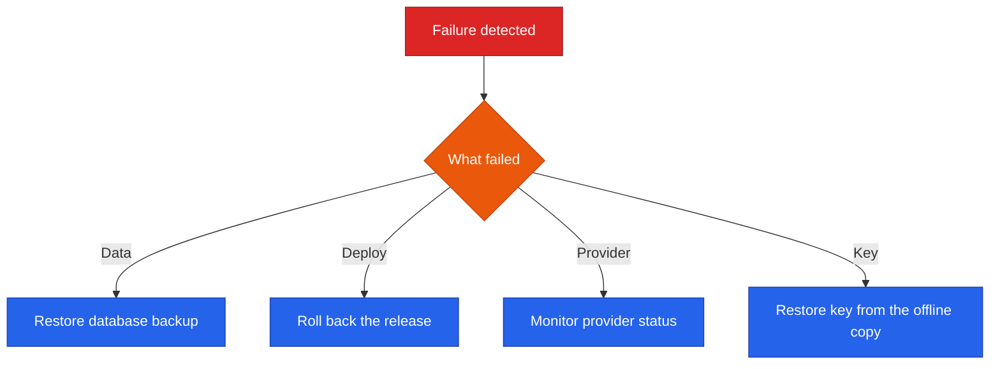

<!--
  Render note: diagrams use Mermaid. View in VS Code preview (Ctrl+Shift+V) with
  the "Markdown Preview Mermaid Support" extension, or in GitHub/GitLab/Notion.
  Diagram style is parser-safe. Items marked [INPUT NEEDED] require owner confirmation.
-->

# Querify — Disaster Recovery and Backup Plan

**Natural-Language Analytics Platform**

| | |
|---|---|
| **Document** | Disaster Recovery and Backup Plan |
| **Owner** | Engineering / DevOps |
| **Version** | 2.0 (Comprehensive Edition) |
| **Status** | Active |
| **Date** | 27 June 2026 |
| **Classification** | Confidential — Internal |
| **Audience** | Engineering, operations, leadership |

---

## How to Read This Document

Layered as **In plain words**, **The detail**, **Why it matters**, with a [Glossary](#9-glossary). Some targets are marked **[INPUT NEEDED]** because they are business decisions to confirm.

---

## Table of Contents

1. [Executive Summary](#1-executive-summary)
2. [Key Concepts in Plain Words](#2-key-concepts-in-plain-words)
3. [What Must Be Recovered](#3-what-must-be-recovered)
4. [Recovery Objectives](#4-recovery-objectives)
5. [Backup Strategy](#5-backup-strategy)
6. [Failure Scenarios and Responses](#6-failure-scenarios-and-responses)
7. [Restore Procedure](#7-restore-procedure)
8. [Roles and Testing](#8-roles-and-testing)
9. [Glossary](#9-glossary)

---

## 1. Executive Summary

**In plain words.** If something goes badly wrong, this plan explains how to get Querify back. The good news: because the platform runs on managed cloud services and keeps very little state, recovery is mostly about restoring one database and re-publishing the code — both routine operations.

**The detail.** Querify runs on managed cloud services, which provides strong baseline resilience: the frontend is static and globally distributed, the backend scales automatically, and the database is a managed service with its own backup capabilities. The most important asset to protect is the **application database**, because it is the system of record. Application code is fully recoverable from source control, and infrastructure is reproducible from configuration.

**Why it matters.** Knowing in advance exactly what to restore, in what order, turns a potential crisis into a managed procedure. The small "blast radius" of failures keeps recovery simple.

> **Executive takeaway:** Most failures have a small blast radius because state is concentrated in one managed database. Recovery is restoring that database and re-deploying from source — both well-defined operations.

---

## 2. Key Concepts in Plain Words

| Concept | Plain-words explanation | Everyday analogy |
|---|---|---|
| **Backup** | A saved copy you can restore from | A photocopy of important papers |
| **Restore** | Bringing a system back from a backup | Re-printing from the photocopy |
| **RPO (Recovery Point Objective)** | How much recent data you can afford to lose | "We can lose at most the last hour of edits" |
| **RTO (Recovery Time Objective)** | How long you can afford to be down | "We must be back within 4 hours" |
| **Blast radius** | How far a failure spreads | How many rooms a burst pipe floods |
| **Point-in-time recovery** | Restoring to an exact moment | Rewinding a recording to a specific second |

---

## 3. What Must Be Recovered

**In plain words.** Some things are precious and hard to recreate (the database, the secret keys). Others can simply be rebuilt from the code. A third group is managed entirely by outside providers.

```mermaid
flowchart TB
    subgraph CRITICAL[Critical - hard to recreate]
        direction TB
        DBASE[Application Database]
        SECRETS[Secrets and keys]
    end
    subgraph REPRODUCIBLE[Reproducible from source]
        direction TB
        CODE[Application code]
        INFRA[Infrastructure configuration]
        FRONTEND[Frontend build]
    end
    subgraph EXTERNAL[Managed by providers]
        direction TB
        IDENTITY[Identity - Clerk]
        PAYMENTS[Payments - Cashfree]
    end

    classDef crit fill:#dc2626,stroke:#991b1b,color:#fff
    classDef repro fill:#2563eb,stroke:#1e40af,color:#fff
    classDef ext fill:#0d9488,stroke:#0f766e,color:#fff
    class DBASE,SECRETS crit
    class CODE,INFRA,FRONTEND repro
    class IDENTITY,PAYMENTS ext
```

**The detail.**

| Asset | Recoverability | Source of truth |
|---|---|---|
| Application database | Critical — restore from backup | MongoDB Atlas backups |
| Secrets and keys | Critical — must be re-supplied | Secret stores (GitHub, Amplify) |
| Application code | Easy — re-deploy | Source control |
| Infrastructure | Easy — re-provision | Deployment configuration |
| Identity and payments | Provider-managed | Clerk and Cashfree |

**Why it matters.** Focusing protection on the truly irreplaceable items (database, keys) is efficient. Everything else can be rebuilt on demand.

> **Critical note — the encryption key.** The at-rest encryption key must be preserved. If it is lost, the encrypted database credentials cannot be decrypted. It is therefore a critical recovery asset and should have a secure offline copy.

---

## 4. Recovery Objectives

**In plain words.** Two numbers define recovery: how much recent data you can afford to lose (RPO) and how quickly you must be back (RTO). The proposed defaults below should be confirmed by the business.

| Objective | Definition | Target |
|---|---|---|
| Recovery Point Objective (RPO) | Maximum acceptable data loss | [INPUT NEEDED — proposed: 24 hours or less] |
| Recovery Time Objective (RTO) | Maximum acceptable downtime | [INPUT NEEDED — proposed: 4 hours or less] |

**Why it matters.** These two numbers drive every other choice: how often to back up (RPO) and how much recovery automation to invest in (RTO). Agreeing them is a business decision about acceptable risk.

---

## 5. Backup Strategy

**In plain words.** The database is backed up automatically by the managed service; the code and configuration are inherently "backed up" because they live in version control; and the critical encryption key has a secure offline copy.

**The detail.**

| Asset | Backup mechanism | Frequency |
|---|---|---|
| Application database | MongoDB Atlas automated backups | [INPUT NEEDED — confirm Atlas backup schedule and retention] |
| Code | Source control | Continuous (every commit) |
| Infrastructure config | Stored in source | Continuous |
| Secrets | Secret stores plus a secure offline copy of the critical encryption key | On change |

**Why it matters.** A backup you have never confirmed is only a hope. Confirming the database backup schedule and retention is what makes the RPO real rather than assumed.

> **Action item:** Confirm and document the MongoDB Atlas backup schedule, retention window, and whether point-in-time recovery is enabled. These determine the true RPO.

---

## 6. Failure Scenarios and Responses

**In plain words.** Here are the things that could go wrong and exactly what to do for each.

**The detail.**

| Scenario | Impact | Response |
|---|---|---|
| Database data loss or corruption | Critical — loss of state | Restore from the latest backup |
| Bad deployment | Service errors | Roll back (see the CI/CD document) |
| Region outage (cloud provider) | Backend and hosting unavailable | Wait out provider recovery; consider multi-region later |
| Identity provider outage | Logins fail | Provider-managed; monitor the status page |
| Payment provider outage | Checkout fails | Provider-managed; existing plans unaffected |
| Lost encryption key | Stored credentials undecryptable | Restore the key from the secure offline copy |

**Why it matters.** Pre-deciding the response to each scenario removes panic and guesswork during a real incident.

---

## 7. Restore Procedure

**In plain words.** The step-by-step recipe to bring the service back: declare the incident, pick the last good backup, restore it, confirm the keys are present, redeploy, check it works, and tell people.

**The detail.**

| Step | Action |
|---|---|
| 1 | Declare the incident and assign an owner |
| 2 | Identify the most recent healthy backup |
| 3 | Restore the database from that backup |
| 4 | Confirm all secrets and the encryption key are in place |
| 5 | Re-deploy the backend and frontend from the last good release |
| 6 | Run the health endpoint and a smoke test of core flows |
| 7 | Resume service and communicate status |

**Why it matters.** A written, ordered procedure means anyone on the team can lead a recovery, not just the person who happened to set things up.

---

## 8. Roles and Testing

**In plain words.** Someone must own the recovery, someone executes it, and someone keeps people informed. And the plan must be rehearsed — an untested plan is just a wish.

**Roles.**

| Role | Responsibility |
|---|---|
| Incident owner | Coordinates the recovery and makes the restore decision |
| Engineering | Executes the database restore and re-deployment |
| Communications | Updates stakeholders and, if needed, users |

> For a small team, one person may hold several roles; the incident owner must always be explicitly assigned.

**Testing the plan.**

| Test | Frequency | Goal |
|---|---|---|
| Restore drill | [INPUT NEEDED — proposed: quarterly] | Confirm a backup can actually be restored within the RTO |
| Rollback drill | [INPUT NEEDED — proposed: per major release] | Confirm a release can be reverted quickly |
| Key-recovery check | [INPUT NEEDED — proposed: quarterly] | Confirm the offline key copy is valid and accessible |

**Why it matters.** Rehearsing recovery surfaces the gaps (a missing key, an unclear step) while it is safe to find them — not during a real outage.

---

## 9. Glossary

| Term | Plain-words definition |
|---|---|
| **Backup** | A saved copy you can restore from |
| **Restore** | Bringing a system back from a backup |
| **RPO** | The maximum recent data loss you can accept |
| **RTO** | The maximum downtime you can accept |
| **Point-in-time recovery** | Restoring the database to an exact past moment |
| **Blast radius** | How far a failure spreads |
| **Failover** | Switching to a backup system when the main one fails |
| **System of record** | The authoritative store of the truth (here, the database) |
| **Drill** | A practice run of a recovery procedure |
| **Encryption key** | The secret needed to read encrypted data |

---

---

**Querify — Disaster Recovery and Backup Plan v2.0 (Comprehensive Edition)**
Confidential — Internal Use Only · © 2026 Querify

