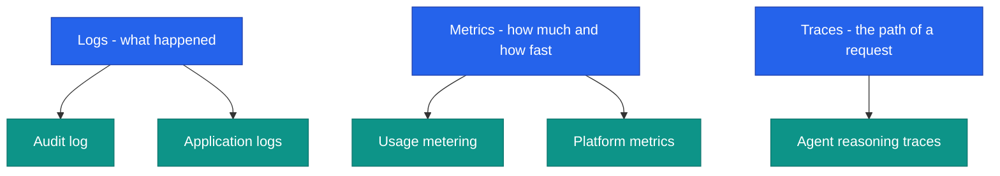
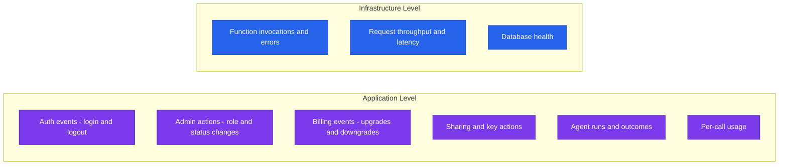
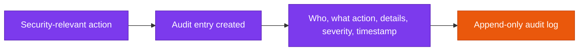
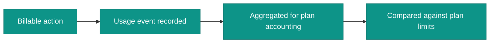
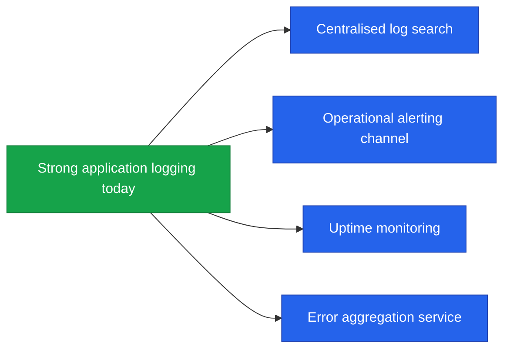

<!--
  Render note: diagrams use Mermaid. View in VS Code preview (Ctrl+Shift+V) with
  the "Markdown Preview Mermaid Support" extension, or in GitHub/GitLab/Notion.
  Diagram style is parser-safe. Items marked [INPUT NEEDED] require owner action.
-->

# Querify — Monitoring and Observability

**Natural-Language Analytics Platform**

| | |
|---|---|
| **Document** | Monitoring and Observability |
| **Owner** | Engineering / DevOps |
| **Version** | 2.0 (Comprehensive Edition) |
| **Status** | Active |
| **Date** | 27 June 2026 |
| **Classification** | Confidential — Internal |
| **Audience** | Engineering, operations, leadership |

---

## How to Read This Document

Layered as **In plain words**, **The detail**, **Why it matters**, with a [Glossary](#9-glossary).

---

## Table of Contents

1. [Executive Summary](#1-executive-summary)
2. [Key Concepts in Plain Words](#2-key-concepts-in-plain-words)
3. [The Three Pillars](#3-the-three-pillars)
4. [What Is Tracked Today](#4-what-is-tracked-today)
5. [Audit Logging](#5-audit-logging)
6. [Agent Traces](#6-agent-traces)
7. [Usage Metering and Health](#7-usage-metering-and-health)
8. [Alerting and Recommended Enhancements](#8-alerting-and-recommended-enhancements)
9. [Glossary](#9-glossary)

---

## 1. Executive Summary

**In plain words.** "Observability" means being able to see what the system is doing — who did what, what the AI did, how much was used, and whether everything is healthy. Querify already records a lot of this. The main thing to add after launch is *proactive alerts* that tell the team about problems automatically, instead of someone having to look.

**The detail.** Querify captures an append-only **audit log** of security-relevant actions, **agent traces** of every AI run, **usage metering** for billing, and an internal **analytics dashboard** summarising platform health. Infrastructure-level logs and metrics come from the managed cloud platform.

**Why it matters.** You cannot fix what you cannot see. Strong observability shortens the time to detect and diagnose problems, which directly protects uptime and customer trust.

> **Executive takeaway:** The platform is well-instrumented at the application level. The main post-launch enhancement is proactive alerting on the signals it already collects.

---

## 2. Key Concepts in Plain Words

| Concept | Plain-words explanation | Everyday analogy |
|---|---|---|
| **Logs** | A written record of events as they happen | A diary of what occurred and when |
| **Metrics** | Numbers measured over time | A car's speedometer and fuel gauge |
| **Traces** | The step-by-step path of a single request | A parcel-tracking history |
| **Audit log** | A tamper-resistant record of sensitive actions | A visitor sign-in book that cannot be erased |
| **Alerting** | Automatic notification when something is wrong | A smoke alarm |
| **Observability** | The overall ability to understand the system from the outside | A hospital monitor showing vital signs |

---

## 3. The Three Pillars

**In plain words.** Good observability rests on three kinds of information: logs (what happened), metrics (how much and how fast), and traces (the path a request took). Querify provides all three.

| Pillar | Question it answers | Where Querify provides it |
|---|---|---|
| Logs | What happened? | Audit log plus application logs |
| Metrics | How much, how fast? | Usage metering plus platform metrics |
| Traces | What path did it take? | Agent reasoning traces |

**Why it matters.** Each pillar answers a different question during an investigation. Having all three means the team can move quickly from "something is wrong" to "here is exactly why."

---

## 4. What Is Tracked Today

**In plain words.** Here is the signal the platform already captures, at both the application level (what users and the AI did) and the infrastructure level (how the servers behaved).

| Signal | Captured | Stored in |
|---|---|---|
| Authentication events | Yes | Audit log |
| Admin actions (role, status, plan) | Yes | Audit log |
| Billing lifecycle | Yes | Audit log plus payment events |
| Agent runs (steps, tokens, latency, success) | Yes | Agent traces |
| Per-call API usage | Yes | Usage events |
| Daily token consumption | Yes | Daily token logs |
| Function errors and latency | Yes | Cloud platform logs and metrics |

**Why it matters.** This breadth of signal means most questions ("did this user really do that?", "why was the app slow yesterday?", "how much AI did we use?") can already be answered from data the platform records.

---

## 5. Audit Logging

**In plain words.** Every sensitive action — a login, an admin changing someone's role, a plan upgrade — is written into a special record that can be added to but never edited or erased.

| Field | Meaning |
|---|---|
| Actor | The user (or "system") who performed the action |
| Action | A named event (for example, a role change or a key creation) |
| Details | Context such as the target and what changed |
| Severity | Informational, warning, or critical |
| Timestamp | When it happened |

**Why it matters.** An append-only audit log is the backbone of accountability and incident investigation. Because it cannot be altered, it is trustworthy evidence of what occurred.

> **Privacy note.** Audit logs record *actions*, not sensitive payloads. Passwords and full payment details are never logged.

---

## 6. Agent Traces

**In plain words.** Every time the AI answers a question, Querify records the steps it took, the query it wrote, how many AI "tokens" it used, and how long it took. This makes every answer explainable after the fact.

| Captured per run | Use |
|---|---|
| Ordered reasoning steps | Understand how an answer was reached |
| Generated query | Audit and debugging |
| Tokens and latency | Cost and performance analysis |
| Success or error | Quality monitoring |

Traces are retained according to plan tier (7 to 90 days; unlimited on Enterprise) and pruned automatically by the scheduler.

**Why it matters.** Traces are what let the team (and the user) trust and debug AI answers. If a result looks odd, the trace shows exactly how it was produced — turning a mysterious black box into a transparent record.

---

## 7. Usage Metering and Health

**In plain words.** The platform counts billable actions for plan accounting and exposes simple health signals so the team can see at a glance that everything is up.

**Metering.**

| Metric | Purpose |
|---|---|
| API calls | Public API accounting |
| Token usage | Daily allowance enforcement |
| Scheduled runs and alert evaluations | Automation accounting |

**Health and platform metrics.**

| Signal | Source |
|---|---|
| Service health endpoint | A simple check the platform exposes |
| Function invocations, errors, duration | Cloud platform metrics |
| Database connectivity and performance | Managed database monitoring |
| Internal analytics dashboard | Summarises users, queries, tokens, providers, and recent activity |

**Why it matters.** Metering keeps billing fair and transparent. Health signals give an early read on whether the service is healthy, before customers notice anything.

---

## 8. Alerting and Recommended Enhancements

**In plain words.** Querify already has user-facing data alerts. For *operations*, the recommended next step is to wire the existing signals to an alerting channel so the team is notified automatically of trouble.

**Operational alerting targets.**

| Condition | Why it matters | Status |
|---|---|---|
| Spike in failed logins | Possible brute-force attempt | [INPUT NEEDED — wire to an alerting channel] |
| Spike in server errors | Service degradation | [INPUT NEEDED] |
| Payment webhook failures | Revenue and plan-sync risk | [INPUT NEEDED] |
| Critical audit events | Sensitive admin actions | [INPUT NEEDED] |
| Database health degradation | Imminent outage risk | [INPUT NEEDED] |

**Recommended enhancements.**

| Enhancement | Benefit |
|---|---|
| Centralised log search | Faster incident investigation across functions |
| Operational alerting channel | Proactive notification of the conditions above |
| External uptime monitoring | Independent confirmation the service is reachable |
| Error aggregation | Group and prioritise recurring errors |

**Why it matters.** Moving from "look and see" to "be told automatically" is the difference between catching a problem in minutes versus hours. These are modest additions on top of signal the platform already produces.

---

## 9. Glossary

| Term | Plain-words definition |
|---|---|
| **Observability** | The ability to understand a system from its outputs |
| **Log** | A recorded event |
| **Metric** | A measured number over time |
| **Trace** | The step-by-step record of one request |
| **Audit log** | A tamper-resistant record of sensitive actions |
| **Append-only** | Can be added to but never changed or deleted |
| **Metering** | Counting usage for billing |
| **Latency** | How long something takes to respond |
| **Throughput** | How many requests are handled over time |
| **Alerting** | Automatic notification of a problem |
| **Health endpoint** | A simple address reporting whether the service is up |
| **Token** | A unit of AI text processing, used to measure usage |

---

---

**Querify — Monitoring and Observability v2.0 (Comprehensive Edition)**
Confidential — Internal Use Only · © 2026 Querify

