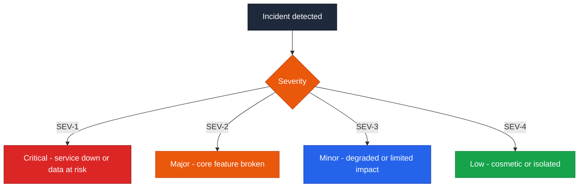
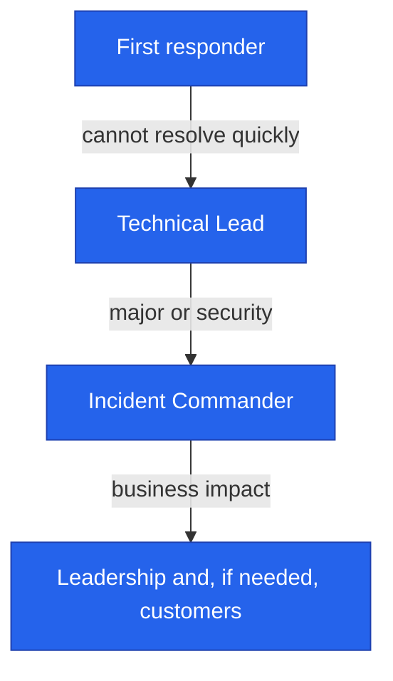
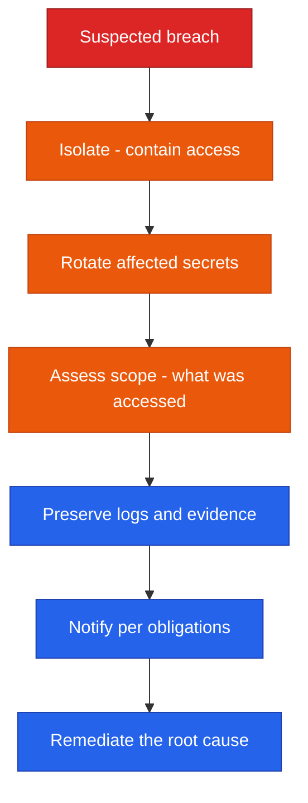

<!--
  Render note: diagrams use Mermaid. View in VS Code preview (Ctrl+Shift+V) with
  the "Markdown Preview Mermaid Support" extension, or in GitHub/GitLab/Notion.
  Diagram style is parser-safe. Items marked [INPUT NEEDED] require owner action.
-->

# Querify — Incident Response Plan

**Natural-Language Analytics Platform**

| | |
|---|---|
| **Document** | Incident Response Plan |
| **Owner** | Engineering / Security |
| **Version** | 2.0 (Comprehensive Edition) |
| **Status** | Active |
| **Date** | 27 June 2026 |
| **Classification** | Confidential — Internal |
| **Audience** | Engineering, security, leadership, on-call staff |

---

## How to Read This Document

Layered as **In plain words**, **The detail**, **Why it matters**, with a [Glossary](#9-glossary). When the worst happens, this is the calm, pre-agreed playbook.

---

## Table of Contents

1. [Purpose](#1-purpose)
2. [Key Concepts in Plain Words](#2-key-concepts-in-plain-words)
3. [Severity Levels](#3-severity-levels)
4. [Roles](#4-roles)
5. [Response Lifecycle](#5-response-lifecycle)
6. [Escalation](#6-escalation)
7. [Security Breach Procedure](#7-security-breach-procedure)
8. [Rapid Secret Rotation and Communication](#8-rapid-secret-rotation-and-communication)
9. [Glossary](#9-glossary)

---

## 1. Purpose

**In plain words.** This plan is the fire drill for Querify. It says, in advance, who is in charge, how serious different problems are, and exactly what to do — so that during a real incident the team acts calmly and consistently instead of improvising under stress.

**The detail.** This plan defines how the team detects, responds to, and recovers from incidents — outages, degradations, and security events. The goal is to minimise impact, restore service quickly, and learn from every incident.

**Why it matters.** The middle of an incident is the worst time to invent a process. A pre-agreed plan turns chaos into a checklist, reduces downtime, and protects customer trust.

> **Executive takeaway:** There is a defined chain of command, clear severity levels, and a step-by-step breach procedure including rapid secret rotation. The team does not improvise under pressure.

---

## 2. Key Concepts in Plain Words

| Concept | Plain-words explanation | Everyday analogy |
|---|---|---|
| **Incident** | Anything that disrupts the service or risks data | A fire, flood, or break-in |
| **Severity** | How serious the incident is | The difference between a smoke wisp and a blaze |
| **Incident Commander** | The single person in charge of the response | The fire chief at the scene |
| **Escalation** | Bringing in more senior help when needed | Calling for backup |
| **Containment** | Stopping the problem from spreading | Closing a fire door |
| **Post-incident review** | Learning from what happened, without blame | A debrief after the event |

---

## 3. Severity Levels

**In plain words.** Not all problems are equal. Severity levels (SEV-1 most serious to SEV-4 least) decide how fast and how widely the team responds.

| Level | Definition | Examples | Response time |
|---|---|---|---|
| SEV-1 | Service down or customer data at risk | Total outage, suspected breach, payment failure | Immediate, all hands |
| SEV-2 | A core feature is broken for many users | Login failing, queries failing widely | Urgent |
| SEV-3 | Degraded or limited impact | Slow responses, one feature affected | Same business day |
| SEV-4 | Cosmetic or isolated | Minor visual glitch | Next planned work |

**Why it matters.** A shared severity scale means everyone instantly understands how urgently to react, without debate, the moment an incident is classified.

---

## 4. Roles

**In plain words.** During an incident, a few clear roles prevent confusion: one person leads, one fixes, one communicates, one keeps notes.

| Role | Responsibility |
|---|---|
| Incident Commander | Owns the incident end to end; makes decisions; coordinates |
| Technical Lead | Diagnoses and applies the fix or rollback |
| Communications Lead | Updates internal stakeholders and, if needed, customers |
| Scribe | Records the timeline of actions and findings |

> For a small team, one person may hold several roles. The Incident Commander role must always be explicitly assigned. **[INPUT NEEDED — name the on-call owner and contact method.]**

**Why it matters.** Clear roles prevent the two classic incident failures: everyone assuming someone else is handling it, or several people stepping on each other.

---

## 5. Response Lifecycle

**In plain words.** Every incident follows the same arc: notice it, size it up, stop the bleeding, fix it, confirm it is fixed, tell people, and learn from it.

| Phase | Action |
|---|---|
| Detect | Notice the problem (monitoring, user report, alert) |
| Triage | Assign a severity and an Incident Commander |
| Contain | Limit the spread (disable a feature, block traffic, suspend an account) |
| Fix | Apply a fix or roll back to the last good release |
| Verify | Confirm the service is healthy |
| Communicate | Tell stakeholders it is resolved |
| Review | Hold a blameless post-incident review |

**Why it matters.** Containment before fixing is the key discipline: stopping the spread limits damage even before the root cause is found.

---

## 6. Escalation

**In plain words.** If the first responder cannot resolve it quickly, the issue moves up to more senior help, and for serious cases, to leadership.

| Trigger | Escalate to |
|---|---|
| Cannot resolve within the severity's response time | Technical Lead |
| SEV-1 or SEV-2, or any security event | Incident Commander |
| Customer-impacting or financial | Leadership and communications |

**Why it matters.** Clear escalation paths ensure problems do not stall with someone who is stuck — help arrives on a defined timeline.

---

## 7. Security Breach Procedure

**In plain words.** A suspected breach gets a special, urgent sequence: lock it down, change the keys, work out what was reached, keep the evidence, notify whoever must be told, and fix the root cause.

| Step | Action |
|---|---|
| Isolate | Contain access — suspend compromised accounts or keys, restrict entry points |
| Rotate | Rotate any potentially exposed secrets immediately (see section 8) |
| Assess | Determine what data or systems were reachable, using the audit log |
| Preserve | Keep logs and evidence; the audit log is append-only by design |
| Notify | Inform affected parties per legal and contractual obligations **[INPUT NEEDED — confirm notification obligations for your jurisdiction]** |
| Remediate | Fix the root cause and harden against recurrence |

**Why it matters.** A breach is the highest-stakes incident. Following a precise sequence — especially preserving evidence and meeting notification obligations — protects both customers and the company legally.

---

## 8. Rapid Secret Rotation and Communication

**In plain words.** Knowing how to change secret keys fast is essential during a breach. And keeping people informed — internally always, customers when it affects them — is part of every incident.

**Rapid secret rotation.**

| Secret | Where it lives | Rotation note |
|---|---|---|
| Identity provider secret | Clerk plus GitHub Secrets | Regenerate in Clerk, update the secret, re-deploy |
| Payment provider secret | Cashfree plus GitHub Secrets | Regenerate in Cashfree, update, re-deploy |
| Database connection string | GitHub Secrets | Rotate the database user, update, re-deploy |
| Payload obfuscation key | Both halves | Must change in both; mismatched halves break requests |
| At-rest encryption key | GitHub Secrets | Caution — rotating it makes existing encrypted credentials unreadable; requires a re-encryption plan |

> **Critical caveat:** The at-rest encryption key cannot be casually rotated. A rotation plan must re-encrypt existing stored credentials with the new key. Treat this key as long-lived and protect it accordingly.

**Communication.**

| Audience | When | Channel |
|---|---|---|
| Internal team | Throughout the incident | [INPUT NEEDED — team channel] |
| Customers | When there is material impact | [INPUT NEEDED — status page or email] |
| Leadership | SEV-1 and SEV-2 | Direct |

**Post-incident review.** Every SEV-1 and SEV-2 gets a blameless review: what happened, the root cause, what went well and poorly, and concrete actions to prevent recurrence. "Blameless" means focusing on systems and process, not individuals.

**Why it matters.** Fast, correct secret rotation can be the difference between a contained scare and a real breach. Honest, timely communication preserves trust even when something goes wrong.

---

## 9. Glossary

| Term | Plain-words definition |
|---|---|
| **Incident** | An event disrupting service or risking data |
| **Severity (SEV)** | How serious an incident is, from 1 (worst) to 4 |
| **Incident Commander** | The person in charge of the response |
| **Triage** | Quickly assessing and prioritising |
| **Containment** | Stopping a problem from spreading |
| **Escalation** | Bringing in more senior help |
| **Secret rotation** | Replacing secret keys with new ones |
| **Breach** | Unauthorised access to systems or data |
| **Blameless review** | A learning-focused debrief without blame |
| **Root cause** | The underlying reason, not just the symptom |

---

---

**Querify — Incident Response Plan v2.0 (Comprehensive Edition)**
Confidential — Internal Use Only · © 2026 Querify

