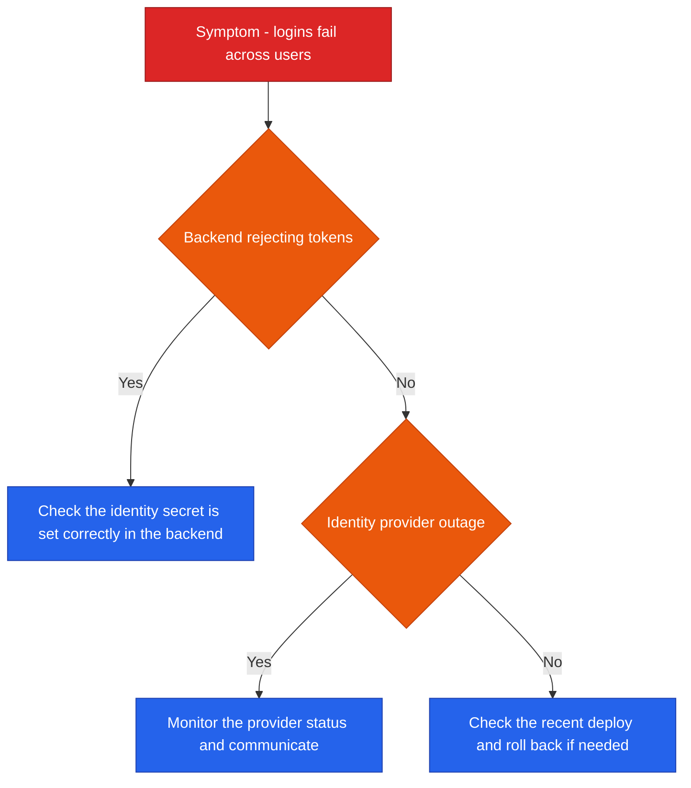
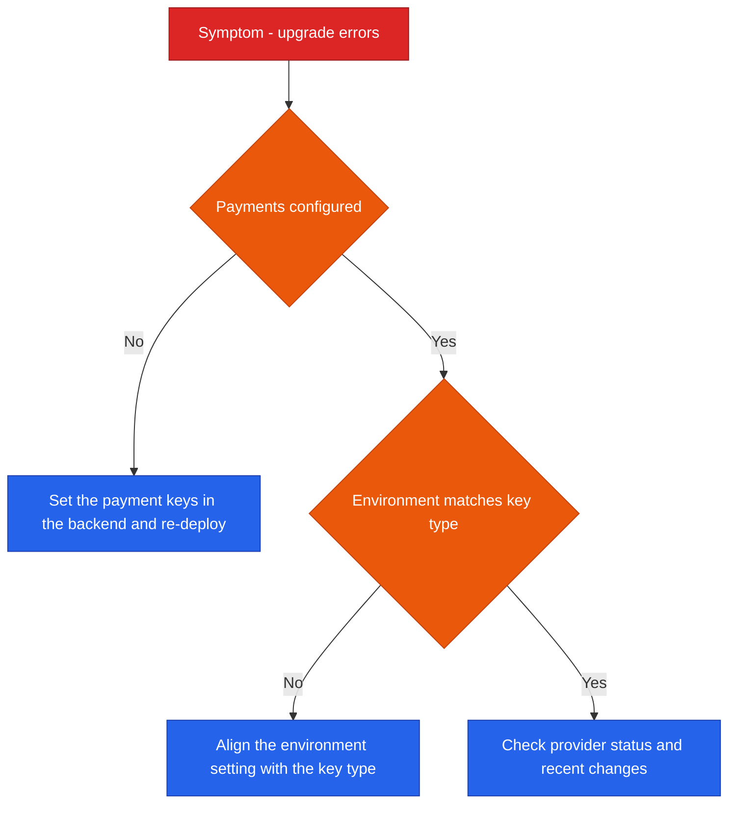
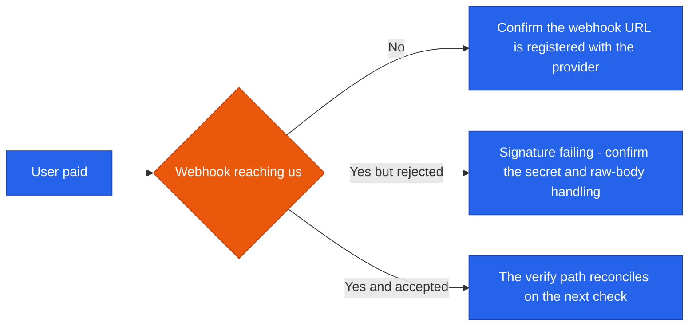
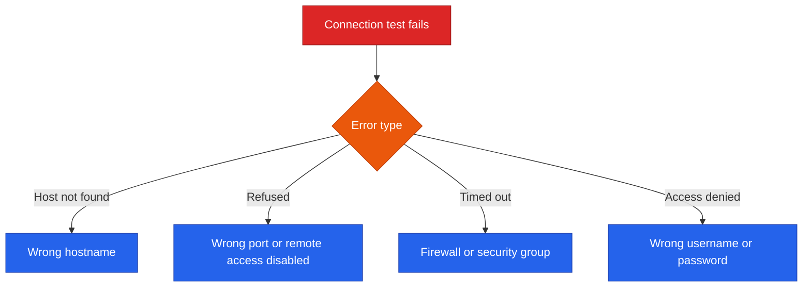
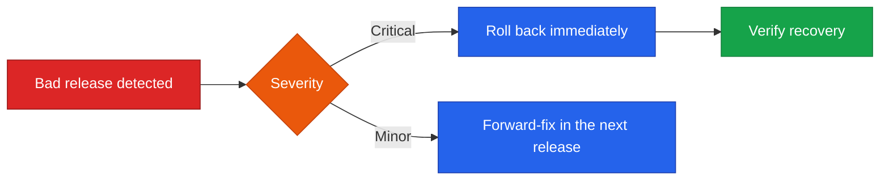
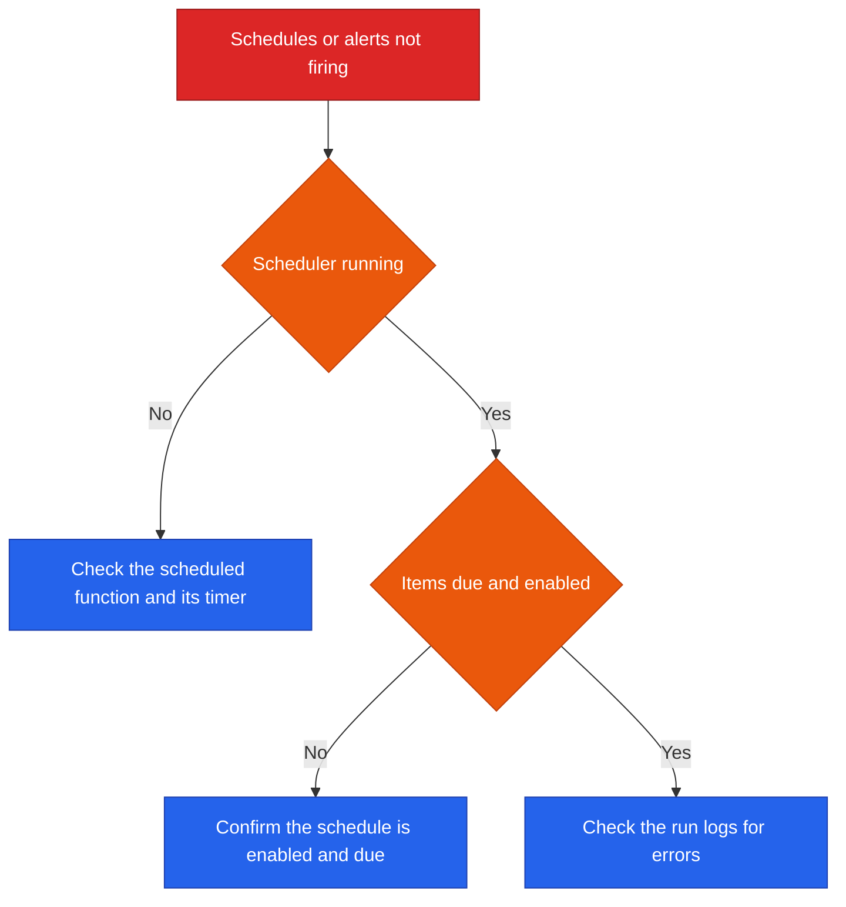

<!--
  Render note: diagrams use Mermaid. View in VS Code preview (Ctrl+Shift+V) with
  the "Markdown Preview Mermaid Support" extension, or in GitHub/GitLab/Notion.
  Diagram style is parser-safe: no line-break tags, no emoji, no semicolons in
  labels, no nested subgraphs, no cylinder shapes.
-->

# Querify — Operational Runbooks

**Natural-Language Analytics Platform**

| | |
|---|---|
| **Document** | Operational Runbooks |
| **Owner** | Engineering / DevOps |
| **Version** | 2.0 (Comprehensive Edition) |
| **Status** | Active |
| **Date** | 27 June 2026 |
| **Classification** | Confidential — Internal |
| **Audience** | On-call engineers, support, operations |

---

## What a Runbook Is (In Plain Words)

**In plain words.** A runbook is a recipe for a specific emergency: "if you see X, do these steps." It is written to be followed by someone under pressure, possibly half-asleep at 2am, who needs to act correctly without having to think it all through from scratch.

**Why it matters.** Runbooks turn rare, stressful situations into repeatable procedures. They capture hard-won knowledge so that any team member — not just the original author — can resolve a problem quickly and safely.

**How to use a runbook.** Find the symptom in the index, jump to that runbook, follow the steps in order, and use the diagram to decide between branches. Each runbook states the **symptom**, the **likely cause**, and the **resolution**.

### Index

| # | Scenario | Severity |
|---|---|---|
| 1 | Users cannot log in | SEV-1/2 |
| 2 | Payments or upgrades failing | SEV-1/2 |
| 3 | Payment webhook not updating plans | SEV-2 |
| 4 | A user cannot create a resource | SEV-3 |
| 5 | Live database connection fails | SEV-3 |
| 6 | Slow first response after idle | SEV-3 |
| 7 | A bad release reached production | SEV-1/2 |
| 8 | Suspected secret exposure | SEV-1 |
| 9 | Suspend a user immediately | SEV-2 |
| 10 | Scheduled reports or alerts not running | SEV-3 |

---

## Runbook 1 — Users Cannot Log In

**Symptom.** Logins fail across many users.

| Likely cause | Resolution |
|---|---|
| Backend has the wrong or missing identity secret (test key in production, or unset) | Confirm the live identity secret is set in the backend and matches the live identity instance; re-deploy |
| Identity provider outage | Confirm via the provider status page; communicate to users; wait for recovery |
| A recent deploy broke authentication | Roll back to the last good release |

> **Known pattern (why this happens):** Login breaks if the backend runs with a *test* identity key while the frontend uses the *live* one. The two must be from the same identity instance. This is the single most common login failure.

---

## Runbook 2 — Payments or Upgrades Failing

**Symptom.** The upgrade button errors, or checkout fails.

| Likely cause | Resolution |
|---|---|
| Payment keys not set | A "payments not available" message means the backend lacks payment keys; set them and re-deploy |
| Environment and key mismatch | A "bad gateway" or "authentication failed" at checkout means the environment setting (test versus live) does not match the key type; align them and re-deploy |
| Provider issue | Check the payment provider's status |

> **Known pattern:** Test keys with the environment set to live (or vice versa) cause an authentication failure. They must match exactly.

---

## Runbook 3 — Payment Webhook Not Updating Plans

**Symptom.** A user paid, but their plan did not upgrade automatically.

| Likely cause | Resolution |
|---|---|
| Webhook URL not registered | Register the webhook endpoint in the provider dashboard |
| Signature verification failing | Confirm the signing secret is correct; the webhook must read the raw request body |
| Transient miss | The verification path reconciles the payment when the user returns; confirm the plan updates |

> **Safety net:** Plan upgrades are idempotent and reconciled by both the webhook and a verification check, so a single missed webhook does not lose the payment.

---

## Runbook 4 — A User Cannot Create a Resource

**Symptom.** A user sees a "limit reached" message.

| Likely cause | Resolution |
|---|---|
| Plan limit reached | Expected behaviour — the user is at their plan's cap for that resource. Advise an upgrade, or confirm their plan tier |
| Plan not reflecting a recent upgrade | Confirm the upgrade applied; the plan refreshes after payment verification |

> Usually no action is needed — this is the plan-limit system working as designed.

---

## Runbook 5 — Live Database Connection Fails

**Symptom.** A connection test fails.

| Cause | Resolution |
|---|---|
| Host not found | The hostname is wrong; correct it |
| Connection refused | Check the port and that the database accepts remote connections |
| Timed out | Check firewall and security-group rules allow the connection |
| Access denied | Check the username and password |

> The platform already returns these as friendly, specific messages, so the user usually self-serves. Recommend a read-only, least-privilege database user.

---

## Runbook 6 — Slow First Response After Idle

**Symptom.** The first request after a quiet period is slow.

| Cause | Resolution |
|---|---|
| Serverless cold start | Expected for the first request after idle; a keep-alive routine reduces this. If persistently slow, review function memory and the keep-alive cadence |

> This is normal serverless behaviour, not a fault. Subsequent requests are fast.

---

## Runbook 7 — A Bad Release Reached Production

**Symptom.** A new release is causing errors.

| Step | Action |
|---|---|
| Assess | Decide critical (roll back) versus minor (forward-fix) |
| Roll back frontend | Redeploy the last good build in the hosting console |
| Roll back backend | Re-deploy from the last good commit or previous stack version |
| Verify | Health check and smoke test |

See the CI/CD document for full rollback detail.

---

## Runbook 8 — Suspected Secret Exposure

**Symptom.** A secret key may have leaked.

| Step | Action |
|---|---|
| Contain | Restrict access to the affected system |
| Rotate | Rotate the exposed secret immediately (see the Incident Response Plan) |
| Assess | Use the audit log to determine exposure |
| Remediate | Fix how the secret leaked; confirm it is not in source or logs |

> Mind the at-rest encryption key caveat — it cannot be casually rotated without re-encrypting stored credentials.

---

## Runbook 9 — Suspend a User Immediately

**Symptom.** A user must be blocked right away.

| Step | Action |
|---|---|
| Suspend | An admin sets the user's status to suspended in the admin area |
| Effect | The suspension takes effect within seconds — the user is blocked even with a valid session token |
| Verify | Confirm the user can no longer access the API |

> The platform blocks suspended users at the authentication layer, with a short cache that is cleared immediately on suspension.

---

## Runbook 10 — Scheduled Reports or Alerts Not Running

**Symptom.** Schedules or alerts are not firing.

| Cause | Resolution |
|---|---|
| Scheduler not invoking | Confirm the scheduled function and its timer are active |
| Nothing due | Confirm the schedule is enabled and its next-run time has passed |
| Runs failing | Check the run logs for the specific error (often a data or query issue) |

---

## Glossary

| Term | Plain-words definition |
|---|---|
| **Runbook** | A step-by-step guide for a specific problem |
| **Symptom** | The observable sign that something is wrong |
| **Rollback** | Returning to the previous good version |
| **Cold start** | The brief delay when a serverless function wakes from idle |
| **Webhook** | An automatic message from another service |
| **Idempotent** | Running an action twice has the same effect as once |
| **Least-privilege** | Granting only the minimum access needed |
| **Secret rotation** | Replacing a secret key with a new one |
| **Token** | A temporary pass proving a user is logged in |

---

---

**Querify — Operational Runbooks v2.0 (Comprehensive Edition)**
Confidential — Internal Use Only · © 2026 Querify

