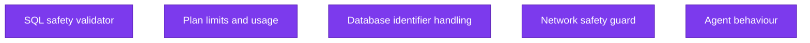
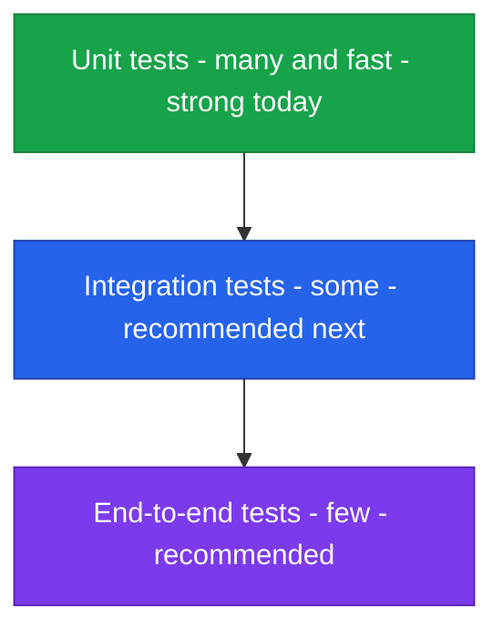
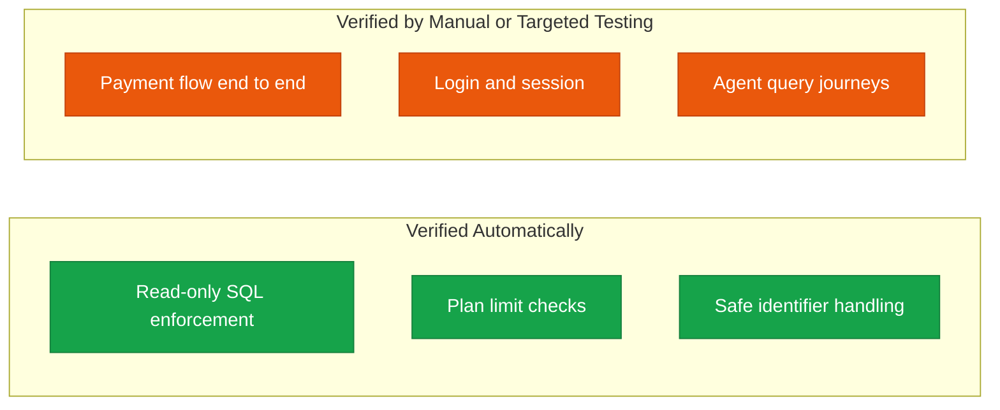
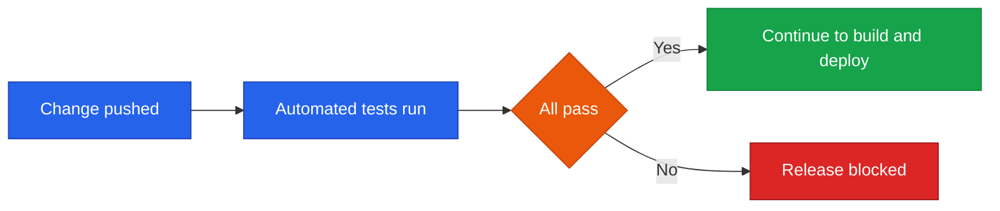
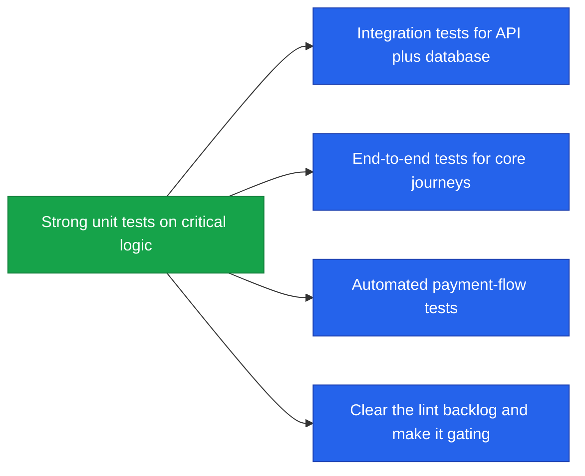

<!--
  Render note: diagrams use Mermaid. View in VS Code preview (Ctrl+Shift+V) with
  the "Markdown Preview Mermaid Support" extension, or in GitHub/GitLab/Notion.
  Diagram style is parser-safe.
-->

# Querify — Testing Strategy

**Natural-Language Analytics Platform**

| | |
|---|---|
| **Document** | Testing Strategy |
| **Owner** | Engineering |
| **Version** | 2.0 (Comprehensive Edition) |
| **Status** | Active |
| **Date** | 27 June 2026 |
| **Classification** | Confidential — Internal |
| **Audience** | Engineers, technical leadership, quality reviewers |

---

## How to Read This Document

Layered as **In plain words**, **The detail**, **Why it matters**, with a [Glossary](#9-glossary).

---

## Table of Contents

1. [Executive Summary](#1-executive-summary)
2. [Key Concepts in Plain Words](#2-key-concepts-in-plain-words)
3. [Testing Philosophy](#3-testing-philosophy)
4. [What Is Tested Today](#4-what-is-tested-today)
5. [The Testing Pyramid](#5-the-testing-pyramid)
6. [Critical Paths Under Test](#6-critical-paths-under-test)
7. [Tests in the Pipeline](#7-tests-in-the-pipeline)
8. [Coverage and Recommended Enhancements](#8-coverage-and-recommended-enhancements)
9. [Glossary](#9-glossary)

---

## 1. Executive Summary

**In plain words.** Testing is how the team proves the software does what it should before customers see it. Querify focuses its automated tests on the riskiest logic — the parts where a bug would be most damaging, like the safety check that keeps queries read-only and the rules that enforce paid plan limits. These tests run automatically and block any release that fails them.

**The detail.** Querify's automated tests focus on the highest-risk logic: the SQL safety validator, plan-limit enforcement, database identifier handling, and network safety. These run automatically in the pipeline and are a hard gate on every release.

**Why it matters.** Targeting tests at risk gives the most safety per unit of effort. The areas most likely to cause a security hole or a billing error are precisely the areas verified on every change.

> **Executive takeaway:** Testing is aimed at risk, not vanity coverage. The most security- and revenue-critical logic is verified automatically before every release.

---

## 2. Key Concepts in Plain Words

| Concept | Plain-words explanation | Everyday analogy |
|---|---|---|
| **Test** | An automatic check that code behaves correctly | A spell-checker for behaviour |
| **Unit test** | Checks one small piece in isolation | Testing a single light bulb |
| **Integration test** | Checks pieces working together | Testing the whole lighting circuit |
| **End-to-end test** | Checks a full user journey | Flipping the switch and confirming the room lights up |
| **Coverage** | How much of the code the tests exercise | The percentage of the house you have inspected |
| **Regression** | A new change breaking something that worked | A repair that accidentally breaks something else |

---

## 3. Testing Philosophy

**In plain words.** Test the things that hurt most if they break, automate those tests so they run every time, and block releases that fail. Then expand coverage steadily.

| Principle | Meaning |
|---|---|
| Risk-first | Test the logic whose failure costs the most |
| Automated | Tests run on every change, with no manual step |
| Gating | A failing test blocks the release |
| Pragmatic | Coverage grows with the product, prioritised by risk |

**Why it matters.** This philosophy delivers real safety quickly for a small team, rather than chasing a coverage number that looks good but tests low-risk code.

---

## 4. What Is Tested Today

**In plain words.** The automated tests today cover the highest-stakes logic in the product.

| Suite | What it verifies | Why it matters |
|---|---|---|
| SQL validator | Only read-only queries pass; writes and multi-statements are blocked | Core security control |
| Plan limits | Limits enforce correctly; unlimited tiers pass | Revenue integrity |
| Identifier handling | Database names and identifiers are handled safely | Prevents injection via identifiers |
| Network guard | Outbound network safety | Prevents abuse of server-side requests |
| Agent behaviour | The agent's core decision logic | Product correctness |

**Why it matters.** Each of these suites guards a place where a single bug could mean a security breach, an incorrect bill, or a wrong answer — the three things that would most damage trust.

---

## 5. The Testing Pyramid

**In plain words.** A healthy test suite is shaped like a pyramid: many small, fast tests at the base, fewer medium ones in the middle, and a handful of full-journey tests at the top. Querify has a strong base today and plans to grow the upper layers.

| Layer | Speed | Current state |
|---|---|---|
| Unit | Fast, many | In place for critical logic |
| Integration | Medium | Recommended next (API plus database flows) |
| End-to-end | Slow, few | Recommended (full user journeys) |

**Why it matters.** The pyramid shape keeps the suite fast (most tests are quick unit tests) while still catching whole-journey problems with a few high-level tests. It is the industry-proven balance.

---

## 6. Critical Paths Under Test

**In plain words.** Here is what is verified automatically versus what is currently checked by hand or targeted testing.

| Path | How it is verified |
|---|---|
| Read-only SQL enforcement | Automated unit tests |
| Plan limits | Automated unit tests |
| Payment flow | Verified end to end against the payment sandbox (and recommended for automated tests) |
| Login and sessions | Delegated to the identity provider; verified through manual and smoke testing |
| Agent query journeys | Agent logic tested; full journeys verified manually |

**Why it matters.** Being honest about what is automated versus manual shows where the next investment should go (automating the payment and journey paths) and where confidence already rests on solid automation.

---

## 7. Tests in the Pipeline

**In plain words.** Tests run automatically on every change. If any fail, the change cannot be released — there is no manual override to push past red tests.

**Why it matters.** Automated, gating tests mean quality does not depend on anyone remembering to run them. The machine enforces it consistently, on every single change.

---

## 8. Coverage and Recommended Enhancements

**In plain words.** Coverage is driven by risk rather than a single target number. The type system already catches a whole class of errors before tests even run. The recommended next steps deepen coverage where it is currently lightest.

| Aspect | Approach |
|---|---|
| What to cover | Security-critical and revenue-critical logic first |
| How much | Driven by risk, not a single percentage target |
| Type safety | The codebase is typed, catching many errors before tests run |
| Linting | Runs in the pipeline (report-only while a known backlog is cleared) |

| Enhancement | Benefit |
|---|---|
| Integration tests | Confidence that routes and the database work together |
| End-to-end tests | Confidence in full user journeys (login, query, upgrade) |
| Automated payment tests | Continuous assurance of the revenue path |
| Lint as a hard gate | Once the backlog is cleared, enforce style automatically |

**Why it matters.** These enhancements are the roadmap to even higher confidence. They are prioritised so the highest-value additions (journey and payment tests) come first.

---

## 9. Glossary

| Term | Plain-words definition |
|---|---|
| **Test** | An automatic check that code behaves correctly |
| **Unit test** | A test of one small piece in isolation |
| **Integration test** | A test of pieces working together |
| **End-to-end test** | A test of a complete user journey |
| **Coverage** | How much of the code the tests exercise |
| **Regression** | A change that breaks something that previously worked |
| **Quality gate** | A checkpoint that blocks a release on failure |
| **Type safety** | Catching errors from mismatched data types before running |
| **Lint** | Automated checking of code style and common mistakes |
| **Smoke test** | A quick check that core functions work |
| **Sandbox** | A safe test environment provided by an external service |

---

---

**Querify — Testing Strategy v2.0 (Comprehensive Edition)**
Confidential — Internal Use Only · © 2026 Querify

