<!--
  Render note: diagrams use Mermaid. View in VS Code preview (Ctrl+Shift+V) with
  the "Markdown Preview Mermaid Support" extension, or in GitHub/GitLab/Notion.
  Diagram style is parser-safe.
-->

# Querify — Technical Debt Register

**Natural-Language Analytics Platform**

| | |
|---|---|
| **Document** | Technical Debt Register |
| **Owner** | Engineering |
| **Version** | 2.0 (Comprehensive Edition) |
| **Status** | Living Document |
| **Date** | 27 June 2026 |
| **Classification** | Confidential — Internal |
| **Audience** | Engineering, technical leadership, product planning |

---

## What Technical Debt Is (In Plain Words)

**In plain words.** Technical debt is like a small shortcut you take to move faster now, knowing you will have to come back and tidy it up later. A little is healthy and normal; too much slows everything down. This register is the honest, running list of those shortcuts, so they are visible and managed rather than forgotten.

**Why it matters.** Hidden debt causes nasty surprises. A written register turns "things we vaguely know are not ideal" into a prioritised, trackable list — which is exactly what mature teams keep.

**How it works.** Each item records its impact, the effort to fix, and a priority. Items are added as they arise and removed as they are paid down.

### Priority Legend

| Priority | Meaning |
|---|---|
| P1 | Address soon — meaningful risk or cost |
| P2 | Plan for an upcoming cycle |
| P3 | Nice to have — low urgency |

---

## Register

| ID | Item | Impact | Effort | Priority |
|---|---|---|---|---|
| TD-01 | Spreadsheet parser has a known vulnerability with no registry fix | Parsing attack surface on uploaded files | Medium | P1 |
| TD-02 | Lint runs report-only due to a pre-existing backlog | Style and type issues not enforced | Medium | P2 |
| TD-03 | Rate limiting is in-memory per function instance | Limits are not globally exact across instances | Medium | P2 |
| TD-04 | No dedicated staging environment | Changes are tested locally then go to production | Medium | P1 |
| TD-05 | A database driver dependency carries unpatched advisories | Reachable only when that database type is used | Low to Medium | P2 |
| TD-06 | Single database region | No automatic regional failover | Medium | P2 |
| TD-07 | Limited automated integration and end-to-end tests | Full journeys verified manually | Medium | P2 |
| TD-08 | Operational alerting not yet wired to a channel | Detection relies on manual checks | Medium | P1 |
| TD-09 | Relational integrity enforced in app code, not the database | Possible for logic gaps to allow inconsistent data | Low | P3 |
| TD-10 | Backup schedule and recovery targets not yet formally confirmed | Recovery expectations undocumented | Low | P1 |

---

## Detail (with Plain-Words Explanations)

### TD-01 — Spreadsheet Parser Vulnerability
**Plain words.** The tool that reads uploaded spreadsheets has a known weakness with no official fix available, and it is used to open files users upload. **Recommendation:** move to the maintainer's patched distribution, or isolate parsing. It is tracked and visibly exempted in the security gate rather than hidden.

### TD-02 — Lint Backlog
**Plain words.** There is a backlog of minor code-style issues, so the automatic style checker only reports rather than blocks. **Recommendation:** clear the backlog, then make the checker a hard gate.

### TD-03 — In-Memory Rate Limiting
**Plain words.** The "how often can you call" limits are counted separately in each running copy of the backend, so under heavy scaling they are approximate rather than perfectly exact. It still blunts abuse effectively. **Recommendation:** move to a shared counter when traffic warrants.

### TD-04 — No Staging Environment
**Plain words.** There is only the developer's machine and live production — no production-like rehearsal space. **Recommendation:** add a staging environment for final checks before release. This is the highest-value reliability improvement.

### TD-05 — Database Driver Advisories
**Plain words.** One database connector has unpatched security advisories upstream; it is only exposed when a customer connects that specific database type. **Recommendation:** monitor for an upstream fix; consider gating that type until resolved.

### TD-06 — Single Database Region
**Plain words.** The database lives in one geographic region, so a whole-region outage has no automatic fallback. **Recommendation:** evaluate multi-region or cross-region backups as the customer base grows.

### TD-07 — Test Depth
**Plain words.** The critical logic is well unit-tested, but there are few tests of whole journeys or of pieces working together. **Recommendation:** add integration and end-to-end tests for login, query, and upgrade.

### TD-08 — Operational Alerting
**Plain words.** The platform records strong signals but does not yet automatically notify the team when something looks wrong. **Recommendation:** connect key conditions to an alerting channel.

### TD-09 — Application-Enforced Integrity
**Plain words.** The database itself does not enforce all the relationships between records; the application does. A logic gap could, in theory, allow inconsistent data. **Recommendation:** add validation rules where consistency is critical.

### TD-10 — Backup and Recovery Targets
**Plain words.** The backup schedule and recovery targets are proposed but not yet formally confirmed and rehearsed. **Recommendation:** confirm and document them, then run a restore drill.

---

## Summary by Priority

```mermaid
flowchart TB
    subgraph P1[P1 - Address Soon]
        direction TB
        A[Spreadsheet parser]
        B[Staging environment]
        C[Operational alerting]
        D[Confirm backup and recovery targets]
    end
    subgraph P2[P2 - Plan Soon]
        direction TB
        E[Lint backlog]
        F[Global rate limiting]
        G[Driver advisories]
        H[Multi-region]
        I[Test depth]
    end
    subgraph P3[P3 - Nice to Have]
        direction TB
        J[Database-level integrity]
    end

    classDef p1 fill:#dc2626,stroke:#991b1b,color:#fff
    classDef p2 fill:#ea580c,stroke:#c2410c,color:#fff
    classDef p3 fill:#16a34a,stroke:#15803d,color:#fff
    class A,B,C,D p1
    class E,F,G,H,I p2
    class J p3
```

**Why it matters.** This priority view is the action plan. The four P1 items are the ones worth tackling first; none is a launch blocker on its own, but each reduces real risk.

---

## Glossary

| Term | Plain-words definition |
|---|---|
| **Technical debt** | A deliberate shortcut that costs time or risk later |
| **Lint** | Automated code-style checking |
| **Rate limiting** | Capping how often an action can be performed |
| **Staging environment** | A production-like copy for final pre-release checks |
| **Advisory (CVE)** | A published security weakness in a software component |
| **Failover** | Automatically switching to a backup when the main fails |
| **Integration test** | A test of pieces working together |
| **End-to-end test** | A test of a complete user journey |
| **Relational integrity** | Guarantees that related records stay consistent |
| **Restore drill** | A practice run of recovering from a backup |

---

---

**Querify — Technical Debt Register v2.0 (Comprehensive Edition)**
Confidential — Internal Use Only · © 2026 Querify

