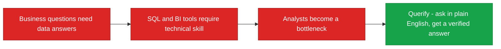
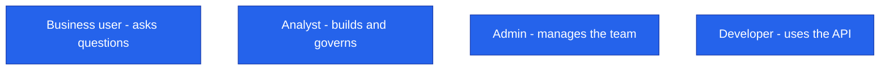

<!--
  Render note: diagrams use Mermaid. View in VS Code preview (Ctrl+Shift+V) with
  the "Markdown Preview Mermaid Support" extension, or in GitHub/GitLab/Notion.
  Diagram style is parser-safe. Items marked [INPUT NEEDED] need a business decision.
-->

# Querify — Product Requirements Document (PRD)

**Natural-Language Analytics Platform**

| | |
|---|---|
| **Document** | Product Requirements Document |
| **Owner** | Product |
| **Version** | 2.0 (Comprehensive Edition) |
| **Status** | Pre-Launch Baseline |
| **Date** | 27 June 2026 |
| **Classification** | Confidential — Internal |
| **Audience** | Product, engineering, leadership, investors |

---

## How to Read This Document

A PRD explains *what* the product does and *why*, so everyone builds toward the same goal. Layered as **In plain words**, **The detail**, **Why it matters**. Business facts only the owner can supply are marked **[INPUT NEEDED]**; everything else is grounded in what is built.

---

## Table of Contents

1. [Overview](#1-overview)
2. [Problem Statement](#2-problem-statement)
3. [Goals and Non-Goals](#3-goals-and-non-goals)
4. [Target Users](#4-target-users)
5. [Feature Requirements](#5-feature-requirements)
6. [User Experience Principles](#6-user-experience-principles)
7. [Plans and Packaging](#7-plans-and-packaging)
8. [Success Metrics](#8-success-metrics)
9. [Assumptions and Dependencies](#9-assumptions-and-dependencies)

---

## 1. Overview

**In plain words.** Querify lets people ask questions about their data in everyday English and get trustworthy answers, charts, and an explanation — no technical skill needed. It works on uploaded files and live databases, and it adds the governance, automation, and teamwork features that organisations need.

**The detail.** Querify is a natural-language analytics platform. It returns verified answers with a transparent reasoning trail, over both uploaded files and live databases, and includes a business glossary, certified metrics, scheduled automations, collaboration, a public API, and embeddable widgets.

**Why it matters.** The product turns "I have a question about my data" into "here is a trustworthy answer" without the usual barrier of needing an analyst or SQL skills — opening data-driven decisions to a far wider audience.

> **Vision statement:** [INPUT NEEDED — confirm the one-line product vision you want to lead with.]

---

## 2. Problem Statement

**In plain words.** Most people in a business cannot get answers from their own data without help. They either learn SQL (hard), wait for an analyst (slow), or guess (risky). And even when they get a number, they often do not trust it.

| Pain | Who feels it | How Querify addresses it |
|---|---|---|
| Data answers require SQL or a specialist | Non-technical business users | Plain-English querying |
| Analysts are a bottleneck for routine questions | Data teams | Self-service answers |
| "Can I believe this number?" | Decision-makers | A verification step and a reasoning trace |
| Definitions of key metrics differ across people | The whole organisation | A shared glossary and certified metrics |

**Why it matters.** Each pain maps to a built feature. The product is a direct answer to a widespread, expensive problem.

---

## 3. Goals and Non-Goals

**In plain words.** Being clear about what the product is *not* trying to do is as important as its goals — it keeps the team focused.

| Goals | Non-Goals |
|---|---|
| Let non-technical users get answers from data | Replace a full enterprise data warehouse |
| Provide verified, explainable answers | Offer write or ETL operations on customer databases (read-only by design) |
| Support both files and live databases | Be a general-purpose chatbot |
| Give teams governance and consistency | Provide ungoverned, unmoderated AI access |
| Be fast and cost-efficient | — |

**Why it matters.** The non-goals prevent scope creep and reinforce the safety posture (read-only) and the positioning (governed analytics, not a chatbot).

---

## 4. Target Users

**In plain words.** Four kinds of people use Querify, each with different needs.

| Persona | Needs | How Querify serves them |
|---|---|---|
| Business user | Quick answers without SQL | Natural-language querying with charts |
| Analyst | Consistency and reusable definitions | Glossary, certified metrics, reports |
| Admin | Team management and control | Roles, plan limits, audit log |
| Developer | Programmatic access | Public API and embeddable widgets |

> **[INPUT NEEDED — confirm the primary target segment** (for example: SMB founders, data teams at mid-market companies, agencies). This sharpens positioning across the business docs.]

**Why it matters.** Knowing the personas keeps every feature decision anchored to a real user need rather than to novelty.

---

## 5. Feature Requirements

**In plain words.** Everything below is already built and present in the platform today — this is not a wish list.

| Area | Capability | Status |
|---|---|---|
| Core | Natural-language querying over files and databases | Built |
| Core | Verified answers with a reasoning trace | Built |
| Core | Charts and visualisations | Built |
| Governance | Business glossary and certified metrics | Built |
| Governance | Audit log, roles, permissions | Built |
| Team | Reports, automations, collaboration | Built |
| Team | Public API, embeddable widgets, workspaces | Built |
| Billing | Subscription plans with enforced limits | Built |

**Why it matters.** A PRD that documents *shipped* capability doubles as proof of completeness for investors, partners, and new hires — the product is real, not aspirational.

---

## 6. User Experience Principles

| Principle | What it means |
|---|---|
| Plain language first | The user never has to write SQL |
| Trust through transparency | Every answer can be explained and traced |
| Fast by default | Local processing where possible |
| Guided, not overwhelming | A clean, focused interface with helpful empty states |
| Consistent | A shared design system across all screens |

**Why it matters.** These principles are the product's character. They are why a non-technical user feels confident rather than intimidated.

---

## 7. Plans and Packaging

**In plain words.** Four tiers, from a free trial to a sales-led enterprise plan, each with limits that grow as you pay more.

| Tier | Positioning |
|---|---|
| Free | Try the platform with essential features |
| Standard | Individuals and small teams |
| Professional | Growing organisations |
| Enterprise | Unlimited scale, sales-led |

Pricing is defined in one place in the backend (the single source of truth). **[INPUT NEEDED — confirm final public pricing and any launch promotions.]** Exact per-tier limits are in the Plan Feature Limits.

**Why it matters.** Clear tiers create a natural upgrade path: users start free, then pay as their usage and team grow.

---

## 8. Success Metrics

**In plain words.** How we will know the product is working. Targets are for the business to set.

| Metric | Why it matters | Target |
|---|---|---|
| Activation (first successful query) | Proves the core value is reached | [INPUT NEEDED] |
| Weekly active users | Engagement | [INPUT NEEDED] |
| Free-to-paid conversion | Monetisation | [INPUT NEEDED] |
| Query success rate | Product quality | [INPUT NEEDED — baseline available from traces] |
| Retention | Durable value | [INPUT NEEDED] |

See the KPI Tracker for the full framework.

**Why it matters.** Defining success metrics up front keeps the team honest about whether the product is actually delivering value, not just shipping features.

---

## 9. Assumptions and Dependencies

| Assumption / Dependency | Note |
|---|---|
| Users will trust AI answers given verification and traces | The core product bet |
| Managed providers (identity, payments, AI, database) remain available | External dependencies |
| Customers can provide read-only access to their databases | Required for live querying |
| AI provider costs stay within unit-economics targets | Monitored via metering |

**Why it matters.** Stating assumptions makes the product's risks explicit. If an assumption proves false (say, users do not trust AI answers), the team knows to revisit the strategy.

---

---

**Querify — Product Requirements Document v2.0 (Comprehensive Edition)**
Confidential — Internal Use Only · © 2026 Querify

