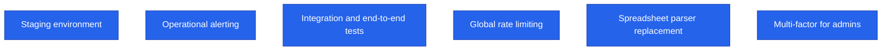
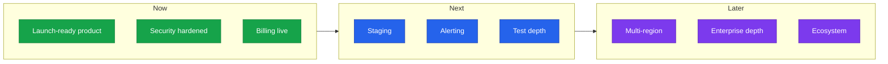

<!--
  Render note: diagrams use Mermaid. Items marked [INPUT NEEDED] need owner dates.
  Diagram style is parser-safe.
-->

# Querify — Product Roadmap

**Natural-Language Analytics Platform**

| | |
|---|---|
| **Document** | Product Roadmap |
| **Owner** | Product |
| **Version** | 2.0 (Comprehensive Edition) |
| **Status** | Living Document |
| **Date** | 27 June 2026 |
| **Classification** | Confidential — Internal |
| **Audience** | Product, engineering, leadership, investors |

---

## How to Read This Roadmap

**In plain words.** A roadmap shows where the product is going. This one is organised by *horizon* — Now, Next, Later — rather than fixed dates, because dates depend on business decisions the owner sets. "Now" is shipped or in progress; "Next" is committed; "Later" is directional. The themes are grounded in what is built and the recommendations from the technical and security reviews.

**Why it matters.** Horizons keep the team aligned on priorities without over-promising specific dates that early-stage plans rarely hit. It is honest and adaptable.

---

## Now — Launch Readiness

**In plain words.** These are shipped or being finalised for launch.

| Theme | Item | Status |
|---|---|---|
| Core product | Natural-language querying, verified answers, charts | Shipped |
| Data sources | Files and a dozen live database types | Shipped |
| Governance | Glossary, certified metrics, audit, roles | Shipped |
| Team | Reports, automations, collaboration, workspaces | Shipped |
| Monetisation | Subscription plans with enforced limits and checkout | Shipped |
| Security | Pre-launch hardening (encryption, suspended users, webhook verification) | Shipped |

**Launch-gate items (from the security review):** confirm production secrets, align the payment environment, patch the spreadsheet parser, confirm backups. **[INPUT NEEDED — target launch date.]**

**Why it matters.** The "Now" column is proof the product is launch-ready, with only a short, known list of gate items remaining.

---

## Next — Post-Launch Hardening

**In plain words.** Right after launch, the focus is on making the already-working product even more robust — drawn directly from the technical-debt and monitoring recommendations.

| Item | Why | Source |
|---|---|---|
| Dedicated staging environment | Safer releases | Tech Debt TD-04 |
| Operational alerting | Proactive incident detection | Monitoring doc |
| Deeper automated tests | Confidence in full journeys | Testing Strategy |
| Global rate limiting | Exact limits at scale | Tech Debt TD-03 |
| Spreadsheet parser replacement | Close a known vulnerability | Tech Debt TD-01 |
| Multi-factor for admins | Stronger admin security | Security review |

**[INPUT NEEDED — assign a target quarter or dates to each.]**

**Why it matters.** This column shows investors and the team that the post-launch plan is concrete and already prioritised, not vague.

---

## Later — Growth and Scale

**In plain words.** Once the platform is stable in production, these are the bigger directions for growth.

| Theme | Possible direction |
|---|---|
| Reliability | Multi-region resilience and cross-region backups |
| Product depth | Richer report-building and scheduling |
| Ecosystem | More integrations and a broader public API |
| Intelligence | Continued agent accuracy and model-routing improvements |
| Enterprise | Advanced governance, deeper single sign-on, compliance certifications |

> **[INPUT NEEDED — confirm which growth themes match your strategy and their relative priority.]**

**Why it matters.** The "Later" horizon signals ambition and direction without committing to specifics too early — useful for strategic conversations and fundraising.

---

## Roadmap at a Glance

**Why it matters.** This single picture is the elevator version of the roadmap — ideal for a board slide or a team standup.

---

## Glossary

| Term | Plain-words definition |
|---|---|
| **Horizon** | A time band (Now, Next, Later) rather than an exact date |
| **Launch gate** | A must-do item before going live |
| **Hardening** | Making a working system more robust and secure |
| **Staging** | A production-like environment for final checks |
| **Multi-region** | Running in more than one geographic location for resilience |
| **Single sign-on (SSO)** | Logging in once to access multiple systems |

---

---

**Querify — Product Roadmap v2.0 (Comprehensive Edition)**
Confidential — Internal Use Only · © 2026 Querify

