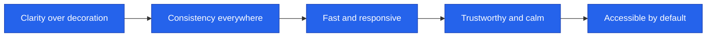
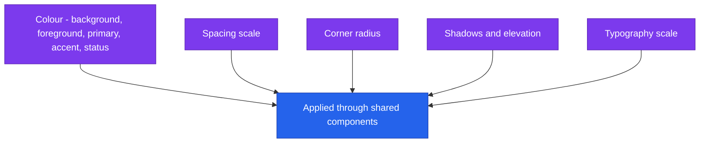
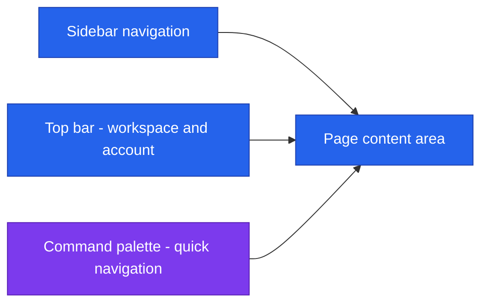
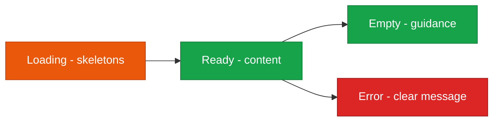

<!--
  Render note: diagrams use Mermaid. View in VS Code preview with the Mermaid extension.
  Diagram style is parser-safe. Items marked [INPUT NEEDED] need an owner decision.
-->

# Querify — Design System and UX Documentation

**Natural-Language Analytics Platform**

| | |
|---|---|
| **Document** | Design System and UX Documentation |
| **Owner** | Design / Engineering |
| **Version** | 2.0 (Comprehensive Edition) |
| **Status** | Active |
| **Date** | 27 June 2026 |
| **Classification** | Confidential — Internal |
| **Audience** | Designers, engineers, product |

---

## How to Read This Document

Layered as **In plain words**, **The detail**, **Why it matters**, with a [Glossary](#9-glossary).

---

## Table of Contents

1. [Overview](#1-overview)
2. [Key Concepts in Plain Words](#2-key-concepts-in-plain-words)
3. [Design Principles](#3-design-principles)
4. [Theme and Tokens](#4-theme-and-tokens)
5. [Shared Component Library](#5-shared-component-library)
6. [Layout and Navigation](#6-layout-and-navigation)
7. [Interaction Patterns and States](#7-interaction-patterns-and-states)
8. [Accessibility](#8-accessibility)
9. [Glossary](#9-glossary)

---

## 1. Overview

**In plain words.** A design system is a shared kit of parts — colours, spacing, buttons, cards — that every screen is built from. Using the same kit everywhere makes the whole product feel like one coherent thing and makes new screens fast to build.

**The detail.** Querify uses a single design system built on a utility-first styling foundation with a shared set of reusable components. Every screen draws from the same tokens (colour, spacing, typography) and the same building blocks.

**Why it matters.** Consistency builds trust and reduces confusion: a button looks and behaves the same everywhere. It also speeds development, because screens are assembled from existing parts rather than hand-crafted each time.

> **Key takeaway:** Consistency is enforced through shared components and design tokens — screens are composed from the same parts rather than styled ad hoc.

---

## 2. Key Concepts in Plain Words

| Concept | Plain-words explanation | Everyday analogy |
|---|---|---|
| **Design system** | The shared kit of UI parts and rules | A brand style guide plus a box of matching LEGO bricks |
| **Design token** | A named value for a colour, spacing, etc. | "Brand blue" defined once and reused |
| **Component** | A reusable UI building block | A standard window frame used throughout a building |
| **Theme** | The overall look (colours, mood) | The colour scheme of a room |
| **State** | What a screen shows in different situations | A kettle: off, heating, ready |
| **Accessibility** | Making the product usable by everyone | Ramps and lifts as well as stairs |

---

## 3. Design Principles

| Principle | What it means in practice |
|---|---|
| Clarity over decoration | A clean, enterprise-grade interface with no visual noise |
| Consistency | Shared components and tokens across all pages |
| Responsiveness | Works across desktop, tablet, and mobile |
| Trust and calm | A refined dark theme, subtle motion, clear states |
| Accessibility | Keyboard support and assistive-technology consideration |

**Why it matters.** These principles are the design's "constitution." Every design decision can be checked against them, keeping the product coherent as it grows.

---

## 4. Theme and Tokens

**In plain words.** All the visual choices — colours, spacing, rounded corners, shadows, text sizes — are defined once as named values (tokens). Screens use the names, not raw values, so a single change updates the whole product.

| Token group | Purpose |
|---|---|
| Colour | A charcoal dark base, a muted primary accent, and dedicated status colours (success, warning, error, info) |
| Spacing | A consistent spacing scale for predictable rhythm |
| Radius | Rounded corners applied uniformly |
| Shadow | Refined elevation for cards and overlays |
| Typography | A type scale for headings, body, captions, and labels |

**Why it matters.** Token-driven design means a rebrand or theme tweak is a small, central change — not a hunt-and-replace across hundreds of screens.

---

## 5. Shared Component Library

**In plain words.** A central set of reusable building blocks ensures every screen uses the same, well-tested parts instead of one-off variations.

| Component | Used for |
|---|---|
| Empty State | Friendly guidance when there is no data yet |
| Status Badge | Consistent status indicators (active, error, pending) |
| Confirm Dialog | Safe confirmation before destructive actions |
| Filter Toolbar | Consistent search and filtering across list pages |
| Density Toggle | Comfortable versus compact table density |
| Skeletons | Loading placeholders that match the final content |
| Brand Loader | A branded full-page loading state |

Beyond these, the product uses a foundation of primitive UI elements (buttons, inputs, cards, dialogs, tables, dropdowns) styled by the same tokens.

**Why it matters.** Reusing components means a fix or improvement to one (say, making the confirm dialog clearer) instantly benefits every screen that uses it.

---

## 6. Layout and Navigation

**In plain words.** Every page sits in the same frame: a sidebar to move around, a top bar for account and workspace, and the main content area. A keyboard "command palette" offers fast navigation for power users.

| Element | Role |
|---|---|
| Sidebar | Primary navigation between sections |
| Top bar | Workspace switcher and account menu |
| Page shell | A consistent content frame on every page |
| Command palette | Keyboard-driven quick navigation and actions |
| Mobile navigation | A responsive bottom navigation on small screens |

**Why it matters.** A consistent layout means users learn the navigation once and feel at home everywhere. The command palette rewards power users with speed.

---

## 7. Interaction Patterns and States

**In plain words.** The product behaves predictably: keyboard shortcuts for common actions, gentle animations that aid understanding, and clear handling of every situation a screen can be in.

**Interaction patterns.**

| Pattern | Behaviour |
|---|---|
| Keyboard shortcuts | Common actions have shortcuts; a panel documents them |
| Command palette | Fast access to pages and actions |
| Guided tour | A first-run walkthrough highlights key areas |
| Subtle motion | Purposeful animation that aids understanding, never distracts |
| Toasts | Non-blocking success and error notifications |

**States.** Every data view accounts for all of its states, not just the happy path.

| State | Treatment |
|---|---|
| Loading | Skeleton placeholders shaped like the final content |
| Ready | The actual content |
| Empty | A friendly empty state with a next action |
| Error | A clear, specific, non-technical message |

**Why it matters.** Handling loading, empty, and error states — not just the success case — is what separates a polished product from a frustrating one.

---

## 8. Accessibility

**In plain words.** The product aims to be usable by everyone, including people who navigate by keyboard or use assistive technology.

| Area | Approach |
|---|---|
| Keyboard | Core flows are keyboard-navigable; shortcuts provided |
| Focus | Visible focus and correct focus handling in dialogs |
| Contrast | The theme is designed for readable contrast |
| Assistive technology | Semantic structure and labelling considered |

> **[INPUT NEEDED — confirm whether a formal accessibility standard (for example WCAG AA) is a stated target for launch.]**

**Why it matters.** Accessibility widens the audience, is often a procurement requirement for larger customers, and is simply the right thing to do.

---

## 9. Glossary

| Term | Plain-words definition |
|---|---|
| **Design system** | A shared kit of UI parts and rules |
| **Design token** | A named value for a colour, spacing, or similar |
| **Component** | A reusable UI building block |
| **Theme** | The overall visual look |
| **State** | What a screen shows in a given situation (loading, empty, error) |
| **Responsive** | Adapts to different screen sizes |
| **Command palette** | A keyboard-driven menu for quick actions |
| **Toast** | A brief, non-blocking notification |
| **Accessibility** | Designing so everyone, including disabled users, can use the product |
| **WCAG** | A widely-used accessibility standard |

---

---

**Querify — Design System and UX Documentation v2.0 (Comprehensive Edition)**
Confidential — Internal Use Only · © 2026 Querify

