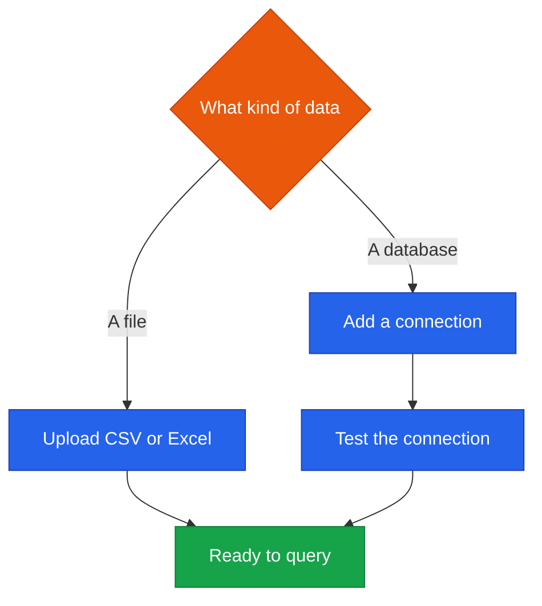
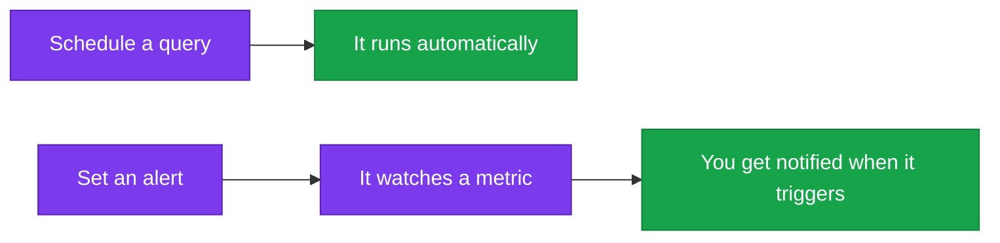

<!--
  Render note: diagrams use Mermaid. View in VS Code preview with the Mermaid extension.
  Diagram style is parser-safe. Items marked [INPUT NEEDED] need owner details.
-->

# Querify — User Guide and Help Documentation

**Getting the Most from Querify**

| | |
|---|---|
| **Document** | User Guide and Help Documentation |
| **Owner** | Product / Support |
| **Version** | 2.0 (Comprehensive Edition) |
| **Status** | Active |
| **Date** | 27 June 2026 |
| **Classification** | Customer-Facing |
| **Audience** | End users of all skill levels |

---

## How to Use This Guide

This guide is written for everyone, including people who have never used an analytics tool. It walks you from signing in to getting your first answer, then through the more advanced features. No technical knowledge is assumed.

---

## Table of Contents

1. [Welcome](#1-welcome)
2. [Getting Started](#2-getting-started)
3. [Asking Your First Question](#3-asking-your-first-question)
4. [Connecting Your Data](#4-connecting-your-data)
5. [Building Reports](#5-building-reports)
6. [Setting Up Automations](#6-setting-up-automations)
7. [Working as a Team](#7-working-as-a-team)
8. [Managing Your Plan](#8-managing-your-plan)
9. [Tips for Better Answers](#9-tips-for-better-answers)
10. [Frequently Asked Questions](#10-frequently-asked-questions)

---

## 1. Welcome

Querify lets you ask questions about your data in plain English and get clear, verified answers — with charts and an explanation of how the answer was found. There is no SQL to learn and no technical skill required.

**Think of Querify as a tireless analyst** who understands plain English, does the work instantly, double-checks the result, and shows you exactly how the answer was reached.

---

## 2. Getting Started

| Step | What to do |
|---|---|
| 1. Sign in | Create an account or sign in with email, Google, or GitHub |
| 2. Add data | Upload a spreadsheet or connect a database |
| 3. Ask | Type a question in plain English |
| 4. Review | Read the answer, view the chart, and check the reasoning |

A short guided tour highlights the main areas the first time you sign in. You can re-take it any time.

---

## 3. Asking Your First Question

1. Go to the **Query** workspace.
2. Choose your data source (an uploaded file or a connection).
3. Type a question, for example: *"What were total sales by month last year?"*
4. Querify generates the answer, shows a chart, and displays the steps it took.

**What you will see:**

| Part of the answer | What it tells you |
|---|---|
| The answer | The direct response to your question |
| The chart | A visual of the result |
| The reasoning trace | The steps Querify took, so you can trust it |

---

## 4. Connecting Your Data

| Source | How |
|---|---|
| Spreadsheet | Upload a CSV or Excel file on the Datasets page |
| Database | Add a connection with your database details, then test it |

> **Your data is safe.** Uploaded files are processed in your browser where possible. Database credentials are encrypted and never shown back to you or anyone else. For best safety, connect with a read-only database user. Querify can only ever *read* your database — it can never change it.

---

## 5. Building Reports

You can ask the assistant to build a whole report for you.

1. Go to the **Query** workspace and ask for a dashboard, for example: *"Build me a sales overview dashboard."*
2. Querify designs the panels, verifies each one, and saves it under **Reports**.
3. Open the report any time to see live charts.

**Why use reports?** They turn a one-off question into a saved, reusable dashboard you can return to and share.

---

## 6. Setting Up Automations

| Automation | What it does |
|---|---|
| Schedule | Runs a saved query on a recurring basis and notifies you |
| Alert | Watches a number and notifies you when it crosses a threshold you set, described in plain English |

**Example.** Set an alert: *"Notify me when weekly sales drop below 50,000."* Querify will check on your behalf and tell you the moment it happens.

---

## 7. Working as a Team

| Capability | How |
|---|---|
| Comment | Discuss a report in context; mention a teammate to notify them |
| Share | Create a link to share a report; revoke it any time |
| Workspaces | Organise work into separate team workspaces |
| Roles | Admins manage who can do what |

**Why it matters to you.** Collaboration keeps everyone working from the same numbers and definitions, so decisions are based on a shared source of truth.

---

## 8. Managing Your Plan

| Action | Where |
|---|---|
| See your plan and usage | The Pricing and Billing page |
| Upgrade | Choose a plan and complete secure checkout |
| Billing history | View past payments on the same page |

> If you reach a plan limit, you will see a clear message. Upgrade any time to raise your limits; the new plan takes effect immediately.

---

## 9. Tips for Better Answers

| Tip | Example |
|---|---|
| Be specific about the time period | "...in the last quarter" |
| Name the measure you want | "total revenue", "number of orders" |
| Ask for a ranking when useful | "top 10 products by..." |
| Define terms once in the Glossary | So "revenue" always means the same thing for everyone |
| Check the reasoning trace | If a number looks odd, the trace shows how it was calculated |

**Why it matters.** Clear questions get clear answers. A few small habits dramatically improve the quality of what you get back.

---

## 10. Frequently Asked Questions

| Question | Answer |
|---|---|
| Do I need to know SQL? | No. Ask in plain English. |
| Can I trust the answers? | Each answer is verified and comes with a reasoning trail you can inspect. |
| Is my data safe? | Uploaded files are processed in your browser where possible; database credentials are encrypted; all traffic is secure. |
| Can Querify change my database? | No. Querify only reads data; it can never modify your database. |
| What happens when I hit a limit? | You see a clear message and can upgrade for higher limits. |
| Can I use it on my phone? | Yes. The interface works across devices. |
| Can developers use it programmatically? | Yes, via the public API with an API key. |
| What if I get a wrong answer? | Check the reasoning trace, and try rephrasing more specifically. The verification step catches many errors automatically. |

> **[INPUT NEEDED — add your support contact and help-centre link here.]**

---

---

**Querify — User Guide and Help Documentation v2.0 (Comprehensive Edition)**
© 2026 Querify

