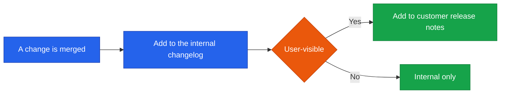

<!--
  Render note: diagrams use Mermaid. View in VS Code preview with the Mermaid extension.
  Diagram style is parser-safe. Items marked [INPUT NEEDED] need an owner decision.
-->

<div align="center">

# Querify — Changelog and Release Notes

**Template and Standard**

| | |
|---|---|
| **Document** | Changelog and Release Notes Template |
| **Owner** | Product / Engineering |
| **Version** | 2.0 (Comprehensive Edition) |
| **Status** | Active |
| **Date** | 27 June 2026 |
| **Classification** | Mixed — Internal changelog plus customer-facing notes |
| **Audience** | Engineering, product, marketing, customers |

</div>

---

## Purpose (In Plain Words)

**In plain words.** A changelog is a running list of what changed in each version. Querify keeps two versions of it: a complete, technical one for the team, and a friendly, benefit-focused one for customers. This document explains *how* to write both and gives copy-ready templates.

**Why it matters.** A clear changelog builds trust (customers see steady progress), helps support (they know what changed and when), and gives the team a reliable history.



---

## Change Categories

**In plain words.** Every entry is tagged so readers can scan for what they care about.

| Category | Use for |
|---|---|
| Added | New features or capabilities |
| Changed | Changes to existing behaviour |
| Improved | Performance, UX, or quality enhancements |
| Fixed | Bug fixes |
| Security | Security-related changes |
| Deprecated | Features being phased out |
| Removed | Features taken out |

**Why it matters.** Consistent categories make the changelog skimmable — a developer can jump to "Fixed," a customer to "Added."

---

## Versioning Standard

**In plain words.** Version numbers follow a simple, predictable pattern so everyone knows how big a change is at a glance.

| Part | Meaning | Example |
|---|---|---|
| Major | Significant or breaking changes | 2.0.0 |
| Minor | New features, backward-compatible | 1.3.0 |
| Patch | Fixes and small improvements | 1.3.1 |

> **[INPUT NEEDED — confirm whether you want public version numbers, or date-based releases (for example "June 2026 release").]**

**Why it matters.** A clear versioning scheme sets expectations: a "patch" is safe and small; a "major" deserves attention.

---

## Internal Changelog Template

**In plain words.** Copy this block for each release; it is the complete, technical record.

```
## [Version] — [Date]

### Added
- [Short description of a new capability]

### Changed
- [Short description of a behaviour change]

### Improved
- [Short description of an enhancement]

### Fixed
- [Short description of a fix]

### Security
- [Short description of a security change]
```

---

## Customer-Facing Release Notes Template

**In plain words.** Friendlier and benefit-led. Copy this for each release customers will notice.

```
# What's New — [Month Year]

We have been busy making Querify better. Here is what is new.

## New
- [Feature name] — [one sentence on the benefit to the user]

## Improved
- [Improvement] — [why it helps]

## Fixed
- [Fix] — [what now works as expected]

Questions or feedback? [support contact]
```

---

## Worked Example (Format Illustration Only)

**In plain words.** This shows the format. It is not a real release record.

```
## [1.1.0] — [Release Date]

### Added
- Billing history view on the Pricing page
- Per-plan limits for connections, reports, and automations

### Improved
- Clearer error messages when a database connection fails

### Security
- Database connection credentials now encrypted at rest
- Suspended accounts blocked immediately
```

**Why it matters.** A worked example removes ambiguity about the expected style and level of detail.

---

## Where Release Notes Live

| Audience | Location |
|---|---|
| Internal team | The internal changelog (in the repository or a shared document) |
| Customers | [INPUT NEEDED — in-app announcement, email, or a public changelog page] |

**Why it matters.** Deciding the home for each audience's notes ensures they are actually seen — an unpublished changelog helps no one.

---

## Glossary

| Term | Plain-words definition |
|---|---|
| **Changelog** | A running list of what changed in each version |
| **Release notes** | The customer-facing summary of a release |
| **Version number** | A label showing how big a change is (major, minor, patch) |
| **Breaking change** | A change that could stop existing usage from working |
| **Deprecated** | Marked for future removal; still works for now |
| **Patch** | A small release with fixes and minor improvements |

---

<div align="center">

---

**Querify — Changelog and Release Notes Template v2.0 (Comprehensive Edition)**
© 2026 Querify

</div>
