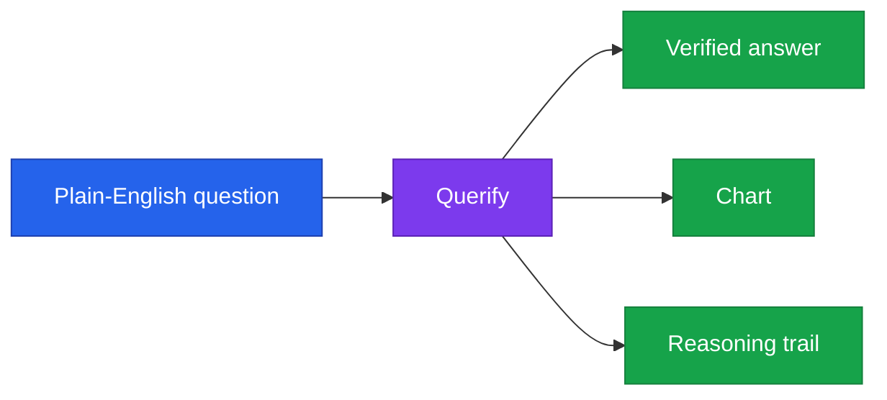

<!--
  Render note: diagrams use Mermaid. View in VS Code preview with the Mermaid extension.
  Diagram style is parser-safe. Items marked [INPUT NEEDED] need owner facts.
-->

# Querify — Executive Summary

**Ask your data anything. Get a verified answer.**

| | |
|---|---|
| **Document** | Executive Summary / One-Pager |
| **Owner** | Founder / CEO |
| **Version** | 2.0 (Comprehensive Edition) |
| **Date** | 27 June 2026 |
| **Classification** | Confidential |
| **Audience** | Investors, partners, executives, press |

---

## How to Read This Document

**In plain words.** This is the one-page story of Querify: the problem, the solution, why it is different, and where it stands. It is written so a busy reader gets the whole picture in two minutes. Facts only the founder can supply (traction, funding, pricing) are marked **[INPUT NEEDED]**.

---

## The Problem

**In plain words.** Every organisation has data it cannot easily ask questions of. Getting an answer means knowing SQL or waiting for an analyst. Existing business-intelligence tools are powerful but need setup and skill. And even when people get a number, they often do not trust it because they cannot see how it was produced.

| Pain | Who feels it |
|---|---|
| Answers require SQL or a specialist | Non-technical staff |
| Analysts are a bottleneck | Data teams and everyone waiting on them |
| Numbers are not trusted | Decision-makers |

**Why it matters.** This is a large, universal problem. Almost every company has data and almost none has enough analysts.

---

## The Solution

**In plain words.** Querify turns plain-English questions into verified, explainable answers — over spreadsheets or live databases — with no SQL required. It checks its own work and shows its reasoning, so the answer can be trusted, and it gives teams shared definitions so everyone measures the same way.

**Why it matters.** Querify removes the two barriers — skill and trust — that keep most people from using their own data.

---

## Why It Is Different

| Differentiator | What it means |
|---|---|
| Self-verifying answers | The system checks its own results before showing them — built for trust |
| Works on your data, in place | Files are analysed in the browser; databases are queried live and read-only |
| Governed, not a free-for-all | A shared glossary and certified metrics keep answers consistent |
| Privacy by design | Minimal data stored centrally; credentials encrypted |
| Provider-agnostic | Multiple AI models and a dozen database types supported |

**Why it matters.** The differentiators cluster around **trust and governance** — exactly where generic "chat with your data" tools are weakest.

---

## What Is Built

**In plain words.** Querify is a complete, launch-ready platform, not a prototype.

| Pillar | Capabilities |
|---|---|
| Core | Natural-language querying, verified answers, charts, reasoning traces |
| Data | Uploaded files plus a dozen live database types |
| Governance | Glossary, certified metrics, audit log, roles |
| Team | Reports, automations, collaboration, workspaces |
| Platform | Public API, embeddable widgets |
| Business | Subscription billing with enforced plan limits |
| Security | Hardened in a full pre-launch review |

**Why it matters.** A finished, secured product de-risks the opportunity: the question is go-to-market, not "can it be built."

---

## Business Model

**In plain words.** Tiered subscriptions, from a free trial to enterprise, with limits that grow as customers pay more. Self-serve checkout is already live.

| Tier | For |
|---|---|
| Free | Trying the platform |
| Standard | Individuals and small teams |
| Professional | Growing organisations |
| Enterprise | Large, sales-led |

> **[INPUT NEEDED — pricing, target market, traction, and funding status to complete this section.]**

**Why it matters.** A working free-to-paid model with live billing means revenue can start immediately at launch.

---

## The Ask / Status

> **[INPUT NEEDED — state your current objective: launch, fundraising, pilot customers, or partnerships, with any specific ask and supporting numbers.]**

---

## Snapshot

| | |
|---|---|
| Product | Natural-language analytics platform |
| Stage | Launch-ready |
| Technology | Cloud-native, serverless, fully managed |
| Security | Pre-launch hardened |
| Contact | [INPUT NEEDED — founder name and contact] |

---

## Glossary

| Term | Plain-words definition |
|---|---|
| **Natural-language analytics** | Asking data questions in plain English |
| **Verified answer** | A result the system has double-checked |
| **Governance** | Shared rules and definitions for consistent answers |
| **Serverless** | Cloud infrastructure with no servers to manage |
| **Self-serve checkout** | Customers can subscribe without talking to sales |
| **Traction** | Evidence of demand (users, revenue, growth) |

---

---

**Querify — Executive Summary v2.0 (Comprehensive Edition)** · Confidential · © 2026 Querify

