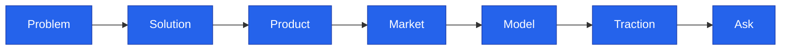

<!--
  Render note: diagrams use Mermaid. Items marked [INPUT NEEDED] need business facts.
  Diagram style is parser-safe.
-->

# Querify — Pitch Deck (Slide Outline)

**Investor / Partner Presentation**

| | |
|---|---|
| **Document** | Pitch Deck Outline |
| **Owner** | Founder / CEO |
| **Version** | 2.0 (Comprehensive Edition) |
| **Date** | 27 June 2026 |
| **Classification** | Confidential |
| **Audience** | Investors, partners |

---

## How to Use This Outline

**In plain words.** A pitch deck is best delivered as actual slides (PowerPoint, Google Slides, or Keynote), not a document. This is the **content and structure** for each slide — drop one slide's content per slide into your tool of choice. For each slide you get its headline, key points, a suggested visual, and a short note on what to *say*. Items marked **[INPUT NEEDED]** require facts only you have.

**Why it matters.** A clear, well-ordered narrative is what wins investor attention. This outline gives you a proven structure so you focus on the story, not the scaffolding.

---

## Slide 1 — Title

| Element | Content |
|---|---|
| Headline | Querify — Ask your data anything. Get a verified answer. |
| Sub | Natural-language analytics for everyone |
| Visual | Logo on a clean background |
| Footer | [INPUT NEEDED — founder, date, contact] |

**Say:** A one-sentence hook — what Querify does and for whom.

---

## Slide 2 — The Problem

| Element | Content |
|---|---|
| Headline | Data answers are locked behind SQL and analysts |
| Points | Business users cannot self-serve; analysts are a bottleneck; people do not trust numbers they cannot trace |
| Visual | A frustrated business user waiting on a data team |

**Say:** Make the pain personal and universal — everyone has waited for a number.

---

## Slide 3 — The Solution

| Element | Content |
|---|---|
| Headline | Plain-English questions, verified answers |
| Points | Ask in English; get an answer, a chart, and the reasoning; works on files and live databases; read-only and safe |
| Visual | The question-to-answer flow |

**Say:** Emphasise *verified* — that is the wedge against generic AI tools.

---

## Slide 4 — Product Demo

| Element | Content |
|---|---|
| Headline | See it in action |
| Points | A live or recorded demo: ask a question, show the verified answer and reasoning trace, then a built report |
| Visual | Product screenshots or an embedded demo |

**Say:** Let the product speak. A 60-second demo beats any slide.

---

## Slide 5 — Why Now / Why Us

| Element | Content |
|---|---|
| Headline | The moment for trustworthy AI analytics |
| Points | AI makes natural-language querying viable; the differentiator is verification and governance, not just chat |
| Visual | A simple "trust gap" graphic |

**Say:** Position the timing — AI is ready, but trust is the missing piece you provide.

---

## Slide 6 — How It Works

| Element | Content |
|---|---|
| Headline | Built for trust and privacy |
| Points | Self-verifying agent; data analysed in place; credentials encrypted; a dozen databases and multiple AI models |
| Visual | A simplified architecture-at-a-glance |

**Say:** Reassure on trust and privacy without going deeply technical.

---

## Slide 7 — Market

| Element | Content |
|---|---|
| Headline | A large and growing market |
| Points | [INPUT NEEDED — market size (TAM/SAM/SOM), target segment, growth trend] |
| Visual | A market-size funnel |

**Say:** Ground the opportunity in a credible, sourced number.

---

## Slide 8 — Business Model

| Element | Content |
|---|---|
| Headline | Tiered subscriptions, self-serve to enterprise |
| Points | Free, Standard, Professional, Enterprise; usage-based limits; live checkout |
| Visual | The four-tier pricing ladder |
| Note | [INPUT NEEDED — final pricing and unit economics] |

**Say:** Show the upgrade path and that revenue can start day one.

---

## Slide 9 — Competition

| Element | Content |
|---|---|
| Headline | How we are different |
| Points | Versus BI tools (no skill required); versus generic AI chat (verified and governed) |
| Visual | A positioning quadrant |
| Note | [INPUT NEEDED — name the specific competitors to position against] |

**Say:** Be fair to competitors, then land your unique angle.

---

## Slide 10 — Traction

| Element | Content |
|---|---|
| Headline | Momentum |
| Points | [INPUT NEEDED — users, revenue, pilots, partnerships, growth] |
| Visual | An up-and-to-the-right chart |

**Say:** Lead with your strongest real number. If pre-launch, show readiness and pipeline.

---

## Slide 11 — Team

| Element | Content |
|---|---|
| Headline | The people behind Querify |
| Points | [INPUT NEEDED — founders and key team, with relevant background] |
| Visual | Headshots and one-line bios |

**Say:** Why this team is the right one to win this market.

---

## Slide 12 — Roadmap

| Element | Content |
|---|---|
| Headline | Where we are going |
| Points | Now (launch-ready), Next (hardening and depth), Later (scale and enterprise) |
| Visual | The three-horizon roadmap |

**Say:** Show a credible, prioritised path, not a fantasy wish list.

---

## Slide 13 — The Ask

| Element | Content |
|---|---|
| Headline | What we are raising or seeking |
| Points | [INPUT NEEDED — the specific ask: amount, use of funds, or partnership goal] |
| Visual | A use-of-funds breakdown |

**Say:** Be specific and confident about the ask and what it achieves.

---

## Slide 14 — Closing

| Element | Content |
|---|---|
| Headline | Ask your data anything |
| Points | Vision recap and contact |
| Visual | Logo and contact details |

**Say:** End on the vision, then make the next step easy.

---

## Design Guidance for the Deck

| Guideline | Detail |
|---|---|
| One idea per slide | Keep text minimal; speak to the visual |
| Consistent theme | Use the product's colours (charcoal base, muted accent) |
| Show, do not tell | Lead with the demo and real screenshots |
| Numbers earn trust | Put real metrics on the traction and market slides |

**Why it matters.** Investors decide quickly. A clean, confident, demo-led deck respects their time and showcases a finished product.

---

---

**Querify — Pitch Deck Outline v2.0 (Comprehensive Edition)** · Confidential · © 2026 Querify

