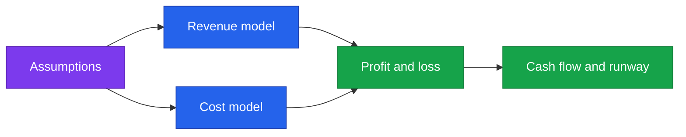

<!--
  Render note: diagrams use Mermaid. Companion spreadsheet: 24-Financial-Model-Template.csv
  Diagram style is parser-safe. Every figure is marked [INPUT NEEDED] - nothing is invented.
-->

# Querify — Financial Model (Structure and Guide)

**Natural-Language Analytics Platform**

| | |
|---|---|
| **Document** | Financial Model — Structure and Guide |
| **Owner** | Founder / Finance |
| **Version** | 2.0 (Comprehensive Edition) |
| **Date** | 27 June 2026 |
| **Classification** | Confidential |
| **Audience** | Founder, finance, investors |

---

## How to Read This Document

**In plain words.** A financial model is a spreadsheet that projects money in and money out over time, so you can see whether the business works and for how long the cash lasts. A real model needs *your* numbers and lives in Excel or Google Sheets. This document explains the **structure** of that model in plain English and tells you exactly which numbers to enter. A starter file, `24-Financial-Model-Template.csv`, accompanies it.

**Why it matters.** A clear model turns gut feeling into evidence — for your own decisions and for investors. Building it on the structure here means you will not miss a key driver.

> **Nothing here is invented.** Every figure is marked **[INPUT NEEDED]**. The model's *shape* is provided; the *numbers* are yours.

---

## Model Overview

**In plain words.** The model has five connected parts: your assumptions feed the revenue and cost models; those feed the profit-and-loss; that feeds the cash-flow and runway.

**Why it matters.** Because everything flows from the assumptions, you can change one input (say, conversion rate) and instantly see the effect on profit and runway. That is the power of a model.

---

## 1. Assumptions Sheet

**In plain words.** This is the one place where all your editable inputs live. Every other sheet reads from here, so you only change a number once.

| Input | Unit | Value |
|---|---|---|
| Pricing — Standard (monthly) | Currency | Defined in product (confirm public price) |
| Pricing — Professional (monthly) | Currency | Defined in product (confirm public price) |
| Annual discount | % | 20% (per product config) |
| New signups per month | Count | [INPUT NEEDED] |
| Free-to-paid conversion rate | % | [INPUT NEEDED] |
| Monthly churn rate | % | [INPUT NEEDED] |
| Average revenue per paid user | Currency | Derived from plan mix |
| AI cost per active user | Currency | [INPUT NEEDED — from usage metering] |
| Infrastructure cost (base) | Currency/month | [INPUT NEEDED] |
| Payment processing fee | % | [INPUT NEEDED — provider rate] |
| Headcount and salaries | Currency/month | [INPUT NEEDED] |
| Other operating costs | Currency/month | [INPUT NEEDED] |

> Pricing is already defined in the product (Standard and Professional, monthly and annual). Confirm the final public numbers and enter them here as the source of truth for revenue.

**Why it matters.** A single, clean assumptions sheet is what makes a model trustworthy and easy to update. Scattered numbers are how models go wrong.

---

## 2. Revenue Model

**In plain words.** Revenue is driven by how many people sign up, how many convert to paid, and how many stay (the opposite of churn).

| Line | How it is calculated |
|---|---|
| New paid users | Signups multiplied by conversion rate |
| Active paid users | Prior active multiplied by (1 minus churn), plus new paid |
| Plan mix | Share across Standard, Professional, Enterprise |
| MRR | Active paid users multiplied by average revenue per user |
| ARR | MRR multiplied by 12 |

**Why it matters.** Recurring revenue (MRR and ARR) is the headline number investors care about for a subscription business. This is how it builds up.

---

## 3. Cost Model

**In plain words.** Costs split into ones that grow with usage (AI, payment fees) and ones that are largely fixed (people).

| Cost category | Driver |
|---|---|
| AI / model costs | Active users multiplied by AI cost per user (variable) |
| Infrastructure | Largely usage-based (serverless, hosting, database) |
| Payment fees | Revenue multiplied by the processing rate |
| People | Headcount (fixed) |
| Other operating | Tools, marketing, admin |

> A structural advantage: infrastructure is pay-per-use, so cost scales with revenue rather than sitting as fixed overhead.

**Why it matters.** Understanding which costs are variable versus fixed is the key to understanding margins and how profit improves as you grow.

---

## 4. Profit and Loss

**In plain words.** This is the classic "did we make money" table: revenue minus costs.

| Line | Formula |
|---|---|
| Revenue | From the revenue model |
| Variable costs | AI plus payment fees |
| Gross profit | Revenue minus variable costs |
| Gross margin | Gross profit divided by revenue |
| Operating costs | People plus infrastructure plus other |
| Operating profit or loss | Gross profit minus operating costs |

**Why it matters.** Gross margin in particular tells investors how profitable each unit of revenue is — a core health metric for a software business.

---

## 5. Cash Flow and Runway

**In plain words.** Runway is how many months of cash you have left at the current burn rate — the single most important survival number for an early company.

| Line | Formula |
|---|---|
| Net monthly cash flow | Revenue minus total costs |
| Closing cash | Opening cash plus net cash flow |
| Runway | Closing cash divided by average monthly burn |

**Why it matters.** Runway determines how long you have to hit your goals before needing more money. Every founder and investor watches it closely.

---

## 6. Key Metrics to Derive

**In plain words.** A few derived ratios tell you whether the business is healthy.

| Metric | Meaning |
|---|---|
| CAC (customer acquisition cost) | What it costs to win a customer |
| LTV (lifetime value) | What a customer is worth over their lifetime |
| LTV : CAC ratio | The health of the acquisition engine (higher is better) |
| Payback period | How many months to recover the cost of winning a customer |
| Gross margin | Profitability per unit of revenue |

> **[INPUT NEEDED — acquisition spend and channel data to compute CAC, LTV, and payback.]**

**Why it matters.** These ratios are the language investors speak. A healthy LTV:CAC and short payback period make a compelling case.

---

## How to Build It

1. Open the companion `24-Financial-Model-Template.csv` in Excel or Google Sheets.
2. Fill the **Assumptions** values (the rows marked for input).
3. Add formulas that reference the assumptions to project 12 to 36 months.
4. Build the profit-and-loss and cash-flow rows from the revenue and cost lines.
5. Add a simple chart of MRR and runway over time.

**Why it matters.** Following these steps gives you a working, living model you can update monthly and present with confidence.

---

## Glossary

| Term | Plain-words definition |
|---|---|
| **MRR** | Monthly recurring revenue from subscriptions |
| **ARR** | Annual recurring revenue (MRR times 12) |
| **Churn** | The rate at which customers leave |
| **Conversion rate** | The share of free users who become paid |
| **Gross margin** | Profit per unit of revenue after variable costs |
| **Burn** | How much cash the business spends per month |
| **Runway** | How many months of cash remain |
| **CAC** | The cost to acquire one customer |
| **LTV** | The total value of a customer over their lifetime |
| **Payback period** | Time to recover the cost of acquiring a customer |

---

---

**Querify — Financial Model (Structure and Guide) v2.0 (Comprehensive Edition)** · Confidential · © 2026 Querify

