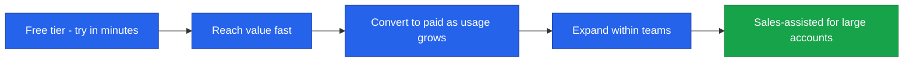
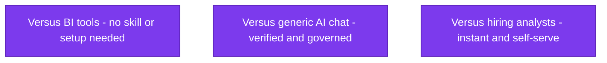
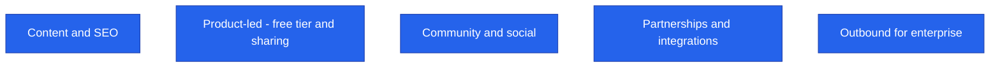
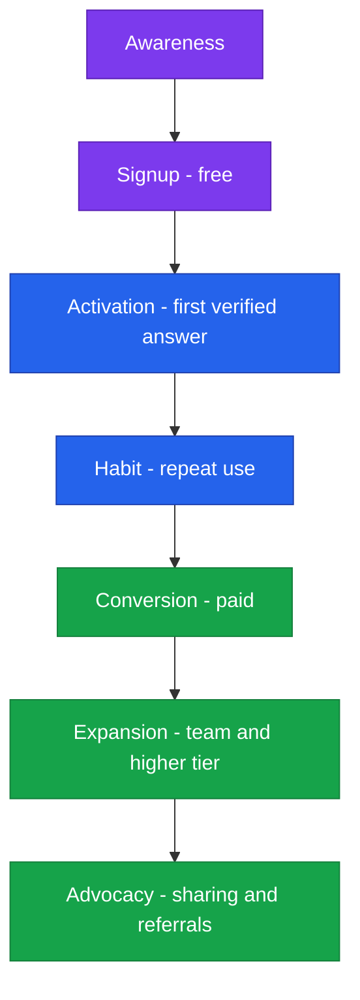
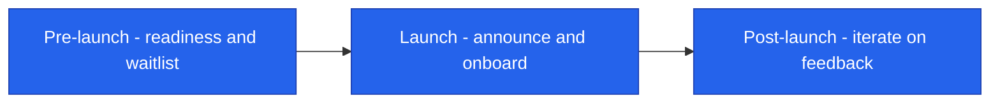

<!--
  Render note: diagrams use Mermaid. Items marked [INPUT NEEDED] require business decisions.
  Diagram style is parser-safe.
-->

# Querify — Go-to-Market Plan

**Natural-Language Analytics Platform**

| | |
|---|---|
| **Document** | Go-to-Market Plan |
| **Owner** | Founder / Growth |
| **Version** | 2.0 (Comprehensive Edition) |
| **Date** | 27 June 2026 |
| **Classification** | Confidential |
| **Audience** | Founder, growth, marketing, investors |

---

## How to Read This Document

**In plain words.** A go-to-market (GTM) plan is how you get the product into customers' hands and turn them into paying users. Layered as **In plain words**, **The detail**, **Why it matters**. Decisions only you can make are marked **[INPUT NEEDED]**.

---

## Table of Contents

1. [Strategy Overview](#1-strategy-overview)
2. [Target Market](#2-target-market)
3. [Positioning](#3-positioning)
4. [Pricing and Packaging](#4-pricing-and-packaging)
5. [Acquisition Channels](#5-acquisition-channels)
6. [The Funnel](#6-the-funnel)
7. [Launch Plan](#7-launch-plan)
8. [Success Metrics](#8-success-metrics)
9. [Glossary](#9-glossary)

---

## 1. Strategy Overview

**In plain words.** Querify's growth strategy is "product-led": the product itself does most of the selling. It is free to try, delivers value in minutes, and naturally encourages users to upgrade as their needs grow. Larger enterprise deals get a human touch.

**Why it matters.** Product-led growth is cost-efficient — the product acquires and converts users, lowering the cost of sales — which suits an early company with limited marketing budget.

---

## 2. Target Market

**In plain words.** Who Querify is for. Focusing on one primary group first ("beachhead") is more effective than trying to reach everyone.

| Segment | Why a fit |
|---|---|
| Small and mid-sized businesses | Need data answers but lack a data team |
| Data-curious teams at larger firms | Want self-service without burdening analysts |
| Agencies and consultancies | Analyse client data quickly |
| Developers | Build on the API and embeds |

> **[INPUT NEEDED — choose the single primary beachhead segment to focus the launch. Sharper focus beats broad targeting early.]**

**Why it matters.** A focused beachhead lets limited resources make a real dent in one market, build references, then expand — rather than being spread too thin to matter anywhere.

---

## 3. Positioning

**In plain words.** Positioning is the one clear idea you want to own in customers' minds. Querify's is "trustworthy, governed AI analytics" — distinct from both complex BI tools and untrustworthy AI chat.

**Positioning statement (draft):** *For teams that need answers from their data but do not have time to learn SQL or wait on analysts, Querify is a natural-language analytics platform that returns verified, explainable answers — unlike BI tools that require setup and skill, or generic AI that cannot be trusted or governed.*

> **[INPUT NEEDED — confirm the positioning statement and the single most important message to lead with.]**

**Why it matters.** Clear positioning makes all your marketing consistent and memorable. Without it, messaging scatters and nothing sticks.

---

## 4. Pricing and Packaging

**In plain words.** A free tier brings people in; paid tiers earn revenue as their usage and teams grow.

| Tier | Role in GTM |
|---|---|
| Free | Acquisition — remove all friction to try |
| Standard | First conversion — individuals and small teams |
| Professional | Expansion — growing organisations |
| Enterprise | Sales-assisted — large accounts |

> Pricing is implemented and configurable. **[INPUT NEEDED — confirm public pricing and any launch promotion, for example an introductory discount or an extended trial.]**

**Why it matters.** Good packaging guides users naturally from free to paid as they get more value — the engine of product-led revenue.

---

## 5. Acquisition Channels

**In plain words.** The ways people will discover Querify. Some are built into the product itself.

| Channel | Approach | Priority |
|---|---|---|
| Content / SEO | Educational content on data questions and analytics | [INPUT NEEDED] |
| Product-led | Free tier, shareable reports and public chats spread the product | High (built-in) |
| Community / social | Build an audience around the product's point of view | [INPUT NEEDED] |
| Partnerships | Integrations and co-marketing with adjacent tools | [INPUT NEEDED] |
| Outbound | Direct outreach for enterprise | [INPUT NEEDED] |

> The product has built-in viral surfaces — shareable reports, embeddable widgets, and public chat apps — that double as acquisition channels.

**Why it matters.** The product's own shareable surfaces mean each happy user can attract more, lowering acquisition cost over time.

---

## 6. The Funnel

**In plain words.** The funnel is the journey from "never heard of it" to "loyal advocate." Each stage has a goal and a lever to improve it.

| Stage | Goal | Key lever |
|---|---|---|
| Awareness | Be discovered | Content, community, viral surfaces |
| Signup | Frictionless start | Free tier |
| Activation | First successful, verified answer | Guided onboarding |
| Habit | Repeat usage | Reports, automations |
| Conversion | Upgrade to paid | Plan limits plus clear value |
| Expansion | More seats and higher tiers | Collaboration, workspaces |
| Advocacy | Referrals | Sharing and embeds |

**Why it matters.** Knowing the funnel tells you exactly where to focus when growth stalls — for example, if signups are high but activation is low, improve onboarding.

---

## 7. Launch Plan

**In plain words.** Three phases: get ready, go live, then iterate fast on what you learn.

| Phase | Activities |
|---|---|
| Pre-launch | Finish the security launch-gate items; prepare messaging and channels; optional waitlist |
| Launch | Public announcement; onboard early users; gather feedback fast |
| Post-launch | Iterate on activation and conversion; expand the channels that work |

> **[INPUT NEEDED — target launch date and the launch channels you will use (for example a launch platform, communities, an email list).]**

**Why it matters.** A phased launch with fast feedback loops means you learn and improve quickly, rather than betting everything on a single launch-day moment.

---

## 8. Success Metrics

| Metric | Why it matters | Target |
|---|---|---|
| Signups | Top-of-funnel volume | [INPUT NEEDED] |
| Activation rate | Reaching first value | [INPUT NEEDED] |
| Free-to-paid conversion | Monetisation | [INPUT NEEDED] |
| Retention | Durable value | [INPUT NEEDED] |
| Referral / sharing rate | Viral growth | [INPUT NEEDED] |

See the KPI Tracker for the full measurement framework.

**Why it matters.** Tracking the funnel's key numbers tells you whether the GTM strategy is actually working and where to adjust.

---

## 9. Glossary

| Term | Plain-words definition |
|---|---|
| **Go-to-market (GTM)** | The plan for getting a product to customers |
| **Product-led growth** | Letting the product itself drive acquisition and conversion |
| **Beachhead** | The first focused market segment you target |
| **Positioning** | The one clear idea you want to own in customers' minds |
| **Funnel** | The journey from awareness to loyal customer |
| **Activation** | A new user reaching the product's core value |
| **Conversion** | Turning a free user into a paying one |
| **Churn** | Customers leaving |
| **Viral surface** | A product feature that spreads it to new users |

---

---

**Querify — Go-to-Market Plan v2.0 (Comprehensive Edition)** · Confidential · © 2026 Querify

