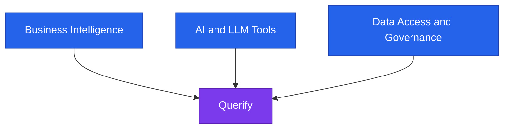
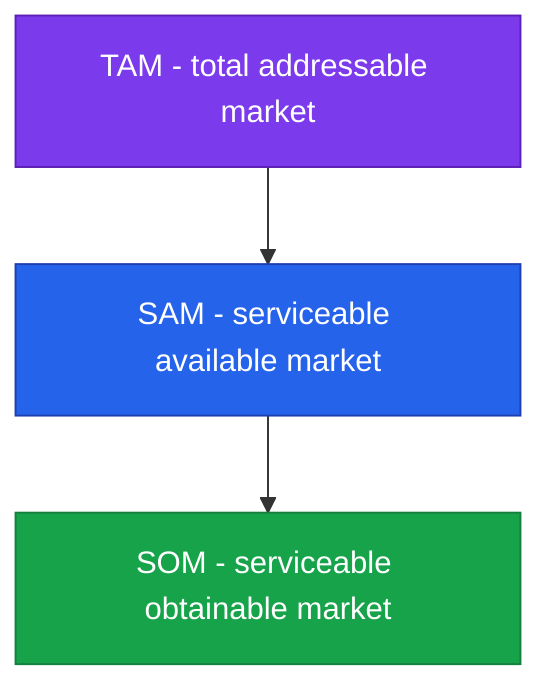
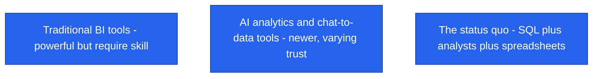
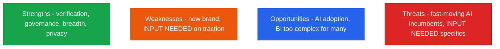

<!--
  Render note: diagrams use Mermaid. Items marked [INPUT NEEDED] require research/data.
  Diagram style is parser-safe.
-->

# Querify — Market and Competitive Analysis

**Natural-Language Analytics Platform**

| | |
|---|---|
| **Document** | Market and Competitive Analysis |
| **Owner** | Founder / Product Marketing |
| **Version** | 2.0 (Comprehensive Edition) |
| **Date** | 27 June 2026 |
| **Classification** | Confidential |
| **Audience** | Founder, marketing, investors |

---

## How to Read This Document — and an Honesty Note

**In plain words.** This document provides the *framework* for analysing Querify's market and competitors, plus Querify's own genuine, code-grounded strengths. It does **not** invent market sizes, competitor names, or their pricing — those are marked **[INPUT NEEDED]** for you to fill with current research. Filling them with verified data is what makes the analysis credible to investors.

**Why it matters.** Investors quickly spot made-up market numbers. A framework you complete with real, sourced data is far more persuasive than impressive-looking guesses.

---

## Table of Contents

1. [Market Landscape](#1-market-landscape)
2. [Market Sizing](#2-market-sizing)
3. [Competitive Categories](#3-competitive-categories)
4. [Competitor Comparison](#4-competitor-comparison)
5. [Querify's Differentiation](#5-querifys-differentiation)
6. [SWOT Analysis](#6-swot-analysis)
7. [Opportunities and Risks](#7-opportunities-and-risks)
8. [Glossary](#8-glossary)

---

## 1. Market Landscape

**In plain words.** Querify sits where three established markets are merging as AI matures: business intelligence, AI tools, and data governance.

| Market | Querify's relationship |
|---|---|
| Business Intelligence | A simpler, conversational alternative for self-service questions |
| AI / LLM tools | Applies AI specifically to governed, verified analytics |
| Data access and governance | Adds a shared glossary and certified metrics |

**Why it matters.** Sitting at a convergence point is attractive to investors — it means a large, active market and multiple ways to win.

---

## 2. Market Sizing

**In plain words.** Market sizing estimates how big the opportunity is, narrowing from everyone who could use it (TAM) to what you can realistically win soon (SOM).

| Layer | Definition | Value |
|---|---|---|
| TAM | Everyone who could use natural-language analytics | [INPUT NEEDED — cite a market report] |
| SAM | The segment Querify can realistically serve | [INPUT NEEDED] |
| SOM | What Querify can win in the near term | [INPUT NEEDED] |

> Use a credible, dated source for each figure. Do not estimate without one.

**Why it matters.** A grounded TAM/SAM/SOM shows investors the opportunity is big enough to matter and that you understand your realistic near-term slice.

---

## 3. Competitive Categories

**In plain words.** Competition comes in three forms: traditional BI tools, newer AI-analytics tools, and simply the status quo (SQL, analysts, and spreadsheets).

| Category | Strength | Weakness Querify exploits |
|---|---|---|
| Traditional BI | Mature, powerful | Requires setup and skill |
| AI / chat-to-data | Easy to start | Trust and governance gaps |
| Status quo (SQL plus analysts) | Flexible | Slow, bottlenecked, inconsistent definitions |

**Why it matters.** Recognising the status quo as a competitor is important — often the real fight is against "we will just keep using spreadsheets," not another product.

---

## 4. Competitor Comparison

**In plain words.** A side-by-side table is the clearest way to show how Querify stacks up. Fill the competitor columns with current, verified information.

| Capability | Querify | Competitor A | Competitor B | Competitor C |
|---|---|---|---|---|
| Plain-English querying | Yes | [INPUT NEEDED] | [INPUT NEEDED] | [INPUT NEEDED] |
| Self-verifying answers | Yes | [INPUT NEEDED] | [INPUT NEEDED] | [INPUT NEEDED] |
| Reasoning trace | Yes | [INPUT NEEDED] | [INPUT NEEDED] | [INPUT NEEDED] |
| Files plus live databases | Yes (a dozen DB types) | [INPUT NEEDED] | [INPUT NEEDED] | [INPUT NEEDED] |
| Shared glossary / certified metrics | Yes | [INPUT NEEDED] | [INPUT NEEDED] | [INPUT NEEDED] |
| Read-only safety | Yes (enforced) | [INPUT NEEDED] | [INPUT NEEDED] | [INPUT NEEDED] |
| Public API plus embeds | Yes | [INPUT NEEDED] | [INPUT NEEDED] | [INPUT NEEDED] |
| Pricing | Tiered (see product) | [INPUT NEEDED] | [INPUT NEEDED] | [INPUT NEEDED] |

> **[INPUT NEEDED — name the actual competitors you want to track and complete each column from their public materials.]**

**Why it matters.** A factual comparison (not spin) builds credibility and helps you and customers see exactly where you win.

---

## 5. Querify's Differentiation

**In plain words.** These strengths are grounded in what the product genuinely does today.

| Differentiator | Evidence in the product |
|---|---|
| Trust through verification | The agent verifies its own results before presenting them |
| Explainability | Every answer ships with a reasoning trace |
| Governance built in | A shared glossary and certified metrics |
| Privacy by design | In-browser file analysis; encrypted credentials; minimal central storage |
| Breadth of sources | A dozen database types plus files |
| Safety | Read-only enforcement on all live queries |
| Extensibility | A public API and embeddable widgets |

**Why it matters.** Differentiators backed by real, shipped capability are defensible. They are not marketing claims; they are facts you can demonstrate.

---

## 6. SWOT Analysis

**In plain words.** SWOT is a quick honest stock-take: Strengths, Weaknesses, Opportunities, Threats.

| Quadrant | Points |
|---|---|
| Strengths | Self-verification, governance, source breadth, privacy-by-design, launch-ready and hardened |
| Weaknesses | New brand; [INPUT NEEDED — traction, team scale, marketing reach] |
| Opportunities | Surging demand for trustworthy AI analytics; BI tools too complex for many users |
| Threats | Well-funded incumbents adding AI; [INPUT NEEDED — name specific competitive moves] |

**Why it matters.** An honest SWOT — including real weaknesses — signals self-awareness to investors and guides where to invest and defend.

---

## 7. Opportunities and Risks

| Opportunity | How to capture |
|---|---|
| "AI you can trust" positioning | Lead with verification and governance |
| Underserved non-technical users | A frictionless free tier and onboarding |
| Viral product surfaces | Shareable reports and public chats |

| Risk | Mitigation |
|---|---|
| Incumbents add similar AI features | Move fast; deepen the governance and trust moat |
| AI cost pressure on margins | Provider-agnostic routing; usage metering |
| Trust incidents in the category | Make verification and transparency a brand pillar |

**Why it matters.** Pairing each opportunity with a capture plan and each risk with a mitigation shows investors you have thought beyond the optimistic case.

---

## 8. Glossary

| Term | Plain-words definition |
|---|---|
| **TAM** | Total addressable market — everyone who could buy |
| **SAM** | Serviceable available market — who you can realistically serve |
| **SOM** | Serviceable obtainable market — who you can win near-term |
| **BI** | Business intelligence — traditional data-analysis software |
| **SWOT** | Strengths, weaknesses, opportunities, threats |
| **Moat** | A durable advantage that protects you from competitors |
| **Status quo** | The current way customers solve the problem without you |
| **Incumbent** | An established competitor already in the market |

---

---

**Querify — Market and Competitive Analysis v2.0 (Comprehensive Edition)** · Confidential · © 2026 Querify

