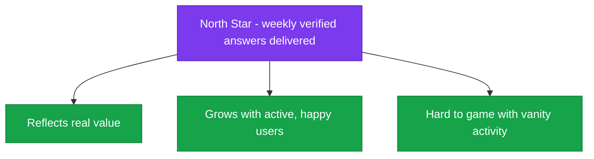

<!--
  Render note: diagrams use Mermaid. Items marked [INPUT NEEDED] require owner targets.
  Diagram style is parser-safe.
-->

# Querify — Metrics and KPI Tracker

**Natural-Language Analytics Platform**

| | |
|---|---|
| **Document** | Metrics and KPI Tracker (Template) |
| **Owner** | Founder / Product |
| **Version** | 2.0 (Comprehensive Edition) |
| **Date** | 27 June 2026 |
| **Classification** | Confidential |
| **Audience** | Founder, product, growth, leadership |

---

## How to Read This Document

**In plain words.** A KPI (key performance indicator) is a number that tells you whether the business is healthy. This document is a ready-to-use framework of the metrics worth tracking, grouped by theme, with space for your targets and actuals. Targets are marked **[INPUT NEEDED]** because only you can set them.

**Why it matters.** Tracking the right handful of numbers — rather than drowning in data — keeps the team focused on what actually drives success. Ironically, a data product needs its own clear metrics most of all.

---

## The Metric Framework

**In plain words.** Metrics fall into five themes that together tell the whole story: acquisition (getting users), activation (reaching value), engagement (staying active), revenue (making money), and quality/reliability (a good, stable product).

**Why it matters.** These five themes map to the customer journey and the business engine. Watching all five prevents blind spots — for example, growing signups while quietly losing users.

---

## 1. Acquisition Metrics

**In plain words.** How many people are discovering and signing up for Querify, and what it costs to get them.

| Metric | What it measures | Target | Actual |
|---|---|---|---|
| Website visitors | Top-of-funnel reach | [INPUT NEEDED] | — |
| Signups | New accounts created | [INPUT NEEDED] | — |
| Signup conversion rate | Visitors who sign up | [INPUT NEEDED] | — |
| Customer acquisition cost (CAC) | Cost to win a paying customer | [INPUT NEEDED] | — |
| Channel mix | Where signups come from | [INPUT NEEDED] | — |

**Why it matters.** Acquisition is the top of the funnel — without it, nothing else happens. CAC tells you whether growth is affordable.

---

## 2. Activation Metrics

**In plain words.** How many new users actually reach the "aha" moment — their first successful, verified answer.

| Metric | What it measures | Target | Actual |
|---|---|---|---|
| Activation rate | New users who get a first answer | [INPUT NEEDED] | — |
| Time to first answer | How quickly users reach value | [INPUT NEEDED] | — |
| Onboarding completion | Users finishing the guided tour | [INPUT NEEDED] | — |
| Data connected rate | Users who connect a file or database | [INPUT NEEDED] | — |

**Why it matters.** Activation is the strongest predictor of whether a user will stay and pay. Improving it lifts every downstream number.

---

## 3. Engagement and Retention Metrics

**In plain words.** Whether users keep coming back and getting value over time.

| Metric | What it measures | Target | Actual |
|---|---|---|---|
| Weekly active users | Regular usage | [INPUT NEEDED] | — |
| Queries per active user | Depth of use | [INPUT NEEDED] | — |
| Retention (week 4, week 12) | Users still active later | [INPUT NEEDED] | — |
| Reports and automations created | Investment in the product | [INPUT NEEDED] | — |
| Churn rate | Users or customers leaving | [INPUT NEEDED] | — |

**Why it matters.** Retention is the foundation of a subscription business. Acquiring users is wasted if they do not stay.

---

## 4. Revenue Metrics

**In plain words.** The money numbers that show the business is working.

| Metric | What it measures | Target | Actual |
|---|---|---|---|
| Monthly recurring revenue (MRR) | Predictable monthly income | [INPUT NEEDED] | — |
| Annual recurring revenue (ARR) | Annualised income | [INPUT NEEDED] | — |
| Free-to-paid conversion | Free users becoming paid | [INPUT NEEDED] | — |
| Average revenue per user (ARPU) | Income per customer | [INPUT NEEDED] | — |
| Lifetime value (LTV) | Total value of a customer | [INPUT NEEDED] | — |
| LTV to CAC ratio | Health of the growth engine | [INPUT NEEDED] | — |
| Expansion revenue | Revenue from upgrades | [INPUT NEEDED] | — |

**Why it matters.** These are the numbers investors and the board watch most closely. MRR growth and a healthy LTV:CAC are the headline signs of a working business.

---

## 5. Quality and Reliability Metrics

**In plain words.** Whether the product is actually good and dependable — directly relevant for an AI product where trust is everything.

| Metric | What it measures | Target | Actual |
|---|---|---|---|
| Query success rate | Answers produced without error | [INPUT NEEDED — baseline from traces] | — |
| Average answer latency | Speed of responses | [INPUT NEEDED] | — |
| Uptime | Service availability | [INPUT NEEDED] | — |
| Error rate | Share of failed requests | [INPUT NEEDED] | — |
| Support tickets per active user | Friction and confusion | [INPUT NEEDED] | — |

**Why it matters.** For an analytics product, quality *is* the product. A high success rate and strong uptime underpin the trust the whole value proposition rests on.

---

## The North Star Metric

**In plain words.** A "North Star" is the single metric that best captures the value the product delivers — the one number to rally the whole team around.

> **[INPUT NEEDED — choose your North Star metric.]** A strong candidate for Querify is **weekly verified answers delivered**, because it captures real, repeated value (a user got a trustworthy answer) better than vanity metrics like raw signups.

**Why it matters.** A single North Star aligns everyone. When teams debate priorities, they can ask "which option moves the North Star most?" — cutting through opinion.

---

## How to Use This Tracker

| Step | Action |
|---|---|
| 1 | Set a target for each metric that matters now (do not track everything at once) |
| 2 | Record actuals on a regular cadence (weekly or monthly) |
| 3 | Review trends, not just snapshots — direction matters more than a single point |
| 4 | Pick the one or two metrics to focus on improving this period |
| 5 | Revisit targets as the business learns |

> Many of these can be sourced from data the platform already records (usage events, traces, payments). Build a simple dashboard that refreshes them automatically.

**Why it matters.** A tracker only helps if it is kept current and acted on. A regular review rhythm turns numbers into decisions.

---

## Glossary

| Term | Plain-words definition |
|---|---|
| **KPI** | A key number that indicates business health |
| **North Star metric** | The single metric that best captures delivered value |
| **Activation** | A new user reaching the product's core value |
| **Retention** | Users continuing to come back over time |
| **Churn** | Users or customers leaving |
| **MRR / ARR** | Monthly / annual recurring revenue |
| **ARPU** | Average revenue per user |
| **CAC** | Cost to acquire a customer |
| **LTV** | Lifetime value of a customer |
| **Uptime** | The percentage of time the service is available |
| **Latency** | How long a response takes |

---

---

**Querify — Metrics and KPI Tracker v2.0 (Comprehensive Edition)** · Confidential · © 2026 Querify

