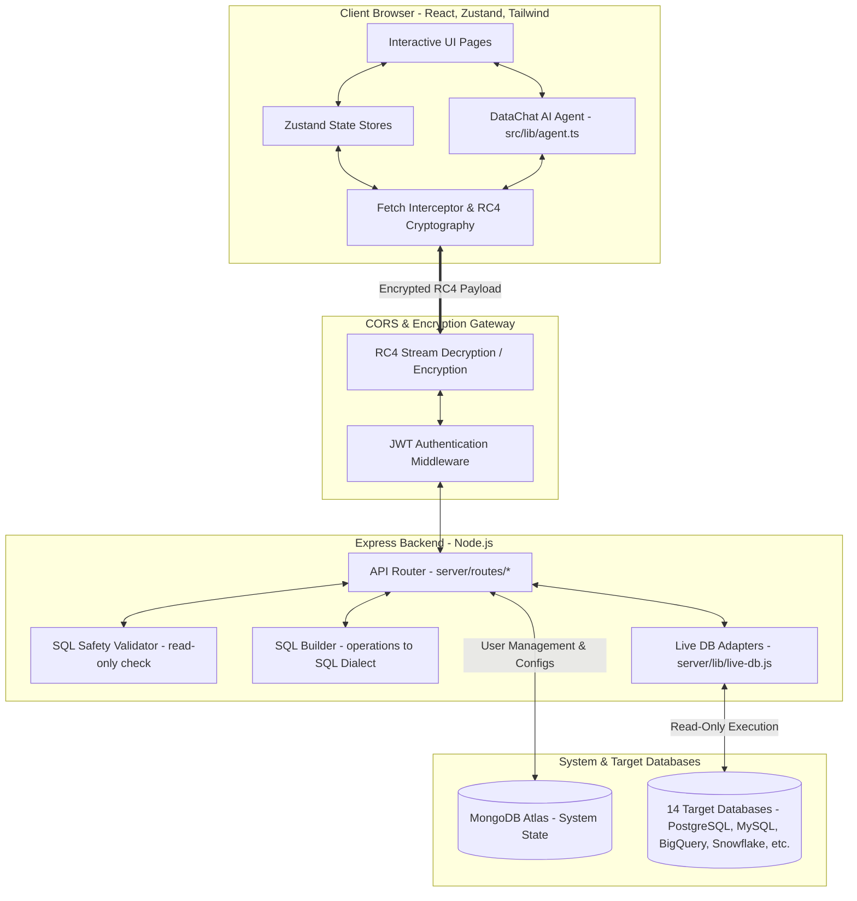

# DataVault AI Suite — End-to-End Technical Documentation

Welcome to the comprehensive, end-to-end technical architecture and component documentation for **DataVault AI Suite** (codenamed *Querify Agent*). This document provides a complete deep-dive into every layer of the system, including frontend pages, Zustand stores, backend API routes, client-side agent logic, secure encryption schemes, and multi-dialect database adapters.

---

## 🗺️ Architectural Topology

DataVault AI Suite is a premium, full-stack application designed to enable natural-language querying (NL2SQL) and dynamic visual analytics over both local files (CSV, Excel) and live database connections. 

The system leverages a hybrid execution architecture:
1. **Local Agent Mode**: Executes analytical operations (groupby, filter, outlier detection, pivots, correlation, etc.) directly in the client's browser utilizing a multi-turn LLM reasoning loop.
2. **Database Adapter Mode**: Translates user intent into secure, read-only SQL dialects (or NoSQL execution commands) and queries 14 different database engines.

---

## 🎨 Frontend Layer & Component Architecture

The frontend is a modern single-page application built on **Vite**, **React 18**, **TypeScript**, **TailwindCSS**, and **shadcn/ui**. It handles all analytical execution in the browser for local datasets and provides an IDE playground for live database sources.

### 1. Router & Layout Hierarchy
- **`src/main.tsx`**: Entry point. Mounts the React application and bootstraps the global styles (`src/index.css`) and global fetch interceptor.
- **`src/App.tsx`**: Sets up `react-router-dom` routing. Protects authenticated pages using the `auth-store` session context and maps the application endpoints.
- **`AppLayout.tsx` & `AppSidebar.tsx`**: Standard workspace scaffolding. Implements sidebar toggle navigation, visual dark mode toggles, notification indicators, user account dropdown triggers, and dynamic global onboarding states.

---

### 2. Page-by-Page Technical Specifications

#### 📄 `QueryPage.tsx`
The primary IDE workspace playground where users perform dataset queries.
- **Layout Grid**: Two-column responsive panel. The left-side accommodates the database/table schema inspector, quick templates library, and execution configuration. The right-side holds the conversation workspace, virtualized tables, and the visual dashboard preview.
- **Natural Language & SQL Interfaces**: Supports dual-mode queries. In SQL mode, a text editor allows native read-only queries with schema autocomplete suggestions. In NL mode, it acts as a conversational chat widget exposing the agentic reasoning steps.
- **Virtualized Rendering**: Incorporates `react-window` to render huge datasets (10k+ rows) at a consistent 60fps, preventing DOM bloating by utilizing a dynamic viewport.
- **Dynamic Recharts Engine**: Automatically scores column attributes (sample data, distinct counts, numeric ranges, timestamp patterns) to infer the optimal chart visualization (Bar, Line, Area, or Pie).
- **Stunning Exports**: Supports download actions generating CSVs, Markdown reports, raw JSON, plain HTML tables, or a premium multi-page PDF summary utilizing `jspdf` and `html2canvas`.
- **Keyboard Shortcuts**: Implements event listeners (e.g., `Ctrl+Enter` to execute, `Ctrl+K` for command palette) with a visual guide layout.

#### 📊 `InsightsPage.tsx`
A custom dashboard creation tool allowing users to compile and save report widgets.
- **Layout Builder**: Integrates an interactive grid where cards can be added, deleted, rearranged, and resized.
- **Chart Settings Widget**: Offers granular customization of layout visual themes, HSL colors, legends, labels, axis toggles, and data limits per card.
- **Automated Reporting**: Incorporates PDF report compile logic (`src/lib/pdf-report.ts`) to programmatically render dashboard components into highly structured vector documents with standard headers, margins, and page breaks.

#### 🤖 `DeployedChatPage.tsx`
A public, unauthenticated page serving a standalone "DataChat AI Agent" widget.
- **Anonymous Session Proxying**: Securely intercepts third-party LLM API endpoint invocations and database connection queries, routing them through a public backend API wrapper that applies the deployment's snapshotted credentials.
- **Chat Interface**: Replicates the robust Recharts visualization engine, virtualized result grids, and reasoning timeline components in a clean, isolated frame suitable for embedding.

#### 🔌 `ConnectionsPage.tsx`
The database management console supporting CRUD configurations for 14 target adapters.
- **Form Wizard**: Dynamically renders standard database fields (host, port, database, service accounts, file path uploads) based on the selected engine type.
- **Security Protocols**: Masking controls ensure sensitive parameters are redacted on render. Credentials are encrypted transparently before transit.
- **Connection Diagnostics**: Incorporates an asynchronous testing pipeline showing detailed connection lifecycle traces (ping status, credential validation, network errors).

#### 🗃️ `DatasetsPage.tsx`
Manages the semantic layer for uploaded files (CSV, XLSX, XLS) and mapped schemas.
- **Semantic Mappings**: Lets users verify data types (string, number, boolean, date), assign custom descriptions to columns, define primary keys, and map schema metadata.
- **Workbook Sheet Selector**: Exposes standard tabs to toggle, rename, or preview multiple sheets within uploaded workbooks.

#### ⚙️ `SettingsPage.tsx`
Manages user preferences and system settings.
- **LLM Configuration Portal**: CRUD settings for 10 providers. Custom toggle inputs show/hide API credentials, model selections, temperature sliders, and tokens limits.
- **Global Keyring**: Lets users establish their shared RC4 payload encryption key, storing it in browser memory to secure frontend-backend communication.

#### 👑 `AdminPage.tsx`
A comprehensive global administration panel.
- **Metric Grids**: Real-time analytical dashboard showing registered user volume, active database connections, query executions, and estimated API usage costs.
- **Audit Logs Table**: Fully searchable log of user actions (logins, deletions, query runs, failed connections).
- **Subscription Management**: Provides administrative controls to update user access plans, quotas, and global limits.

#### 🔑 `AuthPage.tsx`
A secure authentication page.
- **Dual Flow**: Supports custom email/password registration and logins using secure local hashing, alongside an option to integrate third-party SSO via Auth0.

---

### 3. Zustand State Stores (`src/stores/`)

The application isolates its UI and data states into custom **Zustand** stores, achieving performant, reactive updates without prop drilling.

| Store File | Managed State | Important Methods / Capabilities |
| :--- | :--- | :--- |
| `auth-store.ts` | Session state, token strings, user profile metadata, auth status | `signin()`, `signup()`, `signout()`, `refreshUserSession()`, Auth0 federation integration. |
| `connection-store.ts` | Configured active database adapters, connection statuses, DB types | `fetchConnections()`, `testConnection()`, `createConnection()`, `deleteConnection()`. |
| `dataset-store.ts` | Uploaded datasets, semantic layer schemas, worksheet details | `fetchDatasets()`, `uploadDataset()`, `updateDatasetSchema()`, `deleteDataset()`. |
| `llm-store.ts` | Provider parameters, chosen models, custom prompt templates | `fetchLLMSettings()`, `saveLLMSettings()`, `testProviderConnection()`. |
| `history-store.ts` | Logs of past user queries, favorites, custom search text, filters | `fetchHistory()`, `addHistoryEntry()`, `toggleFavorite()`, `deleteHistory()`. |
| `insights-store.ts` | Report layouts, visual cards, grid widget properties | `fetchInsights()`, `saveInsightDashboard()`, `createChartWidget()`. |
| `settings-store.ts` | Encryption keys, visual dark/light modes, user preferences | `setEncryptionKey()`, `toggleDarkMode()`, `updatePreferences()`. |
| `notifications-store.ts`| Actionable toast alerts, system notifications, error logs | `fetchNotifications()`, `markAsRead()`, `clearAllNotifications()`. |
| `plan-store.ts` | Subscription tier details, usage metrics, invoice mockups | `fetchPlans()`, `upgradePlan()`, `calculatePlanQuotas()`. |

---

## 🧠 DataChat AI Agentic Engine (`src/lib/agent.ts`)

The heart of the conversational querying layer is a highly optimized client-side agent framework capable of autonomous multi-step reasoning. It uses an LLM to generate formal commands, which are executed locally on the parsed dataset.

```mermaid
sequenceDiagram
    autonumber
    actor User as Client UI
    participant Agent as Agent Loop (agent.ts)
    participant LLM as callLLM (llm-client.ts)
    participant LocalData as executeOperation

    User->>Agent: "Which product category has the highest average rating?"
    rect rgb(20, 20, 30)
        Note over Agent: Step 1: Pre-process intent<br/>(synonym mapping & column matching hints)
    end
    Agent->>LLM: Prompt (System prompt + Column schema + Intent Hint + Question)
    LLM-->>Agent: JSON Command: {"command":"GetColumns"}
    Agent->>User: Yield intermediate step (Inspecting schema)
    
    rect rgb(20, 20, 30)
        Note over Agent: Step 2: Query schema metadata<br/>(Identifies columns: "category", "rating")
    end

    Agent->>LLM: Prompt (User Question + Schema metadata + Prior step result)
    LLM-->>Agent: JSON Command: {"command":"ExecuteFinalQuery", "args":{"operation":"groupby", "params":{"groupColumn":"category", "aggColumn":"rating", "aggFunction":"mean", "limit":1, "order":"desc"}}}
    
    Agent->>LocalData: executeOperation("groupby", category & rating)
    Note over LocalData: 1. Remove nulls/NaNs<br/>2. Compute mean per category<br/>3. Sort descending<br/>4. Apply limit:1
    LocalData-->>Agent: Result: [{"category": "Electronics", "mean": 4.82}]
    
    Agent->>User: Yield final step (Electronics category has the highest average rating of 4.82)
```

### 1. The 8-Turn Execution Lifecycle
When a user asks a question, the agent enters an asynchronous generator loop limited to **8 steps**:
1. **Pre-processing**: Normalizes inputs (e.g. converting "10k" to 10000) and scores columns to inject semantic matching hints.
2. **Intent Classification**: Evaluates the question's semantic intent (e.g., trend, outlier, ranking, distinct values) and appends execution guidelines to the LLM instruction.
3. **LLM Invocations**: Passes the system prompt, conversation history window (remembers the last 3 Q/A turns), and schema parameters to the configured LLM API.
4. **JSON Extraction & Recovery**: Strips markdown code blocks and attempts to patch common syntax mistakes (missing quotes, trailing commas) to successfully parse the LLM's command.
5. **Command Dispatch**:
   - `GetColumns` / `GetSchema`: Returns table structure parameters.
   - `QuerySheet` / `QueryTable`: Executes an intermediate filter or calculation and feeds it back to the loop.
   - `ExecuteFinalQuery` / `ExecuteSQL`: Runs the final analytical operation.
   - `Answer`: Directly terminates the loop, outputting a direct answer, clarification request, or visual options.
6. **Local Operation Engine**: Runs Javascript analytical algorithms over in-memory datasets.
7. **Rule-Based Fallbacks**: If the LLM repeatedly fails to return a valid command, a local classifier builds a fallback query based on keyword mappings (e.g., detecting "average salary" triggers a mean aggregate fallback).

### 2. Supported Local Analytical Operations
The local processing engine is incredibly robust, supporting complex relational operations directly on rows of data:
- **`filter`**: Filters rows using standard operators (`>`, `<`, `==`, `!=`, `contains`, `starts_with`, `is_null`, `not_null`).
- **`sort`**: Sorts rows by target attributes (`asc` / `desc`) with limit parameters.
- **`groupby`**: Groups rows, applies aggregates (`sum`, `count`, `count_distinct`, `mean`, `min`, `max`), strips null groupings, processes duration strings, and handles outlier exclusions.
- **`aggregate`**: Computes dataset-wide statistics including `median`, standard deviation (`std`), and `variance`.
- **`date_trunc`**: Buckets date records by `day`, `week`, `month`, `quarter`, or `year` for time series analysis.
- **`outlier_detect` / `filter_outliers`**: Identifies statistical anomalies using the **IQR (Interquartile Range)** method or **Z-Score** method.
- **`correlation`**: Computes **Pearson's Correlation Coefficient** ($r$) between two numeric columns.
- **`pivot`**: Computes cross-tabulation summaries, aggregating values across dynamic row/column groupings.
- **`split_frequency`**: Tokenizes list-like entries (e.g., delimited movie genres "Action, Comedy, Drama") to calculate item frequencies.
- **`pipeline`**: Sequentially chains multiple operations (e.g. filter -> clean -> groupby -> sort).

---

## 🔒 Security Gateways & Network Cryptography

DataVault AI Suite prioritizes enterprise security by enforcing absolute payload encryption for all API communications.

### 1. RC4 Stream Cryptography (`src/lib/crypto.ts` & `server/lib/crypto.js`)
Frontend-backend communication relies on a custom, byte-based **RC4 Stream Cipher** execution scheme.
- A client-generated passphrase (stored in browser memory) acts as the shared key.
- Klartext strings are encoded as standard UTF-8 bytes, scrambled by the RC4 key schedule state array, and converted to Base64 strings before transit.
- Re-scrambling the ciphertext bytes with the identical key restores the cleartext.

### 2. Transparent Fetch Interceptor (`src/lib/fetch-interceptor.ts`)
A global monkey-patch interceptor on `window.fetch` automatically manages encryption boundaries:
1. **Authorization Redirection**: Extracts the standard `Authorization` JWT and custom `X-Provider-Api-Key` headers, encrypts them, and maps them to `x-encrypted-auth` and `x-encrypted-provider-key` headers.
2. **Payload Encapsulation**: Intercepts outgoing `POST`, `PUT`, `DELETE`, and `PATCH` requests containing JSON bodies. The body string is encrypted, encapsulated as a single string inside a JSON envelope (`{ "payload": "ciphertext" }`), and marked with `x-encrypted-body: true`.
3. **Response Deciphering**: Evaluates returned responses. If the backend returned `x-encrypted-response: true` or a payload key matching `{ "payload": "..." }`, the interceptor decrypts the ciphertext in memory and constructs a transparent Response object back to the application.

---

## 🔌 Backend Server & Database Adapters

The backend is built on **Node.js**, **Express**, and **MongoDB**. It exposes robust routes, handles API proxies, and compiles visual operations into dialect-safe queries.

### 1. Express Encryption Middleware (`server/middleware/encryption.js`)
Decrypts incoming request payloads and encrypts outgoing Express responses in place:
- Inspects headers (`x-encrypted-auth`, `x-encrypted-provider-key`). Decrypts the values and overrides the standard `req.headers.authorization` object.
- If `x-encrypted-body` is true, decrypts the request body string and parses it back into standard `req.body` JSON.
- Overrides `res.json` and `res.send` methods. If the request was encrypted, the middleware automatically stringifies the response data, encrypts it using RC4, sets `x-encrypted-response: true`, and returns `{ payload: encryptedBase64 }`.

---

### 2. Safe SQL Query Validator (`server/lib/sql-validator.js`)
To protect database sources from SQL Injection and destructive exploits, all incoming queries must pass a strict static analysis check:
- **Comment Stripping**: Removes SQL single-line (`--`) and multi-line (`/* */`) comments.
- **Semicolon Enforcer**: Enforces a single statement limit by scanning for unquoted semicolons.
- **Select-Only Assertion**: Masks string literals and converts keywords to lowercase, asserting that the statement begins strictly with `SELECT` or `WITH`.
- **Keyword Block List**: Blocks queries containing mutative SQL commands:
  > `INSERT`, `UPDATE`, `DELETE`, `DROP`, `ALTER`, `CREATE`, `TRUNCATE`, `MERGE`, `CALL`, `EXEC`, `EXECUTE`, `GRANT`, `REVOKE`, `COMMIT`, `ROLLBACK`, `SAVEPOINT`, `COPY`, `LOAD`, `UNLOAD`, `VACUUM`, `ATTACH`, `DETACH`, `PRAGMA`
- **Output Injection Block**: Restricts writing file output via `INTO OUTFILE` or `SELECT INTO` commands.

---

### 3. Multi-Dialect Database Drivers (`server/lib/live-db.js`)
Contains custom adapters that load database-specific packages on demand and run queries:

- **PostgreSQL / Redshift** (`pg`): Connects via pooling credentials, queries catalog schemas (`pg_class`, `pg_namespace`, `pg_attribute`), and executes read-only SELECT limits.
- **MySQL / MariaDB** (`mysql2`): Uses `mysql2/promise` to query `information_schema` tables, column definitions, and run optimized MySQL-quoted dialect executions.
- **SQL Server** (`mssql`): Connects via pools with `trustServerCertificate: true`. Queries schemas using system views, and translates limit filters using Microsoft's `TOP (N)` dialect syntax.
- **Oracle DB** (`oracledb`): Leverages Oracle's native driver to execute queries against user tables and system metadata.
- **SQLite** (`node:sqlite`): Uses Node 20's high-performance native `DatabaseSync` class to read local database files and execute queries via sync preparations.
- **MongoDB Atlas** (`mongodb`): Queries collections, calculates schema metrics from sample indexes, and exposes NoSQL query builders.
- **Elasticsearch / OpenSearch** (`@elastic/elasticsearch`): Connects via HTTP API keys. Translates index scans, retrieves property mappings, and structures JSON query DSLs.
- **ClickHouse** (REST API): Invokes high-speed HTTP request calls using ClickHouse's optimized `FORMAT JSON` data stream encoding.
- **Snowflake** (`snowflake-sdk`): Establishes connection sessions with target warehouses, databases, and schemas. Maps results securely and supports Snowflake identifiers.
- **BigQuery** (`@google-cloud/bigquery`): Authenticates using parsed Google Service Account JSON files. Connects to GCP projects and datasets, flattening nested schemas to simplify visualization.
- **Databricks SQL** (`@databricks/sql`): Queries cloud lakehouses using high-performance Databricks compute pathways.
- **DuckDB** (`@duckdb/node-api`): Executes local in-memory columnar database operations over parquet/arrow/local file targets.

---

## 📋 Comprehensive API Route Reference

The table below documents every REST API route exposed by the Express backend.

> [!NOTE]
> All request and response payloads listed below are in their **decrypted (Klartext) format**. In transit, they are encrypted in RC4 and wrapped in `{ "payload": "ciphertext" }` if the encryption key is configured.

### 1. Authentication (`server/routes/auth.js`)

| Method | Endpoint | Request Payload | Success Response (200/201) |
| :--- | :--- | :--- | :--- |
| `POST` | `/api/auth/signup` | `{"email":"u@e.com", "password":"pw", "name":"User"}` | `{"token":"jwt_string", "user":{"id":"uid", "email":"u@e.com"}}` |
| `POST` | `/api/auth/signin` | `{"email":"u@e.com", "password":"pw"}` | `{"token":"jwt_string", "user":{"id":"uid", "email":"u@e.com"}}` |
| `POST` | `/api/auth/signout`| *None* | `{"success":true}` |
| `GET` | `/api/auth/profile`| *None* | `{"user":{"id":"uid", "email":"u@e.com", "name":"User"}}` |

---

### 2. Database Connections (`server/routes/connections.js`)

| Method | Endpoint | Request Payload | Success Response (200/201) |
| :--- | :--- | :--- | :--- |
| `GET` | `/api/connections/types` | *None* | `{"types":{"mysql":{...}, "postgresql":{...}}}` |
| `GET` | `/api/connections` | *None* | `{"connections":[{"_id":"id", "name":"ProdDB", "dbType":"mysql"}]}` *(Credentials masked)* |
| `POST` | `/api/connections` | `{"name":"ProdDB", "dbType":"mysql", "config":{...}}` | `{"connection":{"_id":"id", "name":"ProdDB", "status":"untested"}}` |
| `PUT` | `/api/connections/:id` | `{"name":"NewName", "config":{...}}` | `{"connection":{"_id":"id", "name":"NewName"}}` |
| `POST` | `/api/connections/:id/test` | *None* | `{"success":true, "message":"Successfully connected to MySQL"}` |
| `DELETE`| `/api/connections/:id` | *None* | `{"success":true}` |

---

### 3. Database Schema & Query Execution (`server/routes/db-query.js`)

| Method | Endpoint | Request Payload | Success Response (200/201) |
| :--- | :--- | :--- | :--- |
| `GET` | `/api/db-query/:connectionId/schema` | *None* (Query Param: `?table=users`) | `{"schema":{"connectionId":"id", "tables":[{"name":"users","columns":[...]}]}}` |
| `POST` | `/api/db-query/:connectionId/tables` | *None* | `{"tables":[{"name":"users", "rowCount":1500, "columnCount":8}]}` |
| `POST` | `/api/db-query/:connectionId/execute` | `{"sql":"SELECT * FROM users LIMIT 10"}` OR `{"operation":"preview_table","params":{"tableName":"users"}}` | `{"data":[{"id":1,"name":"Alice"}], "columns":[{"name":"id","dtype":"number"}], "sql":"..."}` *(Logs query)* |

---

### 4. Local Datasets (`server/routes/datasets.js`)

| Method | Endpoint | Request Payload | Success Response (200/201) |
| :--- | :--- | :--- | :--- |
| `GET` | `/api/datasets` | *None* | `{"datasets":[{"_id":"id", "fileName":"sales.csv", "displayName":"Sales"}]}` |
| `POST` | `/api/datasets` | `{"fileName":"sales.csv", "fileType":"csv", "fileData":{...}}` | `{"dataset":{"_id":"id", "displayName":"sales.csv"}}` |
| `GET` | `/api/datasets/:id/data` | *None* | `{"_id":"id", "fileData":{"sheets":{"Sheet1":[{"id":1}]}}}` *(Lazy loaded in memory)* |
| `DELETE`| `/api/datasets/:id` | *None* | `{"success":true}` |

---

### 5. Chatbot Deployments (`server/routes/deployments.js`)

| Method | Endpoint | Request Payload | Success Response (200/201) |
| :--- | :--- | :--- | :--- |
| `GET` | `/api/deployments` | *None* | `{"deployments":[{"_id":"uuid", "name":"Sales Bot", "status":"active"}]}` |
| `POST` | `/api/deployments` | `{"name":"Sales Bot", "snapshot":{"selectedDatasetId":"id", "activeModel":"gpt-4"}}` | `{"success":true, "deployment":{...}}` *(Enriches credentials securely)* |
| `GET` | `/api/deployments/public/:id` | *None* | `{"_id":"uuid", "name":"Sales Bot", "snapshot":{...}}` *(Credentials scrubbed)* |
| `POST`| `/api/deployments/public/:id/chat` | `{"messages":[{"role":"user","content":"Hi"}]}` | `{"choices":[{"message":{"role":"assistant","content":"JSON"}}], "usage":{...}}` *(Proxies safely)* |
| `POST`| `/api/deployments/public/:id/execute`| `{"sql":"SELECT * FROM users"}` | `{"data":[...], "columns":[...]}` *(Dialect validation applied)* |

---

### 6. Supporting Modules

#### Query History (`server/routes/history.js`)
- `GET /api/history`: Returns user's query execution logs and bookmarked requests.
- `POST /api/history`: Creates an execution log or saves a favorite query statement.
- `DELETE /api/history/:id`: Removes a logged entry.

#### Settings & Preferences (`server/routes/settings.js`)
- `GET /api/settings`: Returns configured LLM settings and visual preferences.
- `PUT /api/settings`: Saves custom prompts, default temperature settings, and model configs.
- `PUT /api/settings/profile`: Updates username and security passwords.

#### Dashboard Insights (`server/routes/insights.js`)
- `GET /api/insights`: Returns report structures, card layouts, and chart visual parameters.
- `POST /api/insights`: Stores a saved dashboard layout configuration.
- `DELETE /api/insights/:id`: Deletes a saved report layout.

#### Administration & Auditing (`server/routes/admin.js` & `server/routes/audit.js`)
- `GET /api/admin/stats`: Exposes global user registers, connection totals, and cost aggregates.
- `GET /api/audit/logs`: Exposes granular audit logs detailing system state transitions.

---

This complete, end-to-end technical manual serves as the primary system reference for the development and operation of the **DataVault AI Suite** platform.
